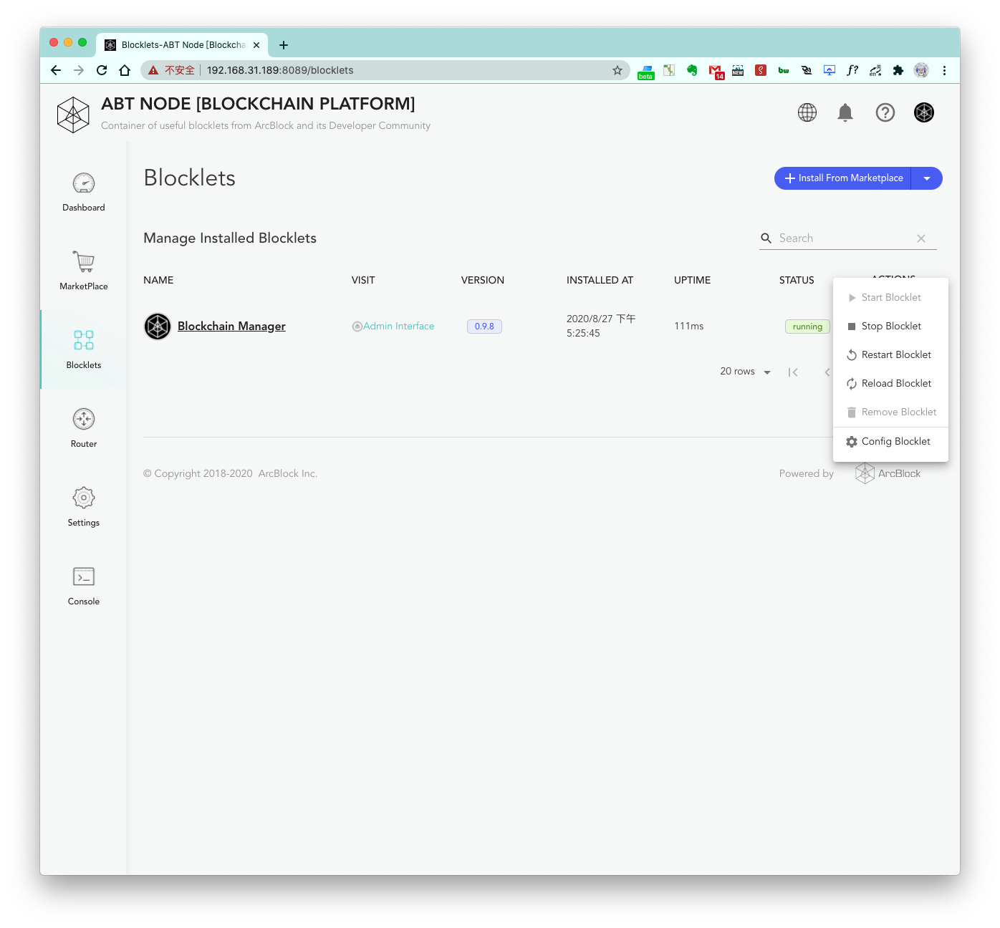

We've designed Blocklets to be easy to use and allow any developer to quickly leverage the Blocklet within in just a few short steps. To start, simply install a Blocklet from the marketplace, and then select `Blocklets` on the left-side action bar to see a list of all the Blocklets that have been installed on your ABT Node. 

## Blocklets page

The `Blocklets` page contains a list of all your installed blocklets and gives you direct access to interact with each Blocklet, as well as showing you key properties that include:

1. Name
2. Interface links
3. Version number
4. Time of installation
5. Uptime
6. Status (`installed`/`running`/`stopped`)

A list of **actions** can be viewed by clicking the three dots next to a blocklet. Possible operations include the
following:

1. `Start Blocklet`
2. `Stop Blocklet`
3. `Restart Blocklet`
4. `Reload Blocklet`
5. `Remove Blocklet` (you will be prompted to choose whether to delete the blocklet data as well)
6. `Config Blocklet`:

## Blocklet details page

In addition to key overview details about your Blocklet, the details page enables you to leverage the **action** buttons on the top right:

1. `Start`
2. `Stop`
3. `Restart`
4. `Reload`: Reload the configuration
5. `Remove` (as stated earlier, you will be prompted to choose whether to delete the blocklet data as well)

Now that we know how to quickly start and stop a Blocklet, let's look further into the environment variables that are available.