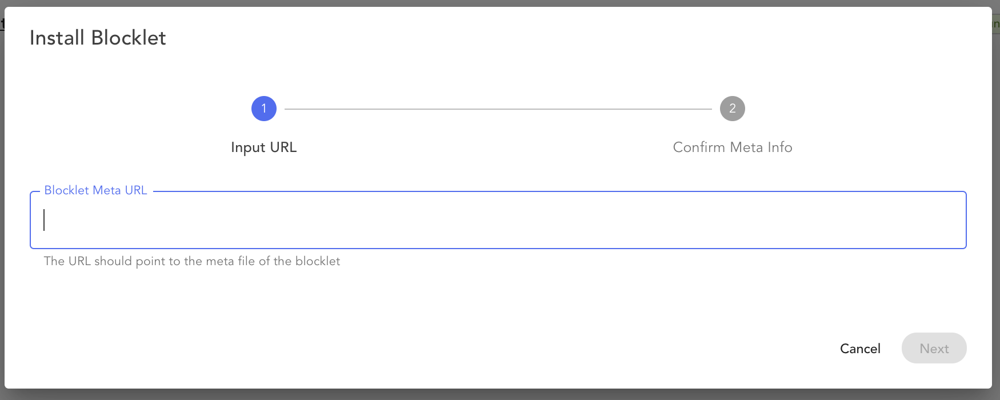
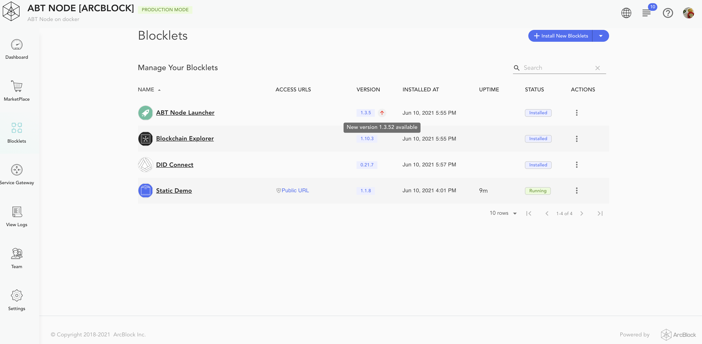
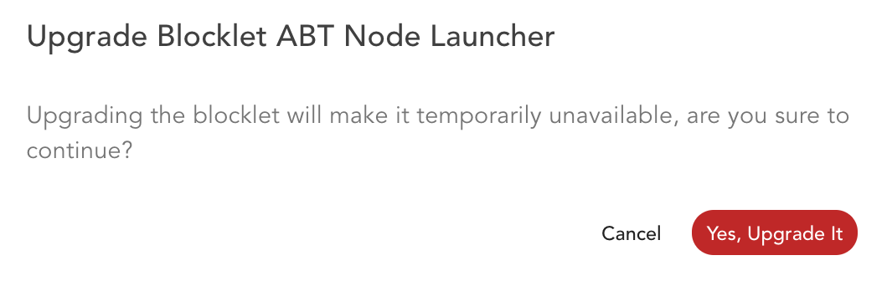

The *Blocklets Management* page shows all Blocklets installed on the ABT Node with the following attributes for each of the Blocklets.

1. Name
2. Access URLs
3. Version
4. Installed At
5. Uptime
6. Status (`installed`/`running`/`stopped`)
7. Actions

A list of operations can be viewed by clicking the three dots next to a Blocklet. Possible operations include the following:

1. `Start Blocklet`
2. `Stop Blocklet`
3. `Restart Blocklet`
4. `Reload Blocklet`
5. `Remove Blocklet` (you will be prompted to choose whether to delete the Blocklet data as well)
6. `Configure Blocklet`
7. `Manage Team`
8. `View Logs`

The `name` attribute orders all blocklet data by default.  Data can be ordered in a different direction or by selecting an other attribute. The data is paginated in sizes of 10. There are control actions at the bottom of the page to find next and previous set of data.

The page also presents a search box to lookup Blocklets using their name.

## Install Blocklet

The Blocklets Management page enables the installation of adhoc Blocklets, which are not available on the Marketplace. Click "Install New Blocklet" button and select "Install from URI".  

Provide the URL for the required [blocklet.json](https://github.com/blocklet/html-2048-sample/releases/download/1.1.9/blocklet.json). Click next to review the details and install the blocklets.

## Upgrade Blocklet

The *Blocklets Management* page generates notifications when a new version on an installed Blocklet is available. It is shown with a red uptick next to the Blocklet version.

You can click the red uptick for the upgrade, it will ask for a confirmation. Once confirmed the ABT Node will download and install the new version of the Blocklet.

## Downgrade Blocklet

You can not downgrade an installed Blocklet. You have to remove the Blocklet and install it again using the older version.
