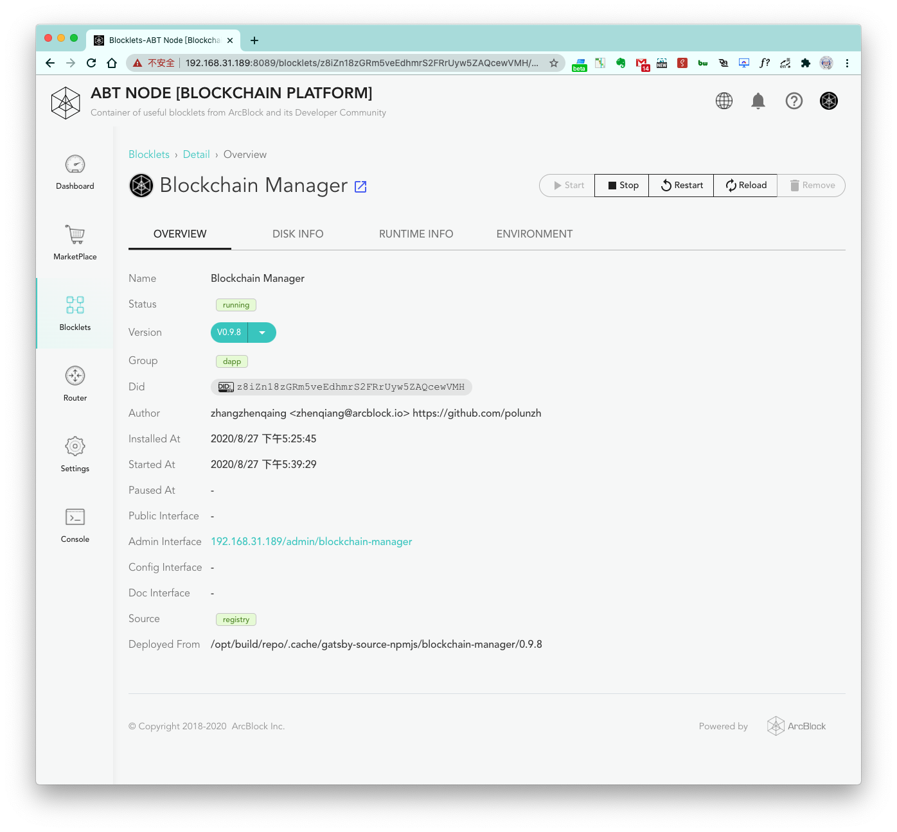

After installing a blocklet from the blocklet marketplace, go to the `Blocklets` page.

## Blocklets page

The `Blocklets` page contains a list of installed blocklets and the following properties of each installed blocklet:

1. Name
2. Interface links
3. Version number
4. Time of installation
5. Uptime
6. Status (`installed`/`running`/`stopped`)

A list of operations can be viewed by clicking the three dots next to a blocklet. Possible operations include the
following:

1. `Start Blocklet`
2. `Stop Blocklet`
3. `Restart Blocklet`
4. `Reload Blocklet`
5. `Remove Blocklet` (you will be prompted to choose whether to delete the blocklet data as well)
6. `Config Blocklet`:

## Blocklet details page

On the details page, there is a row of operation buttons on the top right:

1. `Start`
2. `Stop`
3. `Restart`
4. `Reload`: Reload the configuration
5. `Remove` (as stated earlier, you will be prompted to choose whether to delete the blocklet data as well)
