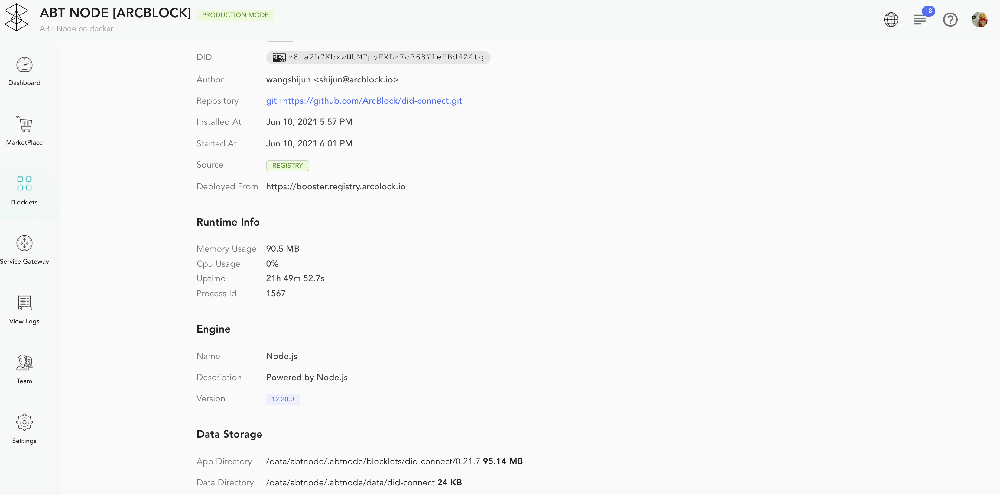
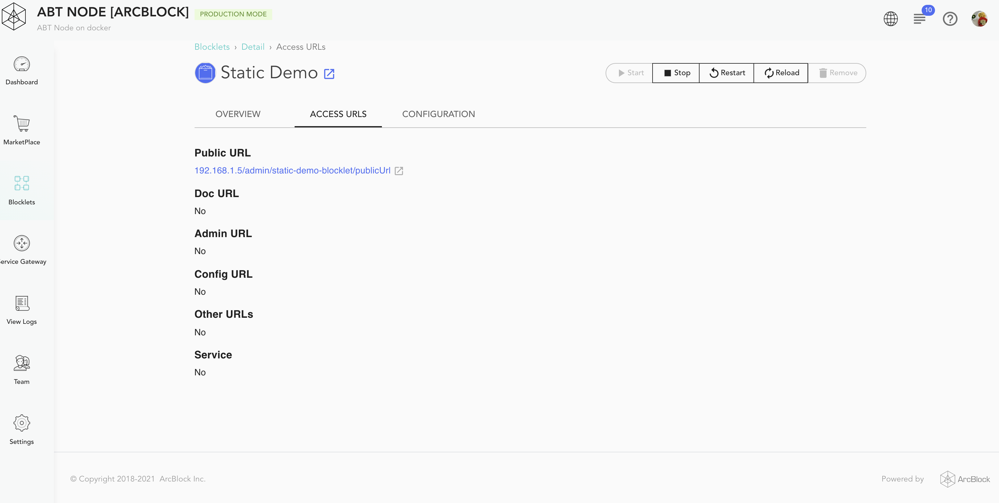

Click a Blocklet on the Blocklet Management page to arrive on the configuration page for the respective Blocklet. The page provides details about the installed Blocklet. The page allows you to control Blocklet operation and update its configuration.

On the details page, there is a row of operation buttons on the top right:

1. `Start`
2. `Stop`
3. `Restart`
4. `Reload`: Reload the configuration
5. `Remove` (as stated earlier, you will be prompted to choose whether to delete the blocklet data as well)

There are the following three tabs that provide further details about the Blocklet

### Overview Tab

The *Overview* tab provides details like version, status, location, source, etc, for the installed Blocklet binary. It also captures basic usage metrics like uptime, CPU, and memory usage.

The page also shows different data locations for the different types of files used by the Blocklet.
- APP Directory: The location to store Blocklet binary.
- Data Directory: The location to store all data processed by a Blocklet.
- Log Directory: The location for the logs generated by the Blocklet
- Cache Directory: The location used for caching all data.

You may prefer to monitor the logs and backup all data for the required directories.

### Access URLs Tab

The *Access URLs* tab provides various access locations for a running Blocklet.

### Configuration Tab

The *Configuration* tab displays different Blocklet and System environment variables. Additionally, you can create user variables for providing Blocklet required parameters.

### Blocklet Variables

The following variables provide information for a particular Blocklet.

1. `BLOCKLET_PORT`: Blocklet port
2. `BLOCKLET_APP_DIR`: Blocklet application directory
3. `BLOCKLET_MAIN_DIR`: Blocklet main directory
4. `BLOCKLET_DATA_DIR`: Blocklet data directory
5. `BLOCKLET_LOG_DIR`: Blocklet log directory
6. `BLOCKLET_CACHE_DIR`: Blocklet cache directory
7. `BLOCKLET_APP_SK`: Blocklet app sk
8. `BLOCKLET_APP_ID`: Blocklet app id
9. `BLOCKLET_BASE_URL`: Blocklet base URL
10. `BLOCKLET_PREFIX`: Blocklet prefix

### System Variables

The following variables provide system information.

1. `ABT_NODE_DID`: ABT Node did
2. `ABT_NODE_PK`: ABT Node pk
2. `ABT_NODE_URL`: ABT Node url
2. `ABT_NODE_IP`: ABT Node IP address
2. `ABT_NODE_PORT`: ABT Node port
2. `ABT_NODE_PROTOCOL`: ABT Node protocol
2. `ABT_NODE_DOMAIN`: ABT Node domain
