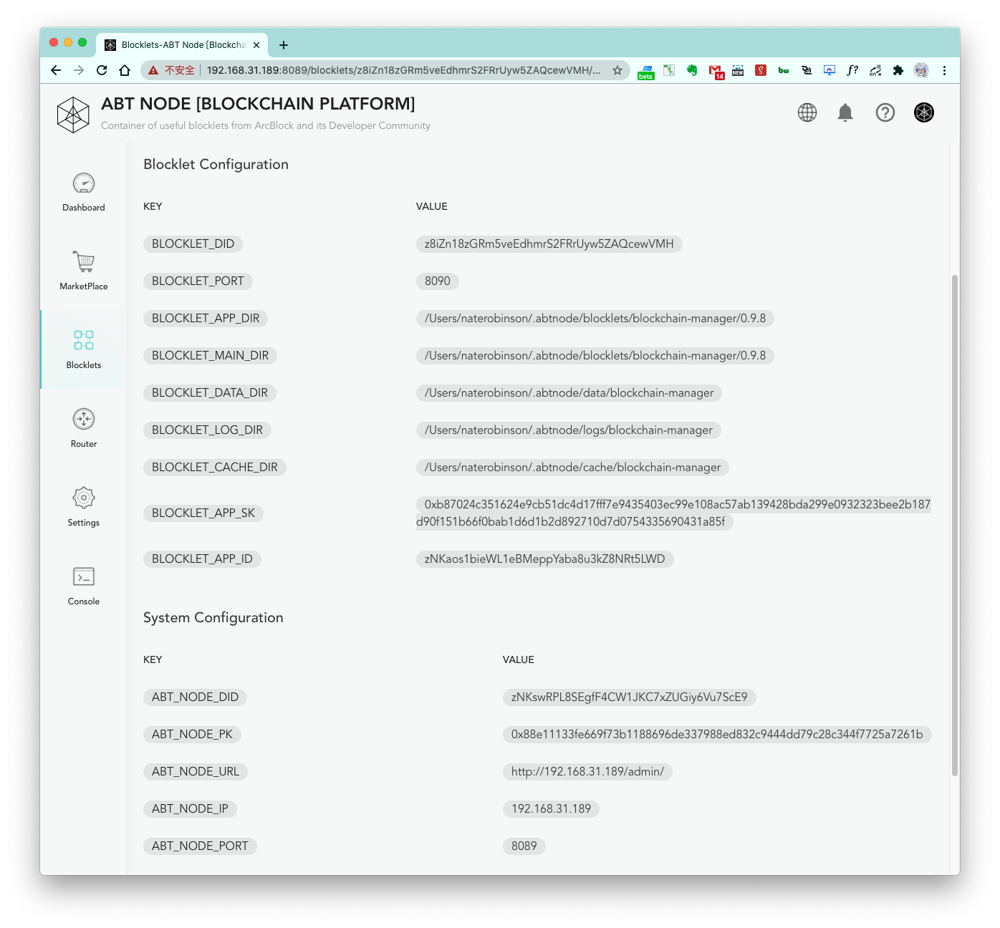

ABT Node provides a few environment variables to blocklets running on the node.

### System Configuration

1. `BLOCKLET_PORT`: Blocklet port
2. `BLOCKLET_APP_DIR`: Blocklet application directory
3. `BLOCKLET_MAIN_DIR`: Blocklet main directory
4. `BLOCKLET_DATA_DIR`: Blocklet data directory
5. `BLOCKLET_LOG_DIR`: Blocklet log directory
6. `BLOCKLET_CACHE_DIR`: Blocklet cache directory
7. `BLOCKLET_APP_SK`: Blocklet app sk
8. `BLOCKLET_APP_ID`: Blocklet app id
9. `BLOCKLET_BASE_URL`: Blocklet base URL
10. `BLOCKLET_PREFIX`: Blocklet prefix

### Global configuration

1. `ABT_NODE_DID`: ABT Node did
2. `ABT_NODE_PK`: ABT Node pk
2. `ABT_NODE_URL`: ABT Node url
2. `ABT_NODE_IP`: ABT Node IP address
2. `ABT_NODE_PORT`: ABT Node port
2. `ABT_NODE_PROTOCOL`: ABT Node protocol
2. `ABT_NODE_DOMAIN`: ABT Node domain
