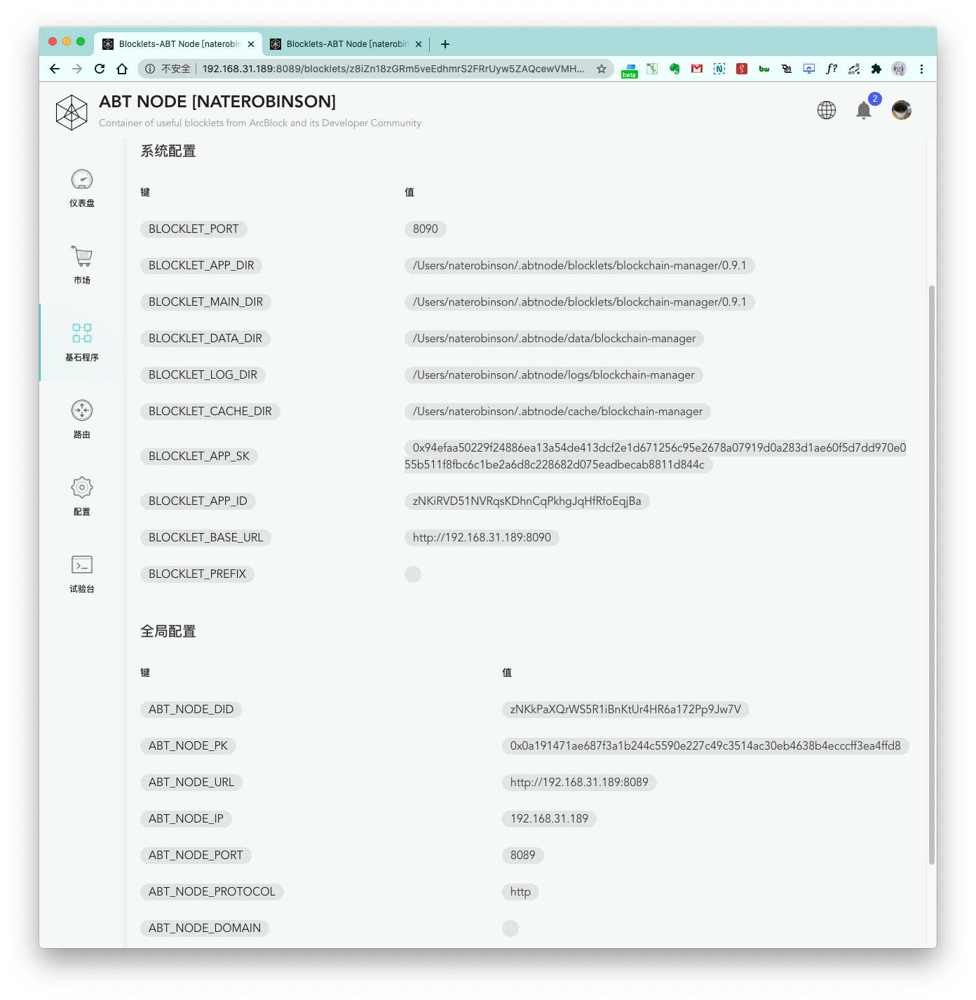

ABT Node 会为运行在节点里面的 Blocklet 提供一系列可访问的变量。

### 系统配置

1. `BLOCKLET_PORT`：Blocklet 运行端口
2. `BLOCKLET_APP_DIR`：Blocklet 存储目录
3. `BLOCKLET_MAIN_DIR`：Blocklet 存储目录
4. `BLOCKLET_DATA_DIR`：Blocklet data 目录
5. `BLOCKLET_LOG_DIR`：Blocklet log 目录
6. `BLOCKLET_CACHE_DIR`：Blocklet cache 目录
7. `BLOCKLET_APP_SK`：Blocklet app sk
8. `BLOCKLET_APP_ID`：Blocklet app id
9. `BLOCKLET_BASE_URL`：Blocklet base url
10. `BLOCKLET_PREFIX`：Blocklet prefix

### 全局配置

1. `ABT_NODE_DID`：ABT Node did
2. `ABT_NODE_PK`：ABT Node pk
2. `ABT_NODE_URL`：ABT Node url
2. `ABT_NODE_IP`：ABT Node ip 地址
2. `ABT_NODE_PORT`：ABT Node 端口
2. `ABT_NODE_PROTOCOL`：ABT Node 协议
2. `ABT_NODE_DOMAIN`：ABT Node Domain
