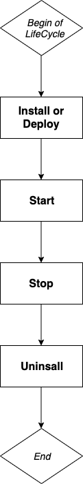

## What is Blocklet?

Blocklet is an application protocol and a software architecture. As a protocol, it describes the way to build the ABT Node platform; as a software architecture, an independent blocklet is a reusable software module, which may be an HTTP service or a function library, etc.; when multiple When Blocklets run together, they need a platform to combine them to form an independent service, such as ABT Node.

## How to define a Blocklet?

We use JSON data format to describe the protocol of Blocklet.

## Define basic information

```json
{
  "name": "blocklet name, can be same as npm package name",
  "description": "blocklet description, can be same as npm package description",
  "version": "blocklet version, can be same as npm package version",
  "group": "only `dapp|static` are allowed and supported"
}
```

`name, description, version, group` describes the basic information of the blocklet. Among them, `group` is divided into two types of `dapp` and `static`. `dapp` is a regular dapp. `static` is a web application that only contains front-end static resources. ABT Node will use an HTTP Server to serve `static` Blocklet.

## Define runtime configuration

```json
{
  "main": "the entrypoint to bundle the blocklet or the static folder",
  "requiredEnvironments": {
    "name": "string, name of the environment",
    "description": "string, description of the environment",
    "required": "bool, is required",
    "default": "Any type, default value"
  }
}
```

In addition to the description of the basic information of the blocklet, the blocklet also defines the `main` field to describe how the blocklet starts to run, which is the description of the so-called entry file. This field is closely related to the operation of the blocklet. `main` defines the entry file or static resource directory of dapp or static type Blocklet. So for ABT Node, the `main` field is necessary, it is very important, otherwise ABT Node has no way to start Blocklet.

In addition to the `main` field, we also define the `requiredEnvironments` field to declare the environment variables that the Blocklet needs to run. There are four attributes that describe an environment variable: name, description, required, default. If the variable is set to required and no default value is provided, the user must set the variable before starting.

`requiredEnvironments` is not necessary, and Blocklet can use this field to request Blocklet users to provide corresponding information through this field. For example, Blocklet depends on the MongoDB database, then you can use requiredEnvironments to ask users to fill in the MongoDB connection string.

## Other configuration

```json
{
  "provider": "arcblock|community",
  "public_url": "public page url, should at least specify one",
  "admin_url": "administrator page url, default to empty",
  "config_url": "configuration page url, default to empty",
  "doc_url": "public document url, if not specified, will use registry detail page"
}
```

Here are other configuration items. For Blocklet, these fields are optional. Let’s briefly introduce these fields.

- provider: The `provider` is the source of the declared blocklet. There are two optional values: arcblock|community. `arcblock` represents the official development of ArcBlock, and `community` is developed by the community.
- public_url: The `public_url` is the publicly accessible address of the blocklet.
- admin_url: The `admin_url` is the address of the management end of the Blocklet.
- config_url: The `config_url` is the address of the blocklet configuration page.
- doc_url: The `doc_url` is the document address of the blocklet. If this address does not exist, ABT Node will use the README of the blocklet as the document page.

## Blocklet life cycle

## Life cycle



In ABT Node, the complete life cycle of Blocklet includes four stages: installation (or deployment), start, stop, and uninstall. Blocklet can be installed in two ways, one is to download and install it in the marketplace, and the other is to deploy and install it directly with ABT Node CLI locally. The CLI deployment is mainly for development and testing. Therefore, in the first phase of the life cycle, there are two situations of installation and deployment.

## Hooks


In these stages, ABT Node provides the hook function, which is used to do something during the execution of the life cycle. Currently includes: pre-deploy, post-install, pre-start, pre-stop, pre-install, pre-uninstall Hook.

For example, a blocklet has hardware requirements for the running machine: the memory cannot be lower than 1G, and the available disk capacity cannot be lower than 500 MB. At this time, you can use the pre-install hook to check whether the target machine has met the demand. If it meets, install normally, otherwise throw an error message and terminate the installation.

Hooks are actually Shell scripts, and these scripts may refer to the files in the blocklet. In the process of packaging the blocklet, the ABT Node packaging tool (ABT Node CLI) will package the files used by the hook separately, so developers need to Declare which files are referenced by hooks in `hookFiles`.

## How to develop a Blocklet?

After understanding some basic Blocklet concepts and protocols, show to develop a Blocklet?

## Initialize the blocklet

ABT Node CLI provides `abtnode blocklet:init` command to help developers quickly create a Blocklet project. This command will help developers create related configuration files and directories.

### Blocklet project structure

```shell
├── blocklet.json
├── blocklet.md
└── package.json
```

After the project is created, we can see that a Blocklet project mainly contains two parts: Blocklet description information and source code.
ABT Node currently only supports the Node.js Blocklet project, so the description of the Blocklet will generally contain two parts: Node.js' package.json and Blocklet's blocklet.json. The content of the Blocklet Spec we mentioned earlier will be placed in blocklet.json. Of course, Blocklet also allows the contents of blocklet.json to be placed in the `blocklet` field of package.json.

### blocklet.json

All description information of Blocklet is placed in the blocklet.json file.
Earlier we said that Blocklet is a Node.js project. We know that Node.js package.json file also contains information such as name, description, and version. For Blocklet, this part of the repeated information is equivalent, ABT Node will first read the configuration of blocklet.json, if not, it will read the package.json.

The following is an example of blocklet.json.

```json
{
  "name": "static-demo-blocklet",
  "description": "Demo blocklet that shows how to serve a static html5 game with ABT Node",
  "version": "1.0.0",
  "group": "static",
  "color": "primary",
  "main": "app/",
  "provider": "arcblock",
  "requiredEnvironments": {
    "name": "DEBUG",
    "description": "Enable test flag",
    "required": false,
    "default": "arcblock*"
  }
}
```

## Blocklet Environment variables

The subsequent development work is an ordinary Web application development. Because Blocklet runs on ABT Node, Blocklet will depend on the environment of ABT Node. ABT Node now provides some environment variables for development.

### Private environment variables

- BLOCKLET_PORT
- BLOCKLET_APP_DIR
- BLOCKLET_DATA_DIR
- BLOCKLET_LOG_DIR
- BLOCKLET_CACHE_DIR
- BLOCKLET_APP_SK
- BLOCKLET_APP_ID
- BLOCKLET_BASE_URL

## Global environment variables

- ABT_NODE_DID
- ABT_NODE_PK
- ABT_NODE_URL
- ABT_NODE_DOMAIN
- ABT_NODE_PROTOCOL

These variables are all literal meanings. During the development of the blocklet, some values of this variable can be read from the environment variables.

## How to package Blocklet?

After the Blocklet development is completed, the code needs to be packaged for deployment. The ABT CLI provides the `abtnode bundle` command to package the source code.

### Test in ABT Node

In understanding the Blocklet declaration cycle section, we mentioned the Deploy phase. This command can deploy the packaged project to the local ABT Node node to test the Blocklet.

## How to release Blocklet?

First, publish the developed Blocklet to NPM. The `abtnode bundle` command will put the packaged code in the `_blocklet` directory of the current directory. When publishing or testing, you need to package and release the code in `_blocklet`.

Then fork the https://github.com/arcblock/blocklets repository, (of course, if you don’t have a Github account, you need to register a Github account first).
Modify the registry.yml file of the project, and put your own Blocklet NPM package address in the registry.yml list. Then give a pull request to ArcBlock's repository: https://github.com/arcblock/blocklets.

Review confirms that there is no problem, and will merge the PR created above into the main branch of the Blocklet warehouse to complete the release.
