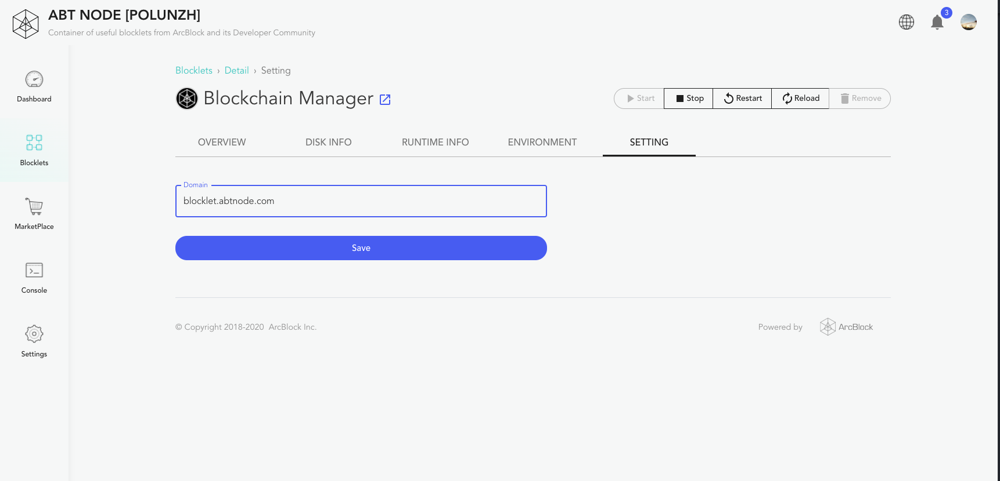
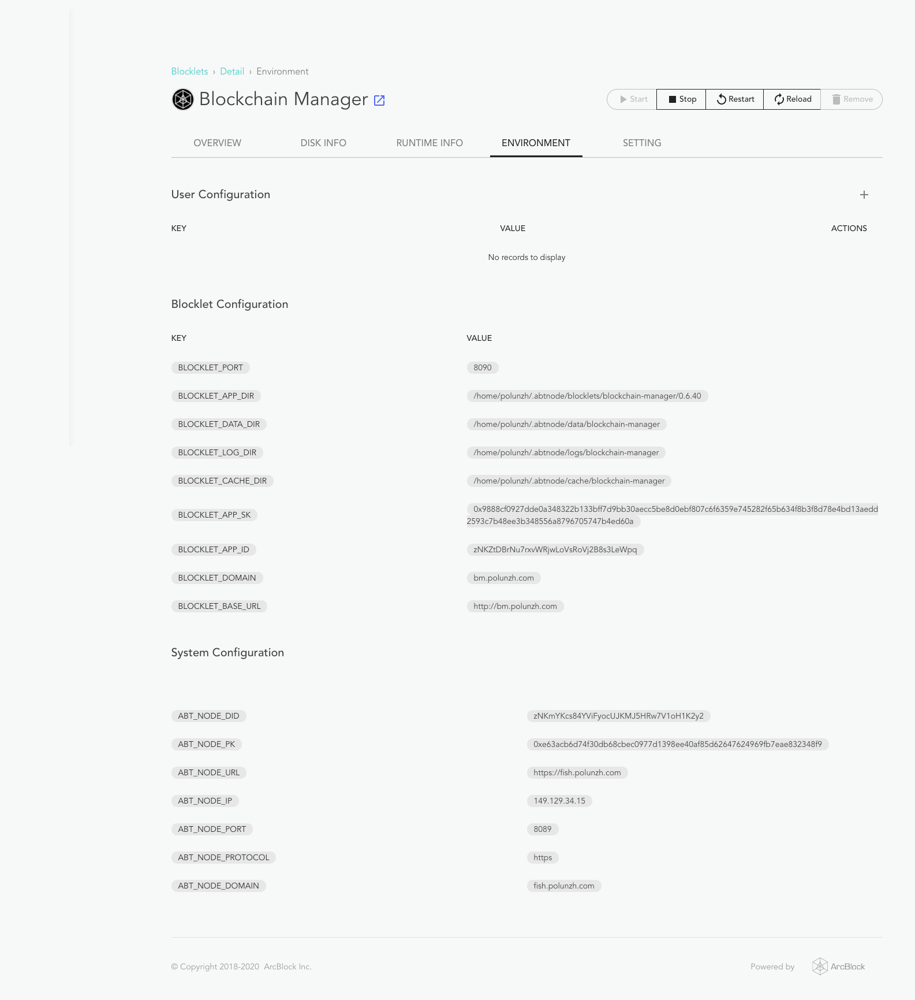

因为 ABT Node 可能会包含多个 Blocklet, 而几乎每个 Blocklet 都需要至少一个端口（静态 Blocklet 不需要）， 所以 ABT Node 和 Blocklet 会需要多个端口，所以生产环境下往往需要和反向代理服务器一起部署。
该文档将以 Nginx 为例介绍如何和反向代理服务器一起部署 ABT Node, 同时给 ABT Node Daemon 和 一个 Blocklet 分别绑定了一个域名。

::: warning
确保安装了最新版的 ABT Node
:::

## 准备条件

- 运行在 8089 端口的 ABT Node daemon 服务
- 运行在 8090 端口的 Blocklet Manager blocklet
- 代理服务器: Nginx
- 两个域名
  - ABT Node: abtnode.com
  - Blocklet Manager blocklet: blocklet.abtnode.com

## Nginx 配置

例子：

```
server {
    listen 80;
    server_name abtnode.com;

    location / {
        proxy_pass http://127.0.0.1:8089;
        proxy_set_header Host $host;
        proxy_set_header X-Real-IP $remote_addr;
        proxy_set_header X-Forwarded-For $proxy_add_x_forwarded_for;
    }
}
server {
    listen 80;
    server_name blocklet.abtnode.com;

    location / {
        proxy_pass http://127.0.0.1:8090;
        proxy_set_header Host $host;
        proxy_set_header X-Real-IP $remote_addr;
        proxy_set_header X-Forwarded-For $proxy_add_x_forwarded_for;
    }
}
```

该配置将域名 `abtnode.com` 并定在 8089 端口, 域名 `blocklet.abtnode.com` 版绑定在 8090 端口。
同时需要注意，需要将 Host 头部通过代理服务器传递给上游的服务。

## 更新 ABT Node 配置

配置好代理后，需要修改 ABT Node 的配置文件, 将 ABT Node 的域名更新到配置文件中:

```yaml
node:
  name: 'ABT Node [polunzh]'
  description: Container of useful blocklets from ArcBlock and its Developer Community
  sk: >-
    0x4000d4f04d39c700003838f04e0eb7c4006a841a2f12ed762b577b2c8ab07acbe63acb6d74f30db68cbec0977d1398ee40af85d62647624969fb7eae832348f9
  pk: '0xe63acb6d74f30db68cb0c0907d1398ee40af85d62647624969fb7eae832348f9'
  did: zNKmYKcs84YViFyocUJKMJ5HRw001oH1K2y2
  dataDir: /home/demo/.abtnode
  domain: 'abtnode.com'
  ip: 192.168.0.1
  port: 8089
  https: true
  secret: '0xa5cd176753101e5f12e604b6a741fed382c19ecfe45cd9d32a5d231404b41f23'
  owner:
    pk: ''
    did: ''
blocklet:
  port: 8089
  registry: 'https://blocklet.arcblock.io'
  owner:
    pk: ''
    did: ''
```

::: success
如果启用了 HTTPS, 需要将配置文件中的 `https` 属性设置为 `true`. 如上面的配置文件。
:::

修改好后配置文件，需要重启 ABT Node 节点并更新配置，可以通过 ABT Node CLI 命令重启:

```
abtnode start -u
```

重启服务后就可以使用域名正常访问节点了。

## 配置 Blocklet 的域名

在 **Blocklets -> 详情 -> 配置** 页面可以配置该 Blocklet 的域名，填写域名后点击保存，然后**重启 Blocklet**



::: warning
重启 Blocklet 才会使修改的域名生效
:::

## 其它

可以在 **Blocklets -> 详情 -> 环境变量** 页面找到 Blocklet 运行时所有的环境变量, 比如端口、当前的域名、IP 等等.



## 注意事项

- 当前只能通过手动修改节点的配置文件来修改节点的 IP, 域名
- 如果启用了 HTTPS, 那么需要将 ABT Node Daemon 和所有的 Blocklet 都启用 HTTPS
