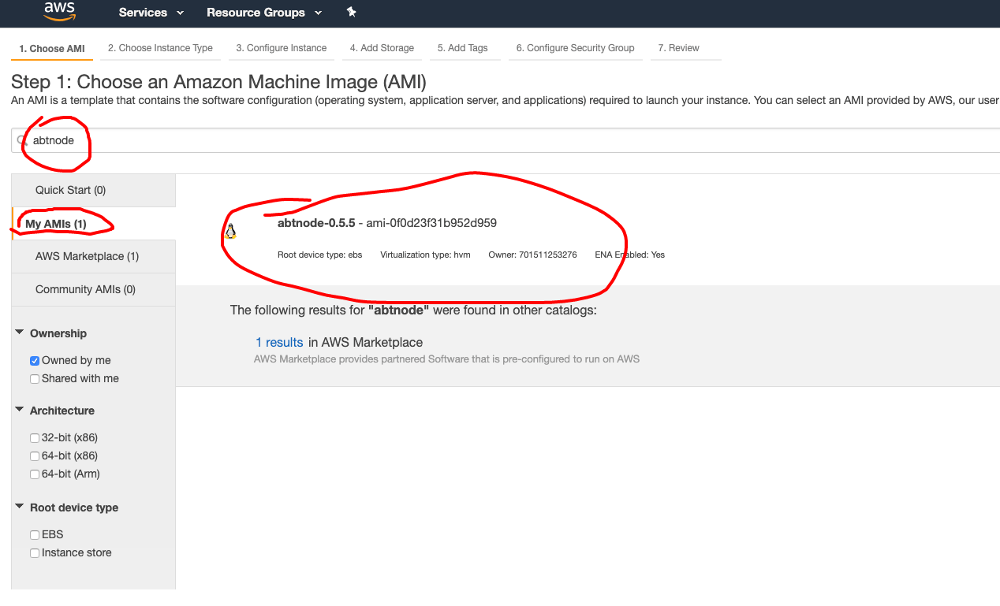
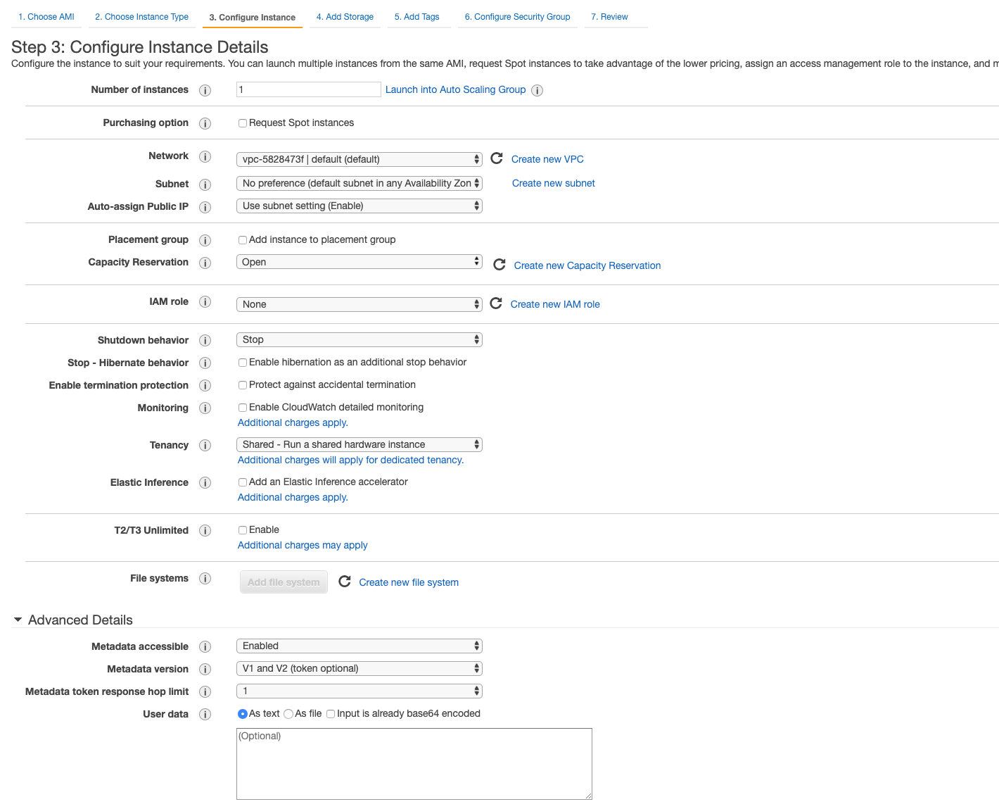
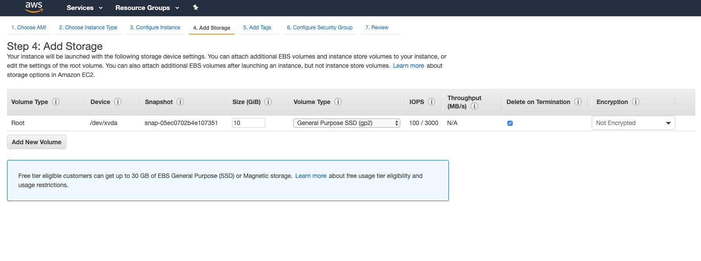
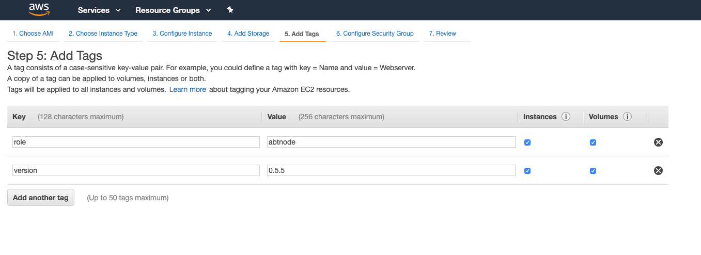
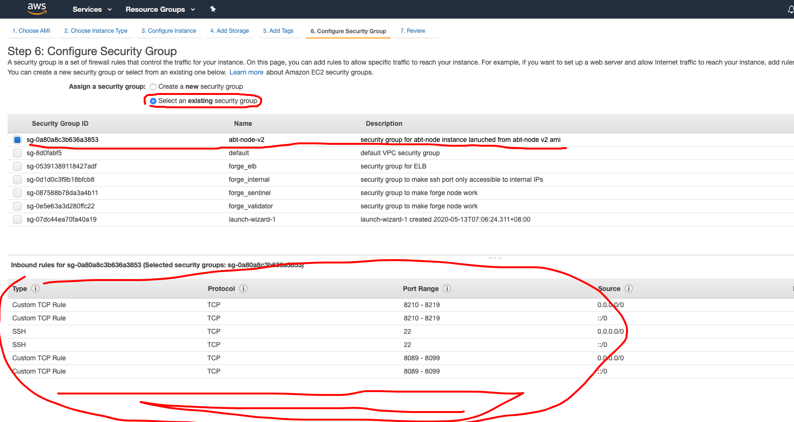
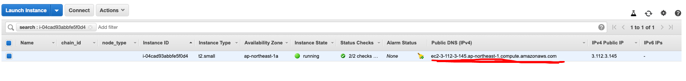

## 1. Login to AWS Console

## 2. Find EC2 Dashboard

Select "instance" on the left, then click the "Launch" button.

## 3. Find and Select ABT Node AMI

Select "My AMIs" on the left, then search by keyword "abtnode", you should see following results, please remember to always use latest when launch new ABT Node instances.

## 4. Select Instance Type

`t4.small` should be ok.

## 5. Config Instance

Keep everything as default should work, please remember to enable public IP for the instance.

## 6. Config Storage

If you just want to play with ABT Node, use a small root disk (10GB) should be ok, if you plan to start forge powered chains, please set a larger disk, please also note that ABT Node stores all data on root disk by default, but this can be configured.

## 7. Add tags

You can add tags to your ABT Node instance to find it easier later.

## 8. Config Security Group

**This step is critical**, if not properly configured, your node will not be accessible from the web.

By default, ABT Node AMI requires following ports to open:

- 22: for SSH access, if you will never do manual configuration for the node, disable it.
- 8089~8099: to serve the ABT Node Dashboard and blocklets, by default this will limit the blocklets you can install
- 8210~8219: to serve the blockchain GraphQL endpoint, by default 10 chains is supported at most

## 9. Select KeyPair and Launch

If you do not need to SSH access to the instance, you can choose no key pair.

Then, you are all setup, hit the "Launch" button on right bottom, and wait for the instance to be ready.

## 10. Setup the ABT Node

Grab your instance public hostname as illustrated in following screenshot.

Open `http://YOUR_PUBLIC_HOSTNAME:8089` to setup your node, this step requires you have [ABT Wallet](https://abtwallet.io) installed.

## 11. Install blocklets and enjoy!

Currently we have several blocklets published in our official blocklet registry, you can download/install/start and play with them directly.

Enjoy!
