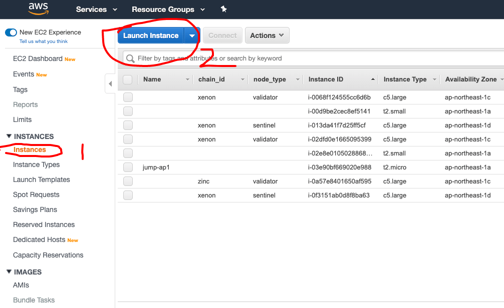

## 1. Login to AWS Console

## 2. Find EC2 Dashboard

Select "instance" on the left, then click the "Launch" button.

## 3. Find and Select ABT Node AMI

Select "My AMIs" on the left, then search by keyword "abtnode," you should see the following results. Please remember to
always use the latest version of ABT Node when launching new ABT Node instances.

## 4. Select Instance Type

`t4.small` should be ok.

## 5. Config Instance

Keep everything as default should work, please remember to enable public IP for instance.

## 6. Config Storage

If you want to play with ABT Node, a small root disk (10GB) should be ok, but if you plan to start forge-powered chains,
please use a larger drive. Also note that ABT Node stores all data on the root disk by default, but you can change this
behavior.

## 7. Add tags

You can add tags to your ABT Node instance to find it easier later.

## 8. Config Security Group

**This step is critical.** If not correctly configured, your node will not be accessible from the web.

By default, ABT Node AMI requires the following ports to open:

- 22: for SSH access, if you will never do the manual configuration for the node, disable it.
- 8089~8099: to serve the ABT Node Dashboard and blocklets, by default this will limit the blocklets you can install
- 8210~8219: to serve the blockchain GraphQL endpoint, by default ten chains is supported at most

## 9. Select KeyPair and Launch

If you do not need SSH access to the instance, you can choose no key pair.

Then, you are all set up, hit the "Launch" button on the right bottom, and wait for the instance to be ready.

## 10. Setup the ABT Node

Grab your instance public hostname as illustrated in the following screenshot.

Open `http://YOUR_PUBLIC_HOSTNAME:8089` to set up your node; this step requires you have [ABT Wallet](
https://abtwallet.io) installed.

## 11. Install blocklets and enjoy!

Currently, we have several blocklets published in our official blocklet registry; you can download/install/start and
play with them.

Enjoy!
