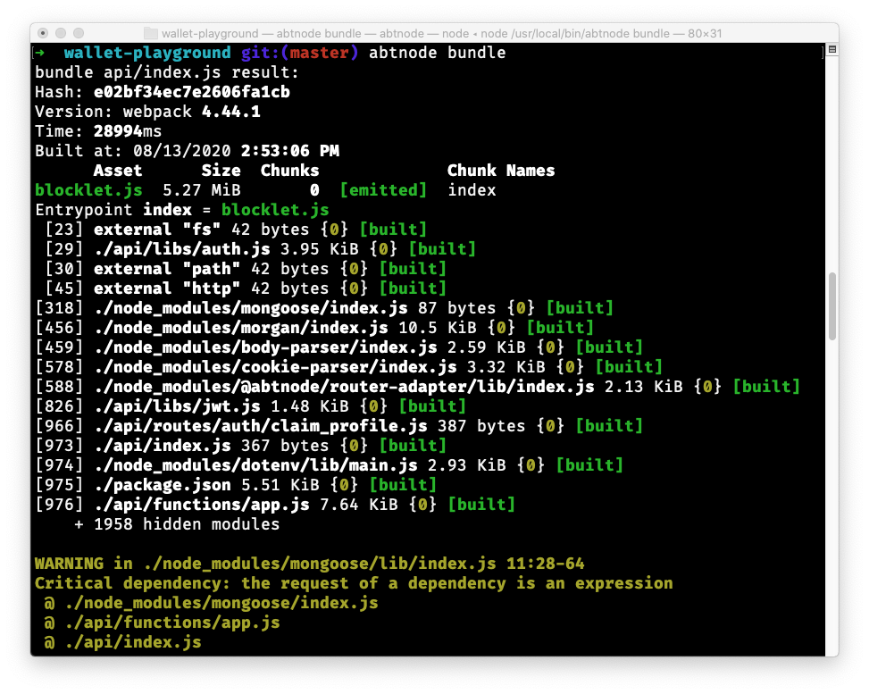
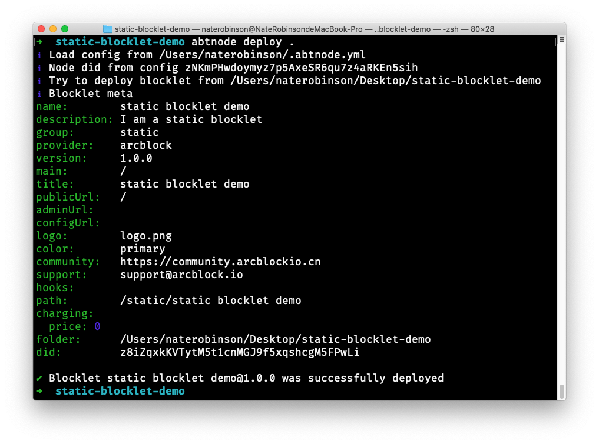
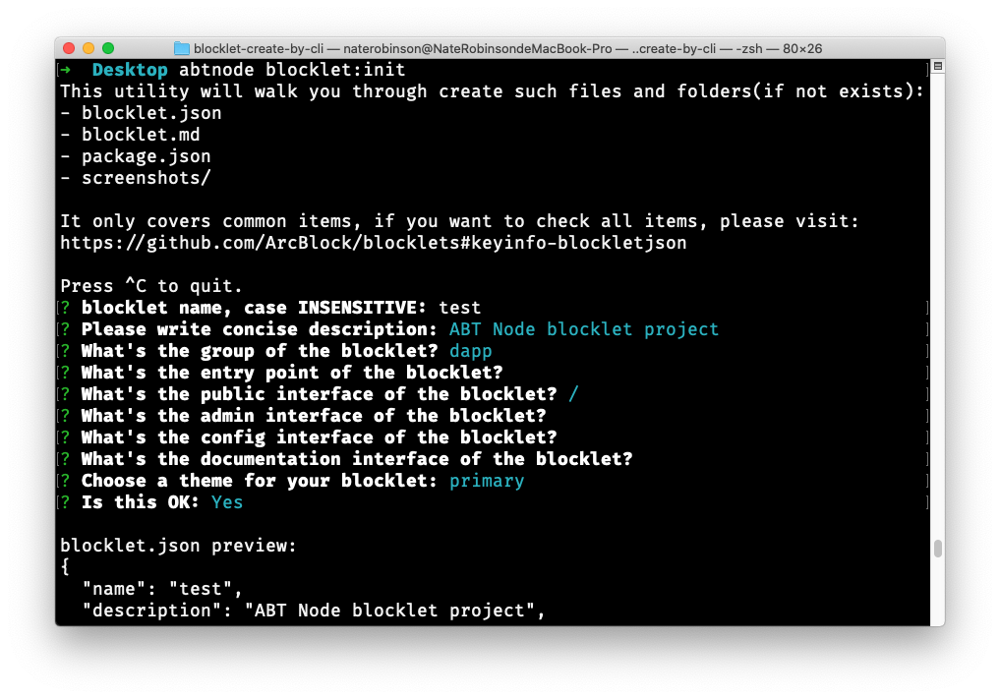
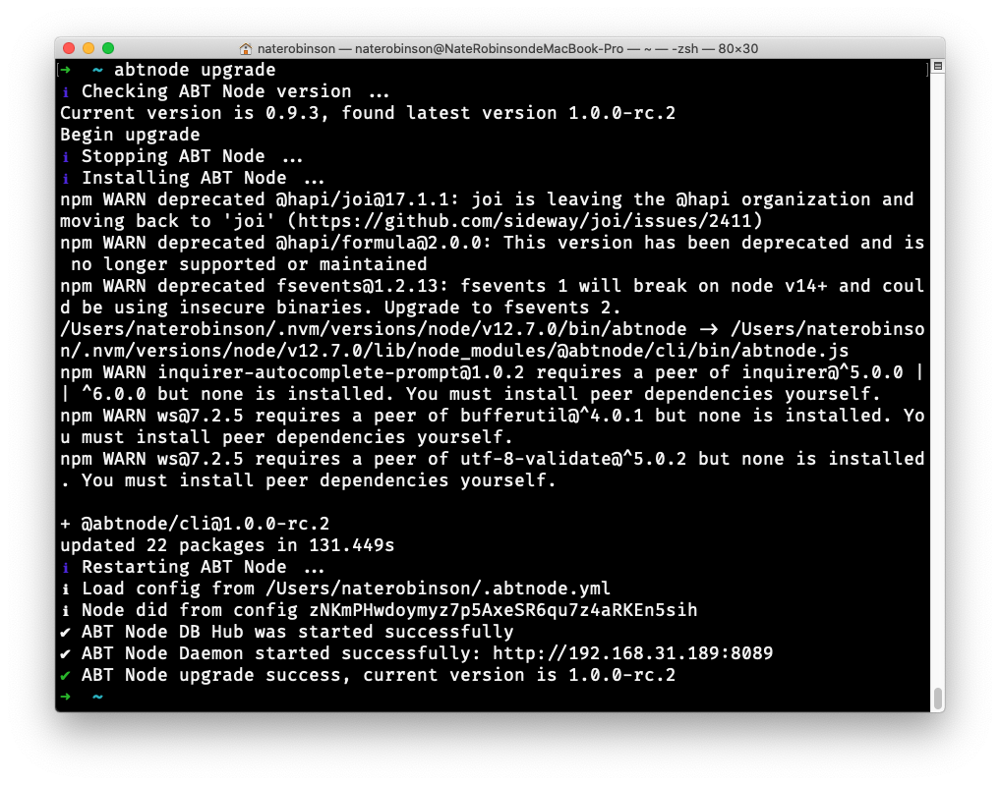
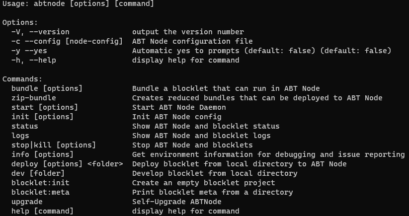

为了方便用户使用 ABT 节点，我们为其量身定制了一个 CLI 工具：`abtnode cli`, 我们先看看它长什么样：

```bash
➜  ~ abtnode -h
Usage: abtnode [options] [command]

Options:
  -V, --version              output the version number
  -c --config [node-config]  ABT Node configuration file
  -s --silent                Should we run in silent mode (default: false)
                             (default: false)
  -y --yes                   Automatic yes to prompts (default: false)
                             (default: false)
  -h, --help                 display help for command

Commands:
  bundle [options]           Bundle a blocklet that can run in ABT Node
  start [options]            Start ABT Node Daemon
  init                       Init ABT Node config
  status                     Show ABT Node and blocklet status
  logs                       Show ABT Node and blocklet logs
  stop|kill [options]        Stop ABT Node and blocklets
  info [options]             Get environment information for debugging and
                             issue reporting
  deploy [options] <folder>  Deploy blocklet from local directory to ABT Node
  blocklet:init              Create an empty blocklet project
  upgrade                    Self-Upgrade ABTNode
  help [command]             display help for command
```

可以看到它提供了丰富的命令供用户使用，主要的命令有：

### 1. abtnode bundle [options]

用来打包一个 Blocklet



### 2. start [options]

启动 ABT 节点

```bash
➜ abtnode start
ℹ Load config from /Users/naterobinson/.abtnode.yml
ℹ Node did from config zNKjPn1W28J6AVQdJjLhjYjmLtyvq7dSvE12
✔ ABT Node Daemon started successfully: http://192.168.31.189/
```

### 3. init

初始化 ABT 节点

```bash
➜ abtnode init
✔ Done!
? Please name your Node ABT Node [naterobinson]
? Give a concise description of your node Container of useful blocklets from Arc
Block and its Developer Community
? Which IP do you want your node to serve on? 192.168.31.189
? Which port do you want your node to listen on? 8089
? Choose routing engine none
? Where does your Node fetch blocklet from? https://blocklet.arcblock.io
? Where do you want ABT Node to store data? /Users/naterobinson/.abtnode
? Where do you want to save config file? /Users/naterobinson/.abtnode.yml
✔ ABT Node configuration is successfully generated /Users/naterobinson/.abtnode.yml
ℹ Now you can start your ABT Node with the following command
ℹ abtnode start
```

### 4. status

查看当前节点的状态

```bash
➜ abtnode status
ℹ Load config from /Users/naterobinson/.abtnode.yml
ℹ Node did from config zNKmPHwdoymyz7p5AxeSR6qu7z4aRKEn5sih

ABT Node is: Running

Blocklets Status
⚠ No blocklets installed yet.
```

### 5. logs

查看当前节点的日志

```bash
➜ abtnode logs
ℹ Load config from /Users/naterobinson/.abtnode.yml
ℹ Node did from config zNKmPHwdoymyz7p5AxeSR6qu7z4aRKEn5sih

ABT Node Logs
- Output: /Users/naterobinson/.abtnode/core/output.log
- Error: /Users/naterobinson/.abtnode/core/error.log
⚠ No blocklets installed yet.
```

### 6. stop|kill [options]

停止 ABT 节点

```bash
➜ abtnode stop
ℹ Load config from /Users/naterobinson/.abtnode.yml
ℹ Node did from config zNKmPHwdoymyz7p5AxeSR6qu7z4aRKEn5sih
✔ abt-node-daemon is stopped successfully
✔ abt-node-db-hub is stopped successfully
✔ Routing engine is stopped successfully
✔ Done!
```

### 7. info [options]

查看当前节点的信息

```bash
➜ abtnode info

  System:
    OS: macOS 10.15.5
    CPU: (12) x64 Intel(R) Core(TM) i7-8850H CPU @ 2.60GHz
    Shell: 5.7.1 - /bin/zsh
  Binaries:
    Node: 12.7.0 - ~/.nvm/versions/node/v12.7.0/bin/node
    Yarn: 1.22.4 - ~/.nvm/versions/node/v12.7.0/bin/yarn
    npm: 6.10.0 - ~/.nvm/versions/node/v12.7.0/bin/npm
  Servers:
    Apache: 2.4.41 - /usr/sbin/apachectl
    Nginx: 1.19.1 - /usr/local/bin/nginx
  Virtualization:
    Docker: 19.03.2 - /usr/local/bin/docker
  Browsers:
    Chrome: 84.0.4147.125
    Safari: 13.1.1
  npmGlobalPackages:
    npm: 6.10.0
    pm2: 4.4.0
    yarn: 1.22.4
```

### 8. deploy [options] <folder>

部署 blocklet



### 9. blocklet:init

初始化一个空的 blocklet 项目



### 10. upgrade

升级 ABT 节点



### 11. help [command]

查看帮助命令


