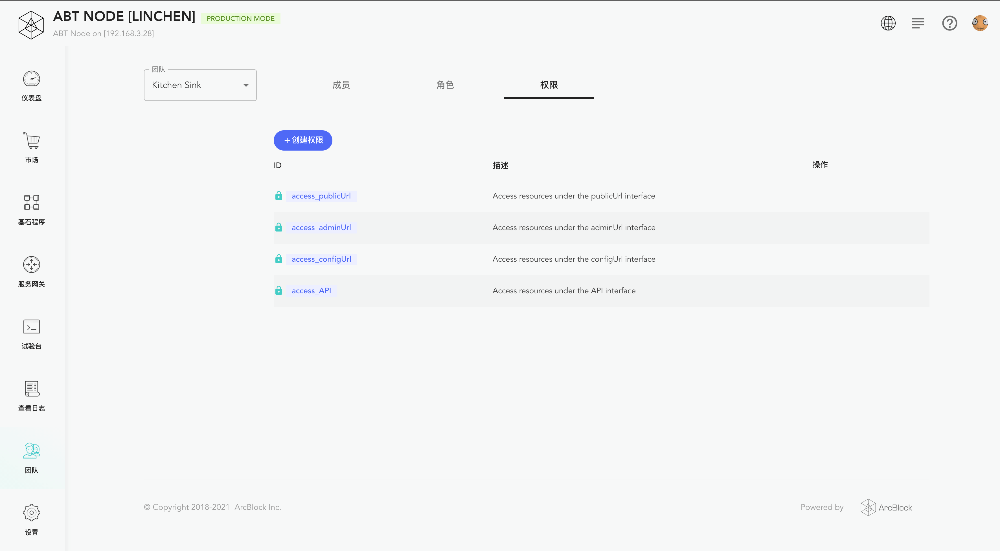

Auth Service is a general Auth service provided by ABT Node for Blocklet.

Blocklet can be declaratively enabled and configured Auth Service in `blocklet.yml`.

Auth Service includes the following main capabilities:
- Set accessible after login
- Set accessible after authorization
- Set invitation login or open login

## Demo

[https://github.com/blocklet/auth-demo](https://github.com/blocklet/auth-demo)

## Enable Auth Service
Enable Auth Service by configuring in `blocklet.yml`, under the interface that needs to start Auth Service

```yml
interfaces:
  - type: web
    name: xxxx
    # ... other interface config
    services:
      - name: '@abtnode/auth-service'
      - config:
        # ...
```

## Configuration
e.g.

```yml
interfaces:
  - type: web
    name: publicUrl
    # ... other interface config
    services:
      - name: '@abtnode/auth-service'
        config:
          invitedUserOnly: no
          profileFields:
            - fullName
            - email
            - avatar
          webWalletUrl: https://web.abtwallet.io
          ignoreUrls:
            - /public/**
          blockUnauthenticated: true
          blockUnauthorized: false
```

- invitedUserOnly: Is only invited users are allowed to login?
  - default: no
- profileFields: What info do you want user to provide when login?
  - default: [fullName, email, avatar]
- blockUnauthenticated: Do you want Auth Service block unauthenticated requests for you?
  - default: true
- blockUnauthorized: Do you want Auth Service block unauthorized requests for you?
  - default: false
- ignoreUrls: Which URLs do not need to be protected?
  - default: none
- webWalletUrl: The URL of your preferred web wallet instance
  - default: https://web.abtwallet.io

## Set accessible after login
After Auth Service is enabled, Auth Service will automatically intercept requests that are not logged in and jump to the Auth Service login page.

If Blocklet wants to handle unlogged requests by itself, it can be configured as follows:

```yml
interfaces:
  - type: web
    name: xxxx
    # ... other interface config
    services:
      - name: '@abtnode/auth-service'
        config:
          blockUnauthenticated: no
```

## Set accessible after authorization

After enabling Auth Service, Auth Service will **not** automatically intercept unauthorized requests. Blocklet needs to handle it by itself.

If Blocklet wants Auth Service to automatically intercept unauthorized requests, you can do the following configuration:

```yml
interfaces:
  - type: web
    name: xxxx
    # ... other interface config
    services:
      - name: '@abtnode/auth-service'
        config:
          blockUnauthorized: yes
```

After setting the Auth Service automatic interception, you need to bind the corresponding interface permissions for the user in the ABT Node dashboard.（The permission control of ABT Node is based on [RBAC](https://en.wikipedia.org/wiki/Role-based_access_control)）




## Set invitation login or open login
Configure invitation login or open login via `invitedUserOnly`

```yml
interfaces:
  - type: web
    name: xxxx
    # ... other interface config
    services:
      - name: '@abtnode/auth-service'
        config:
          blockUnauthorized: yes
```

- invitedUserOnly
  - no: Open login (default)
  - yes: Only log in via invitation link
  - not-first: Only the first login user does not need to go through the invitation link