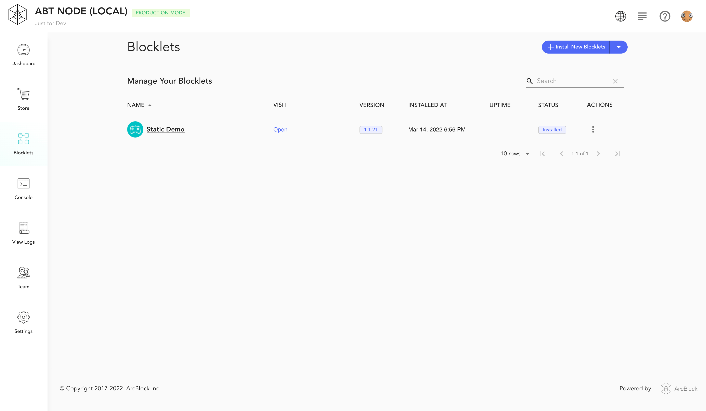

Auth Service is a general Auth service provided by Blocklet Server for Blocklet.

Blocklet can be declaratively enabled and configured Auth Service in `blocklet.yml`.

Auth Service includes the following main capabilities:
- Set accessible after login
- Set accessible after authorization
- Set invitation login or open login

## Getting Started
[static-demo-blocklet](https://github.com/blocklet/html-2048-sample) is an html5 game that can be run on Blocklet Server. The following will introduce how to make a static-demo-blocklet with Auth capability (login protection)

0. Prerequisites: Install and run Blocklet Server v1.2.0 or higher locally

1. Download the project source code [html-2048-sample](https://github.com/blocklet/html-2048-sample)

2. Open `blocklet.yml` in the project root directory, find the interface whose name is publicUrl, and add the Auth Service configuration

``` yml
interfaces:
  - type: web
    name: publicUrl
    path: /
    prefix: '*'
    port: BLOCKLET_PORT
    protocol: tcp
+   services:
+     - name: '@abtnode/auth-service'
```

3. Execute `blocklet bundle` in the project root directory. After successful execution, you will see the successfully created blocklet bundle in `.blocklet/bundle`.

```
linchen@LinkdeMacBook-Pro html-2048-sample % blocklet bundle

ℹ Bundling in zip mode for blocklet static-demo-blocklet...

✔ Creating blocklet bundle in .blocklet/bundle... Done in 0.018s
✔ Blocklet static-demo-blocklet@1.1.7 is successfully bundled!
```

4. Execute `blocklet deploy .blocklet/bundle` in the project root directory to publish the blocklet bundle to the locally running Blocklet Server.

```
linchen@LinkdeMacBook-Pro html-2048-sample % blocklet deploy .blocklet/bundle
ℹ Try to deploy blocklet from /Users/linchen/code/blocklet/html-2048-sample/.blocklet/bundle to Local Blocklet Server
ℹ Node did from config zNKqGAvUzcCowxtNA5r5gKQYUm2hR4X2SE2o
ℹ Load config from /Users/linchen/code/arcblock/andata/.abtnode/abtnode.yml
✔ Blocklet static-demo-blocklet@1.1.7 was successfully deployed!
```

5. Start Static Demo in Blocklet Server dashboard



6. When you visit Static Demo, you will see the login page, which means that Static Demo already has the Auth capability.


7. After the login is successful, you will successfully see the game page. At this point, you will see the information of the logged-in user in the Blocklet Server dashboard.


Congratulations!

## Demo

[https://github.com/blocklet/auth-demo](https://github.com/blocklet/auth-demo): Implement login, logout, display user information, authentication and authorization functions based on Auth Service

## Enable Auth Service
Enable Auth Service by configuring in `blocklet.yml`, under the interface that needs to start Auth Service

```yml
interfaces:
  - type: web
    name: xxxx
    # ... other interface config
    services:
      - name: '@abtnode/auth-service'
      - config:
        # ...
```

## Configuration
e.g.

```yml
interfaces:
  - type: web
    name: publicUrl
    # ... other interface config
    services:
      - name: '@abtnode/auth-service'
        config:
          invitedUserOnly: no
          profileFields:
            - fullName
            - email
            - avatar
          webWalletUrl: https://web.abtwallet.io
          ignoreUrls:
            - /public/**
          blockUnauthenticated: true
          blockUnauthorized: false
```

- invitedUserOnly: Is only invited users are allowed to login?
  - default: no
- profileFields: What info do you want user to provide when login?
  - default: [fullName, email, avatar]
- blockUnauthenticated: Do you want Auth Service block unauthenticated requests for you?
  - default: true
- blockUnauthorized: Do you want Auth Service block unauthorized requests for you?
  - default: false
- ignoreUrls: Which URLs do not need to be protected?
  - default: none
- webWalletUrl: The URL of your preferred web wallet instance
  - default: https://web.abtwallet.io

## Set accessible after login
After Auth Service is enabled, Auth Service will automatically intercept requests that are not logged in and jump to the Auth Service login page.

If Blocklet wants to handle unlogged requests by itself, it can be configured as follows:

```yml
interfaces:
  - type: web
    name: xxxx
    # ... other interface config
    services:
      - name: '@abtnode/auth-service'
        config:
          blockUnauthenticated: false
```

## Set accessible after authorization

After enabling Auth Service, Auth Service will **not** automatically intercept unauthorized requests. Blocklet needs to handle it by itself.

If Blocklet wants Auth Service to automatically intercept unauthorized requests, you can do the following configuration:

```yml
interfaces:
  - type: web
    name: xxxx
    # ... other interface config
    services:
      - name: '@abtnode/auth-service'
        config:
          blockUnauthorized: true
```

After setting the Auth Service automatic interception, you need to bind the corresponding interface permissions for the user in the Blocklet Server dashboard.（The permission control of Blocklet Server is based on [RBAC](https://en.wikipedia.org/wiki/Role-based_access_control)）


## Set invitation login or open login
Configure invitation login or open login via `invitedUserOnly`

```yml
interfaces:
  - type: web
    name: xxxx
    # ... other interface config
    services:
      - name: '@abtnode/auth-service'
        config:
          invitedUserOnly: yes
```

- invitedUserOnly
  - no: Open login (default)
  - yes: Only log in via invitation link
  - not-first: Only the first login user does not need to go through the invitation link