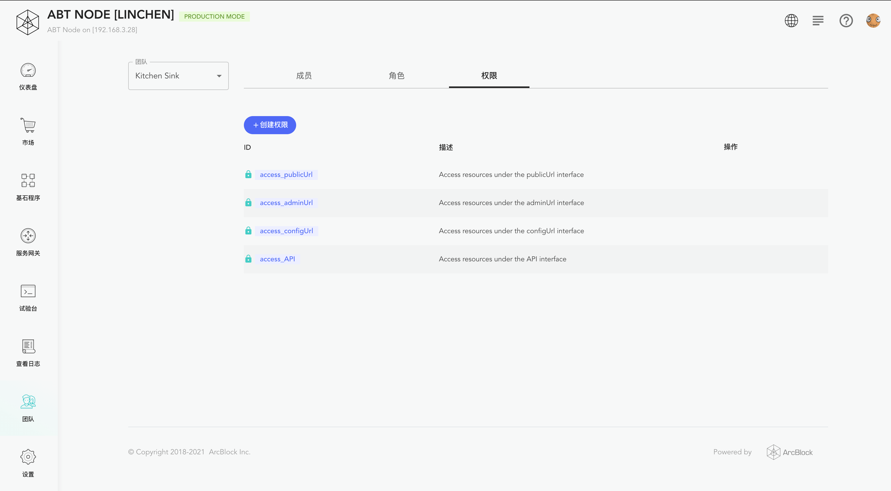

Auth Service 是 ABT Node 为 Blocklet 提供的通用 Auth 服务。

Blocklet 可以通过在 `blocklet.yml` 中以声明的方式启用和配置 Auth Service.

Auth Service 包含以下主要能力：
- 设置登录可访问
- 设置授权可访问
- 设置邀请登录和开放登录

## Demo

[https://github.com/blocklet/auth-demo](https://github.com/blocklet/auth-demo)

## 启用 Auth Service
在 `blocklet.yml` 中，在需要启动 Auth Service 的 interface 下，配置并启用 Auth Service

```yml
interfaces:
  - type: web
    name: xxxx
    # ... other interface config
    services:
      - name: '@abtnode/auth-service'
      - config:
        # ...
```

## 配置
e.g.

```yml
interfaces:
  - type: web
    name: publicUrl
    # ... other interface config
    services:
      - name: '@abtnode/auth-service'
        config:
          invitedUserOnly: no
          profileFields:
            - fullName
            - email
            - avatar
          webWalletUrl: https://web.abtwallet.io
          ignoreUrls:
            - /path/to/**
          blockUnauthenticated: true
          blockUnauthorized: false
```

- invitedUserOnly: 是否只能通过邀请链接登录
  - default: no
- profileFields: 登录时需要提供的身份信息
  - default: [fullName, email, avatar]
- blockUnauthenticated: Auth Service 是否自动拦截未登录的请求, 并跳转到登录页
  - default: true
- blockUnauthorized: Auth Service 是否自动拦截未授权的请求
  - default: false
- ignoreUrls: Auth Service 不会拦截哪些 url
  - default: none
- webWalletUrl: 通过 Auth Service 登录时的 Web Wallet 地址
  - default: https://web.abtwallet.io

## 设置登录可访问
启用 Auth Service 后，Auth Service 会自动拦截未登录的请求, 并跳转到 Auth Service 登录页.

如果 Blocklet 希望自己处理未登录的请求, 可以做如下配置:

```yml
interfaces:
  - type: web
    name: xxxx
    # ... other interface config
    services:
      - name: '@abtnode/auth-service'
        config:
          blockUnauthenticated: no
```

## 设置授权可访问

启用 Auth Service 后，Auth Service **不会** 自动拦截未授权的请求. Blocklet 需要自己处理.

如果 Blocklet 希望 Auth Service 自动拦截未授权的请求, 可以做如下配置:

```yml
interfaces:
  - type: web
    name: xxxx
    # ... other interface config
    services:
      - name: '@abtnode/auth-service'
        config:
          blockUnauthorized: yes
```

设置 Auth Service 自动拦截后，需要在 ABT Node dashboard 中为 user 绑定相应接口的权限。（ABT Node 的权限控制基于 [RBAC](https://en.wikipedia.org/wiki/Role-based_access_control)）




## 设置邀请登录和开放登录
通过 `invitedUserOnly` 配置邀请登录和开放登录

```yml
interfaces:
  - type: web
    name: xxxx
    # ... other interface config
    services:
      - name: '@abtnode/auth-service'
        config:
          blockUnauthorized: yes
```

- invitedUserOnly
  - no: 开放登录 (默认)
  - yes: 只能通过邀请链接登录
  - not-first: 只有第一个登录用户不需要通过邀请链接