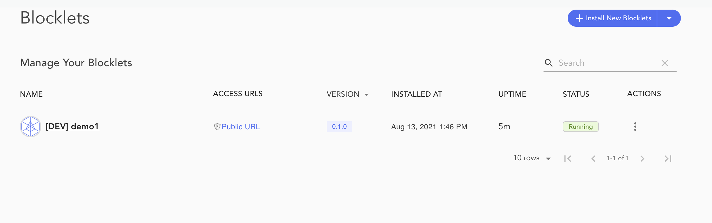

You can quickly create blocklets by using [create-blocklet](https://github.com/blocklet/create-blocklet/) node package. The command generates Blocklet with a working project template with opinionated default values.

The command allows you to generate static- browser-based blocklets and dynamic blocklets - with Nodejs serverside. It also provides support to configure various ABTNode services like authentication.

> ## Prerequisite
> The `create-blocklet` package required Node version 14 and above.

## Generate
Generate the Blocklet by using `npm` command.

`npm init blocklet@latest [blocklet-name]`

The terminal would prompt for user inputs regarding the Blocklet type and ABT Node services.

*Look into the README for the generated project to know details about the Project structure and recommended commands.*

```bash
$ npm init blocklet@latest demo1
npx: installed 117 in 11.608s
null
✔ What type blocklet you want to create: › webapp: browser only
✔ Select a framework: › react
✔ Choose blocklet services: ›

                 Powered By
     _             ____  _            _    
    / \   _ __ ___| __ )| | ___   ___| | __
   / _ \ | '__/ __|  _ \| |/ _ \ / __| |/ /
  / ___ \| | | (__| |_) | | (_) | (__|   <
 /_/   \_\_|  \___|____/|_|\___/ \___|_|\_\

Documentation: https://docs.arcblock.io/abtnode/

Checking abtnode runtime environment...

You need to start your abtnode before develop this blocklet.
Now you should run:

abtnode start -a


Scaffolding project in /data/abtnode/demo1...


✨  Done. Now run:

      cd demo1
     npm install
blocklet dev

Find more usage in README.md


   ╭────────────────────────────────────────────────────────────────╮
   │                                                                │
   │     New major version of npm available! 6.14.14 -> 7.20.6      │
   │   Changelog: https://github.com/npm/cli/releases/tag/v7.20.6   │
   │               Run npm install -g npm to update!                │
   │                                                                │
   ╰────────────────────────────────────────────────────────────────╯

```

## Bootstrap ABT Node

 You need to deploy the Blocklet to an ABTNode instance.  It is recommended to run ABTNode on your workstation. Start an instance by using the [start](../abtnode-cli#start) command.

 ```
 $ abtnode start -a
abtnode start v1.4.6
ℹ Initialize new ABT Node instance config in /data/abtnode...
ℹ Node did from config zNKXSNiTQFGeK7213oAP4GvrtC8NgLQPzwhH
ℹ Load config from /data/abtnode/.abtnode/abtnode.yml
✔ ABT Node DB Proxy ready on port 40404
✔ ABT Node Event Hub ready on port 40407
✔ ABT Node Updater ready on port 40405
✔ Dashboard HTTPS certificate was downloaded successfully!
✔ Starting ABT Node Service... Done in 8.132s
✔ Starting ABT Node Daemon... Done in 8.054s
 ```

## Build Blocklet
Next, move to the blocklet project and build it using `npm install` command.

## Deploy Blocklet
Lastly, deploy the Blocklet by using `blocklet dev` command. ABT Node Blocklet dashboard will show the deployed Blocklet.


