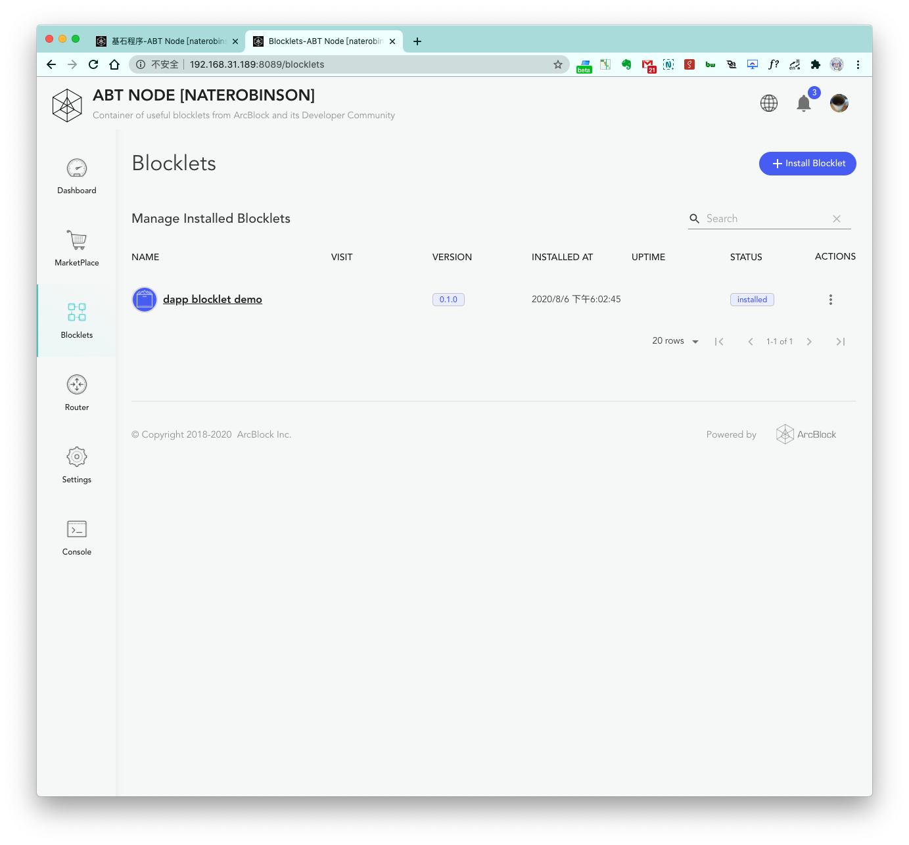
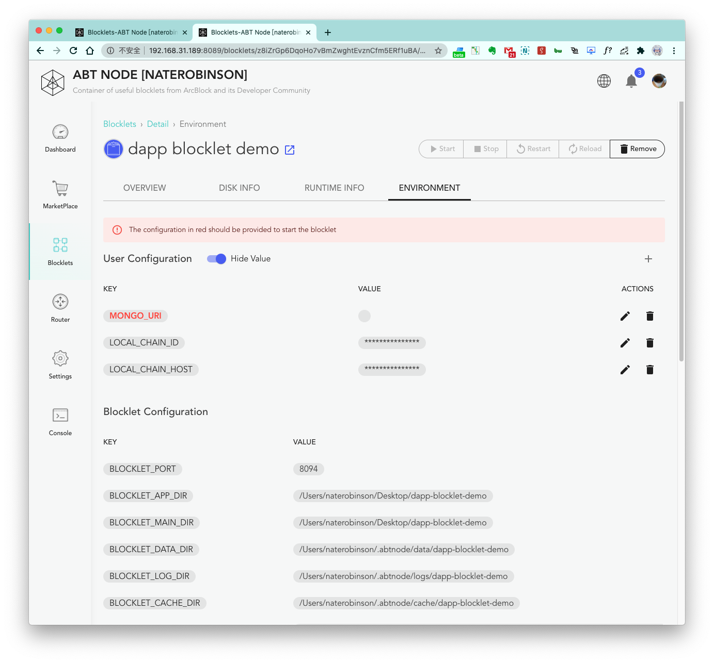
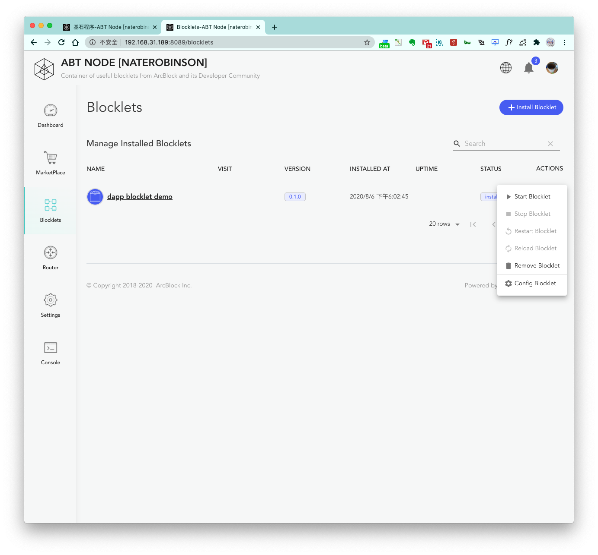

The previous section [Create Static Blocklets](static-blocklets) introduced in detail how to create a static blocklet
that can be deployed and run in ABT Node from scratch. This section is about creating and deploying a DApp blocklet from
scratch in ABT Node.

## Step 1: Preparing the Environment

1. First, set up Node.js development environment.


2. Then, install Forge CLI.


3. Next, initialize and run ABT Node.


4. Finally, install MongoDB and run it locally.

## Step 2: Create DApp Blocklet

We will use the `forge blocklet:use forge-react-starter` command in `forge cli` to generate a Dapp Blocklet template
project.

1. First, create a project directory and enter it. `forge blocklet:use forge-react-starter` will be run from this
directory

```terminal
mkdir dapp-blocklet-demo
cd dapp-blocklet-demo
```

2. Next, run `forge blocklet:use forge-react-starter` to complete the creation of the template project.

For the steps here, please refer to the document: [Use Starter Blocklet](
/handbook/7-working-with-blocklets/starter-blocklets)

3. Then, run the project.

Execute `yarn start` in the project's main directory to run the project.


After the generated template project is successfully configured, it can run locally.


## Step 3: Deploy DApp Blocklet

First, press `Ctrl+C` to stop the local test process, and then execute the `abtnode deploy .` command.


After the deployment succeeded, take a look at the ABT Node `Corner Program` page.



## Step 4: Configure DApp Blocklet

If we directly click on the More menu on the far right of `dapp blocklet demo`, the gray button cannot be clicked when
the `Start` button will appear. The appearance of the `Start` button indicates that our DApp needs some configure. Click
on the details page.



Let's configure `MONGO_URI` as local: `mongodb://127.0.0.1:27017/dapp-blocklet-demo`.

## Step 5: Run DApp Blocklet

Click to open the three dots on the right side of the just deployed `dapp blocklet demo`, and select `Start`:



The blocklet should now be in the `running` state. Click on the `public interface` to verify that it's running:


We have now successfully created a DApp blocklet in ABT Node.
