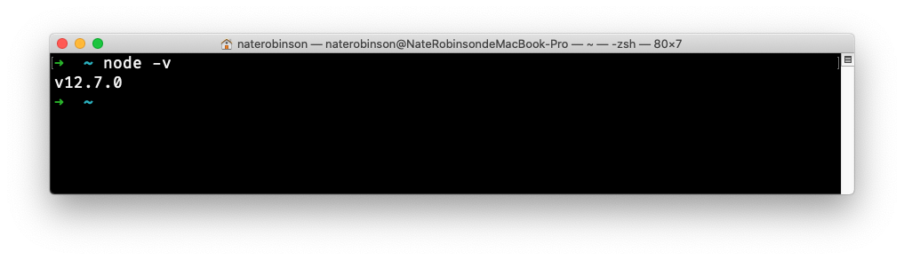
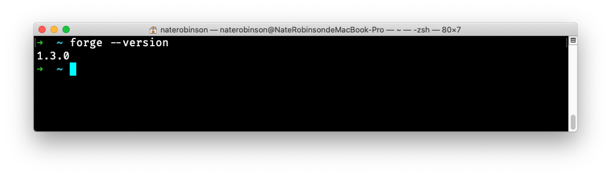
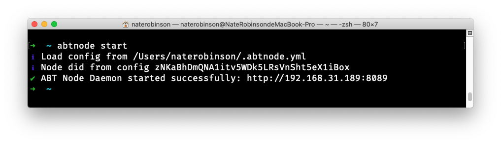
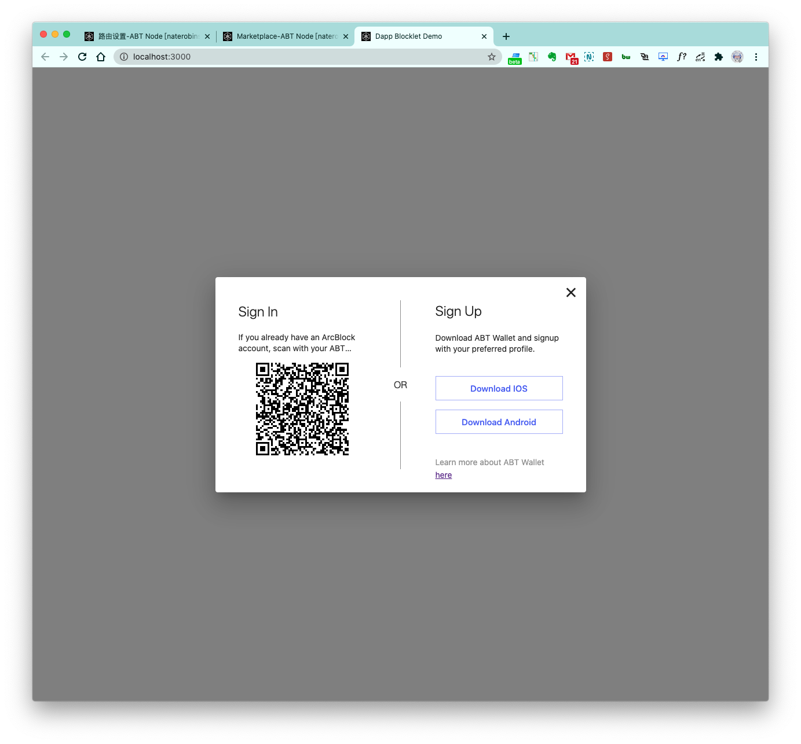
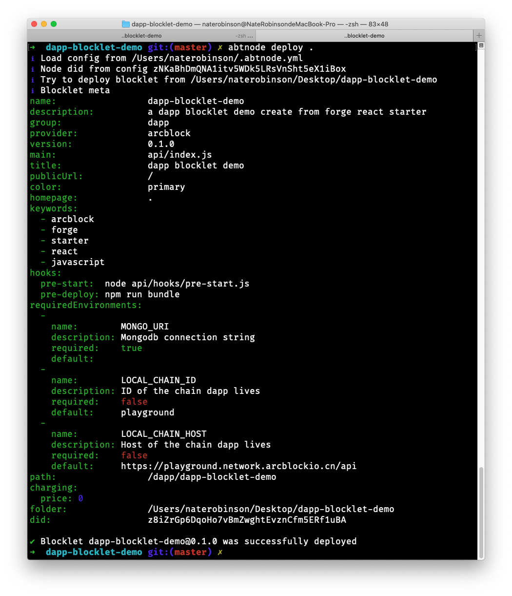
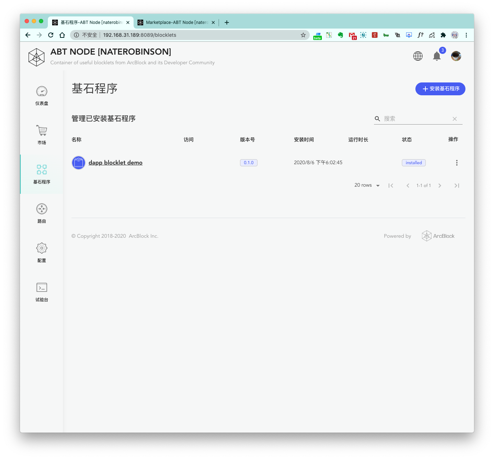
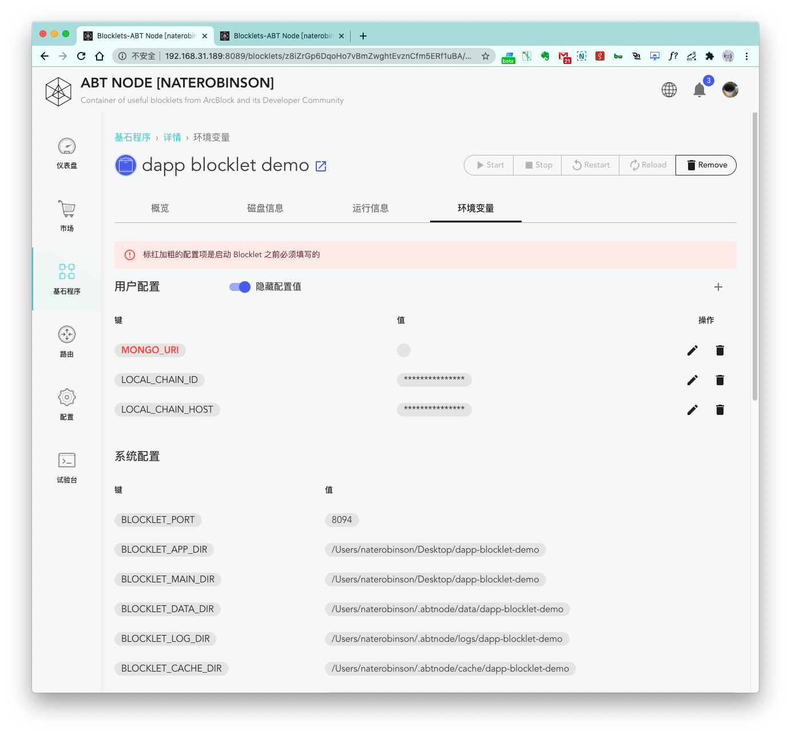
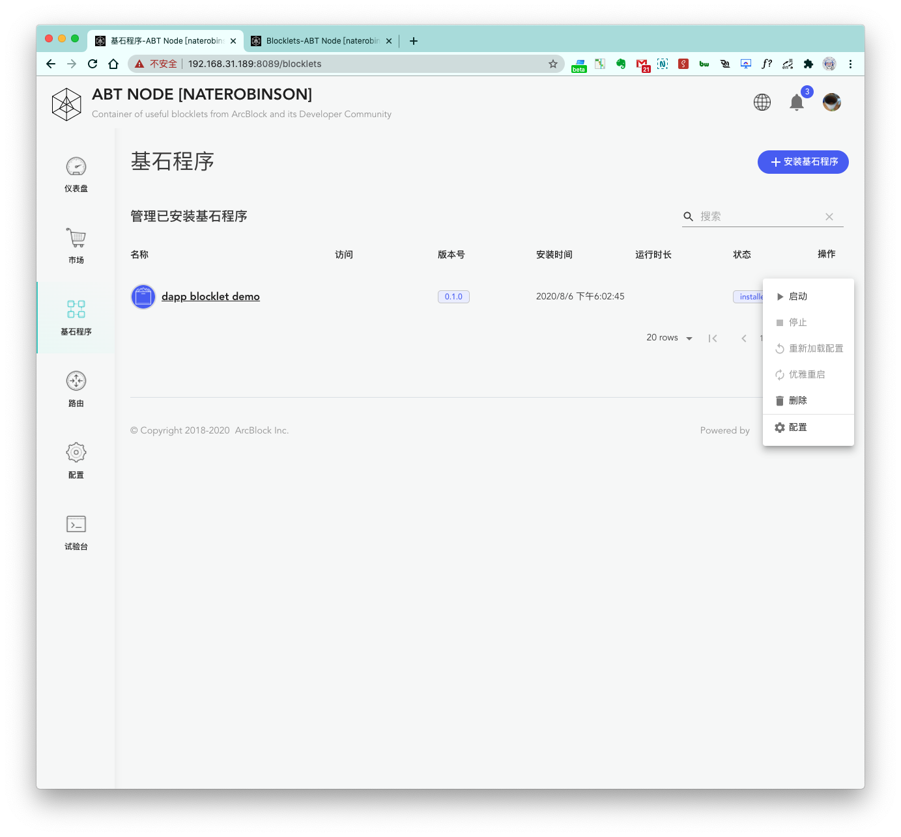
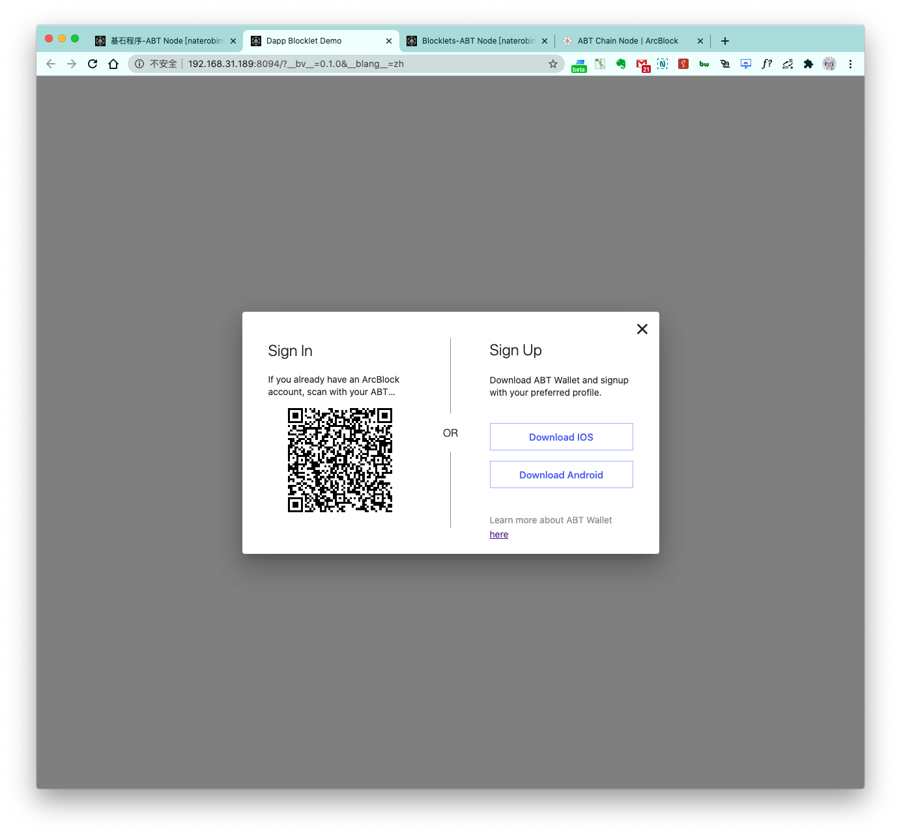

上一个章节：[创建静态 Blocklets](/zh/abtnode/developer/static-blocklets) 详细介绍了如果从 0 到 1 创建一个可以部署运行在 ABT Node 里面的静态 Blocklet， 这个章节我们将继续带领大家，从 0 到 1 创建并部署一个更加复杂的 Dapp Blocklet 到 ABT Node 中。

## 第一步，环境准备

1. NodeJs 开发环境搭建完毕



2. Forge Cli 已经安装完毕



3. ABT Node 已经初始化完毕, 并且已经处于运行状态



4. 本地已经安装好 MongoDB 并成功运行

## 第二步，创建 Dapp Blocklet

这里我们会使用到 `forge cli` 里面的 `forge blocklet:use forge-react-starter` 命令生成一个 Dapp Blocklet 模板项目.

1. 创建一个项目目录并进入目录，将会在这个目录下执行 `forge blocklet:use forge-react-starter`

```terminal
mkdir dapp-blocklet-demo
cd dapp-blocklet-demo
```

2. 执行 `forge blocklet:use forge-react-starter` 完成模板项目创建

这里的步骤请参考文档：[使用 Starter Blocklet](https://docs.arcblockio.cn/zh/handbook/7-working-with-blocklets/starter-blocklets)

3. 尝试运行项目

在根目录下执行 `yarn start` 启动项目，进行预览



可以看到，生成的模板项目成功配置之后，可以正常本地运行。


## 第三步，部署 Dapp Blocklet

首先让我们 `Ctrl+C` 停掉刚刚的本地测试进程，然后执行 `abtnode deploy .` 命令，看看会发生什么:



deploy 成功！我们看看 ABT Node `基石程序` 页面：



## 第四步，配置 Dapp Blocklet

可以看到如果我们直接点开 `dapp blocklet demo` 最右侧的更多菜单，`启动` 按钮时灰色不可点击的，是因为我们这个 Dapp 有一些必须配置的项目，可以点开详情页面查看：



我们配置一下 `MONGO_URI` 为本地的：`mongodb://127.0.0.1:27017/dapp-blocklet-demo`，成功配置之后，即可进入下一步。

## 第五步，运行 Dapp Blocklet

点击打开刚刚部署好的 `dapp blocklet demo` 最右侧的更多菜单，并 `启动`：



成功启动之后，Blocklet 进入 `running` 状态，我们点击 `公开界面` 进行验证：



Blocklet 已经成功运行起来了，到这儿，我们就已经成功的在 ABT Node 里面部署了一个 Dapp Blocklet 啦，你也快来试试吧！
