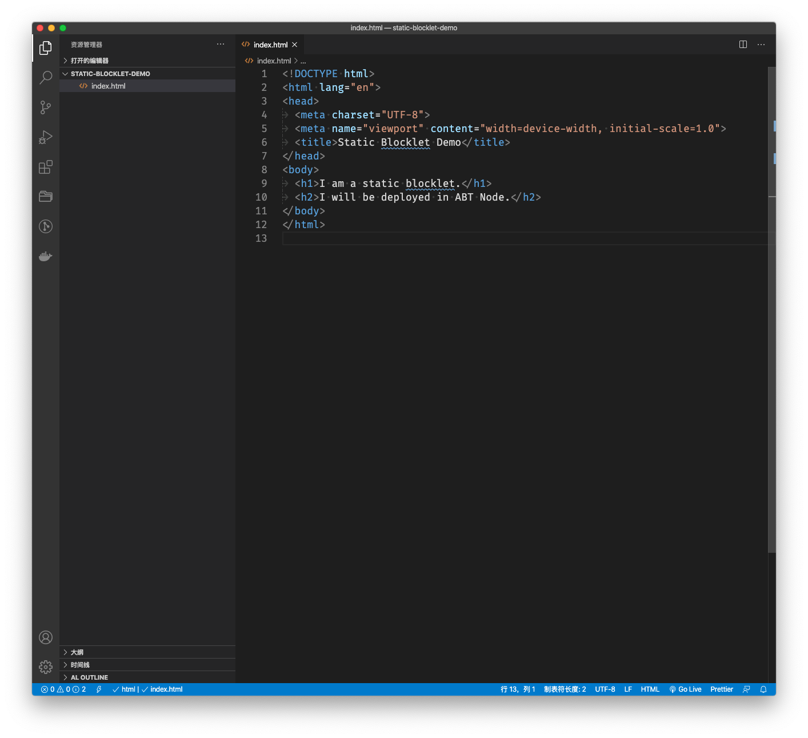
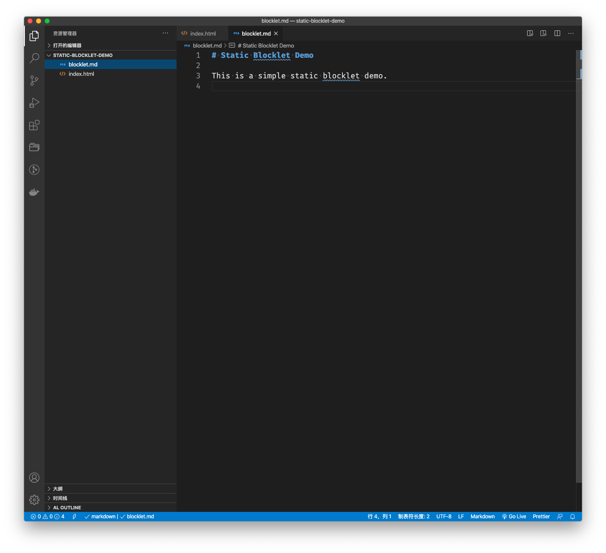
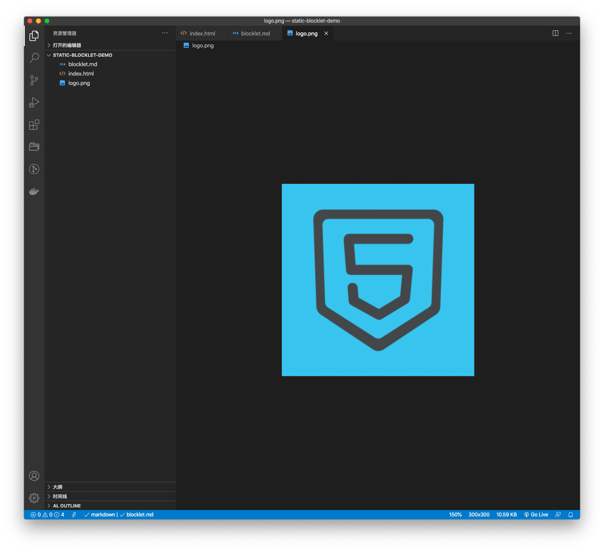
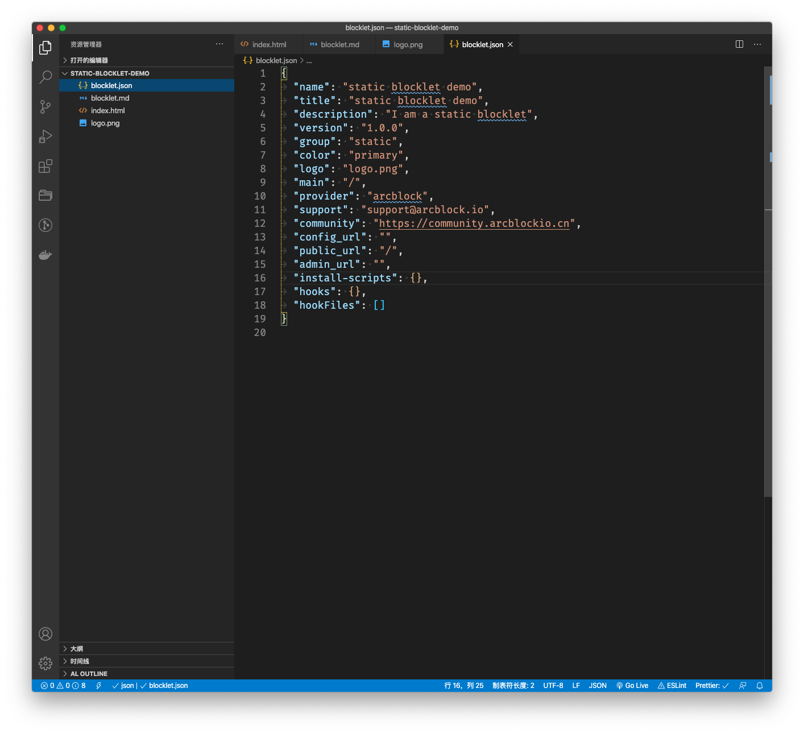
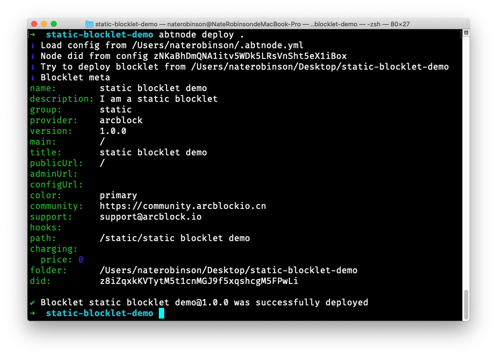
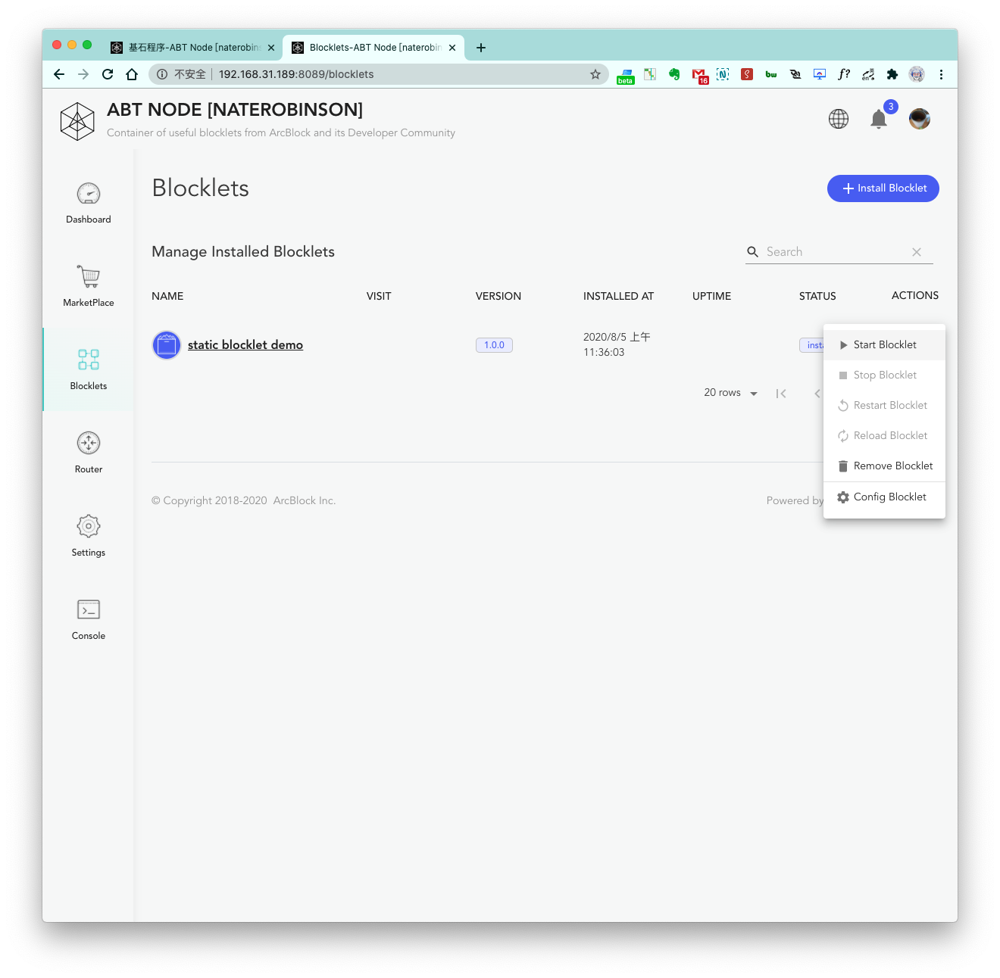
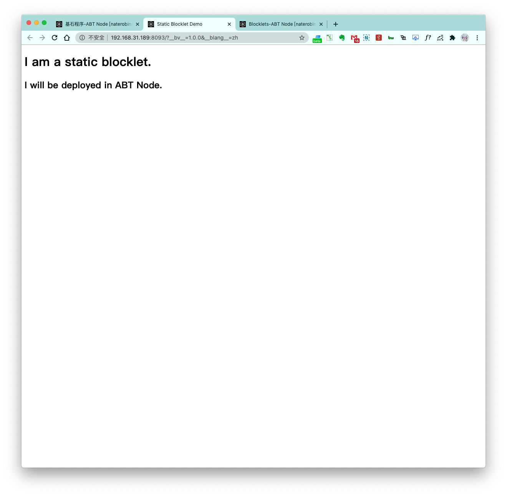

## Step 1: Preparing the Environment

First, initialize and run ABT Node.

## Step 2: Prepare the Front-End Static Code

Next, prepare a simple static page `index.html`.



Code:

```html
<!DOCTYPE html>
<html lang="en">
<head>
<meta charset="UTF-8">
<meta name="viewport" content="width=device-width, initial-scale=1.0">
<title>Static Blocklet Demo</title>
</head>
<body>
<h1>I am a static blocklet.</h1>
<h2>I will be deployed in ABT Node.</h2>
</body>
</html>
```

## Step 3: Create the necessary files

For the blocklet to be displayed in a more user-friendly way in ABT Node, we need to add the following two files.

### 1. `blocklet.md`

This file is similar to a `README.md` file, but this file is specifically for ABT Node. In this file, you can write an description of the blocklet, instructions, etc., which will allow other users to quickly understand what the blocklet does and what problems it solves.



### 2. `logo.png`

Create a logo for the blocklet and put it in the project directory.



## Step 4: Create `blocklet.json`

Next, create `blocklet.json`.



`blocklet.json`:

```json
{
"name": "static blocklet demo",
"title": "static blocklet demo",
"description": "I am a static blocklet",
"version": "1.0.0",
"group": "static",
"color": "primary",
"logo": "logo.png",
"main": "/",
"provider": "arcblock",
"support": "support@arcblock.io",
"community": "https://community.arcblockio.cn",
"config_url": "",
"public_url": "/",
"admin_url": "",
"install-scripts": {},
"hooks": {},
"hookFiles": []
}
```

Parameter Description:

-`name`: blocklet name
-`title`: the name displayed by the blocklet
-`description`: blocklet description
-`version`: blocklet version number
-`main`: the entry point of the packed block or static folder
-`group`: Only allow and support `dapp|static`
-`provider`: `arcblock|community`
-`public_url`: public page URL, at least one should be specified
-`admin_url`: management page URL, default is empty
-`config_url`: configuration page URL, default is empty
-`doc_url`: public document URL, if not specified, the registration details page will be used
-`hooks`: blocklet hooks, empty by default
-`hookFiles`: string array, files used by hooks, array, default is empty


## Step 5: Deploy Blocklet

After completing the above steps, we only need to go to the main directory of the project and execute the deployment command `abtnode deploy .` to complete the deployment of the blocklet.

> Please make sure that ABT Node can run before deploying.



After deploying the blocklet, you can open the ABT Node `Blocklets` page to view the installed blocklets:


## Step 6: Run  the Blocklet

Click to open the three dots on the right side of the just deployed `dapp blocklet demo`, and select `Start`:



The blocklet should now be in the `running` state. Click on the `public interface` to verify that it's running:



We have now successfully created a static blocklet in ABT Node.
