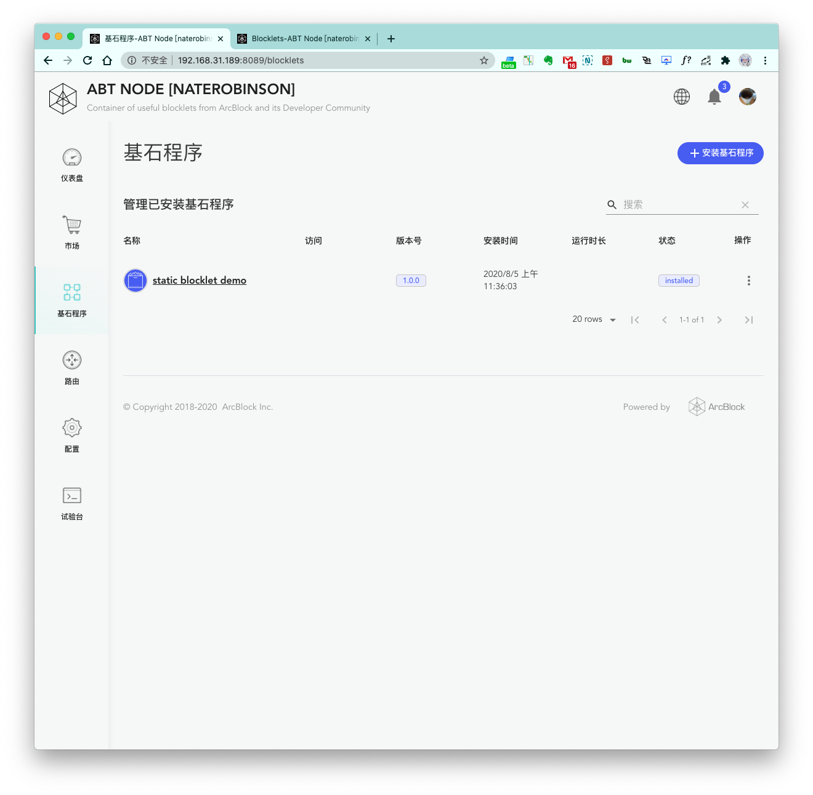
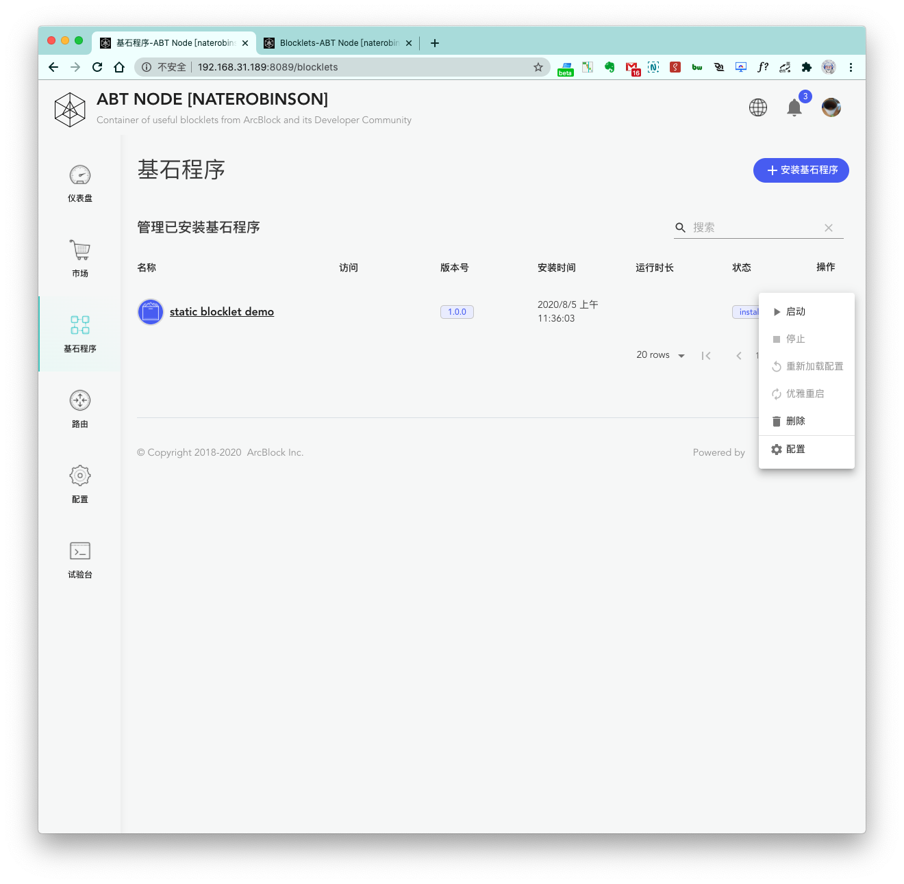

## 第一步，环境准备

1. ABT Node 已经初始化完毕, 并且已经处于运行状态

## 第二步，准备前端静态代码

下面我们准备一个最简单的静态页面 `index.html`


代码：

```html
<!DOCTYPE html>
<html lang="en">
<head>
	<meta charset="UTF-8">
	<meta name="viewport" content="width=device-width, initial-scale=1.0">
	<title>Static Blocklet Demo</title>
</head>
<body>
	<h1>I am a static blocklet.</h1>
	<h2>I will be deployed in ABT Node.</h2>
</body>
</html>
```

## 第三步，完善必要的文件

为了让 Blocklet 在 ABT Node 中能更友好的被展示，我们需要添加下面两个文件。

### 1. `blocklet.md` 文件

这个类似于一般项目的 `README.md`, 只不过这个 `blocklet.md` 是专门给 ABT Node 用的，里面可以编写这个 Blocklet 的简介，使用说明等等，其他用户看到这个文档就可以快速的了解你的 Blocklet 是做什么，解决什么问题的。


### 2. blocklet logo 文件

这里准备了一个简单的 `logo.png` 文件，放到项目目录下


## 第四步，编写 `blocklet.json`

准备好了前面的步骤，我们就可以来编写 `blocklet.json` 了


`blocklet.json`：

```json
{
	"name": "static blocklet demo",
	"title": "static blocklet demo",
	"description": "I am a static blocklet",
	"version": "1.0.0",
	"group": "static",
	"color": "primary",
	"logo": "logo.png",
	"main": "/",
	"provider": "arcblock",
	"support": "support@arcblock.io",
	"community": "https://community.arcblockio.cn",
	"config_url": "",
	"public_url": "/",
	"admin_url": "",
	"install-scripts": {},
	"hooks": {},
	"hookFiles": []
}
```

参数说明：

- `name`: blocklet 名称
- `title`: blocklet 展示的名称
- `description`: blocklet 描述
- `version`: blocklet 版本号
- `main`: 打包块或静态文件夹的入口点
- `group`: 只允许和支持 `dapp|static`
- `provider`: `arcblock|community`
- `public_url`: 公共页面 url，应至少指定一个
- `admin_url`: 管理页面 url，默认为空
- `config_url`: 配置页面 url，默认为空
- `doc_url`: 公共文档 url，如果没有指定，将使用注册表详细信息页
- `hooks`: blocklet 钩子，默认为空
- `hookFiles`: 字符串数组，钩子使用的文件，数组，默认为空


## 第五步，部署 Blocklet

完成上面的步骤之后，我们只需来到项目的根目录下执行部署命令 `abtnode deploy .` 即可完成 Blocklet 的部署。

> 部署前请确保 ABT Node 已经成功运行


部署成功之后，即可打开 ABT Node 的 `基石程序` 页面查看已安装的基石程序：



## 第六步，运行 Blocklet

点击打开刚刚部署好的 `static blocklet demo` 最右侧的更多菜单，并 `启动`：



成功启动之后，Blocklet 进入 `running` 状态，我们点击 `公开界面` 进行验证：


到这儿，我们就已经成功的在 ABT Node 里面部署了一个静态 Blocklet 啦，你也快来试试吧！
