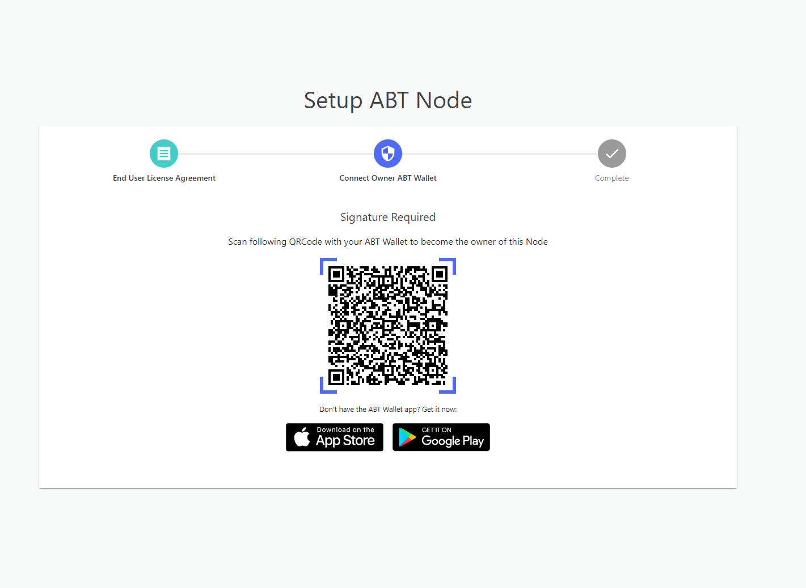

Once ABT Node has started you need to access the node dashboard to work with it. To do so, please make sure you are connected to the network of the deployed ABT Node.

## Install ABT Wallet

Access to ABT Node is authorized using ABT wallet. Thus install [ABT Wallet](https://abtwallet.io) for iOS or Android at [ABT Wallet](https://abtwallet.io). , Open up the app and follow the directions in the app to set up your wallet

## Access ABT Node

Access the ABT Node from your browser; as a first step, you must accept ArcBlock's End-User Agreement.  

Next, scan the generated QRCode using your ArcBlock ABT Wallet. It will authorize access to the ABT Node from your wallet.

Once authorized, you should have access to the ABT Node dashboard.
