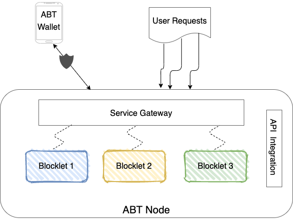
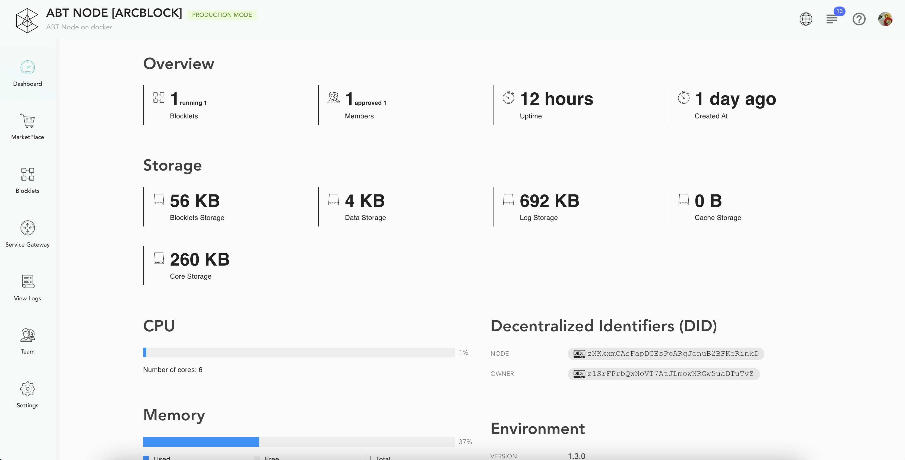
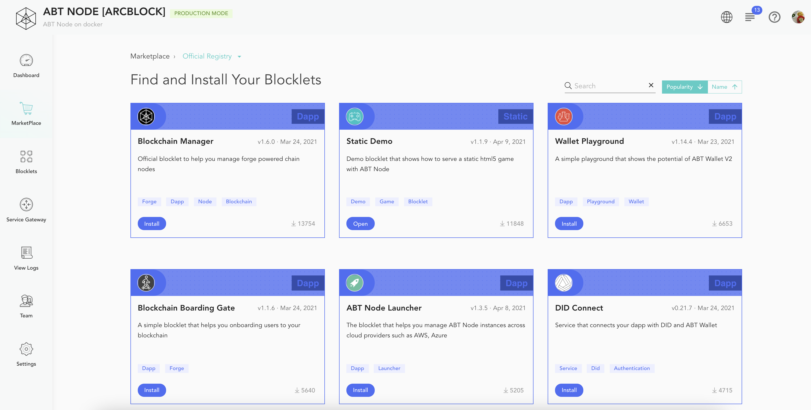
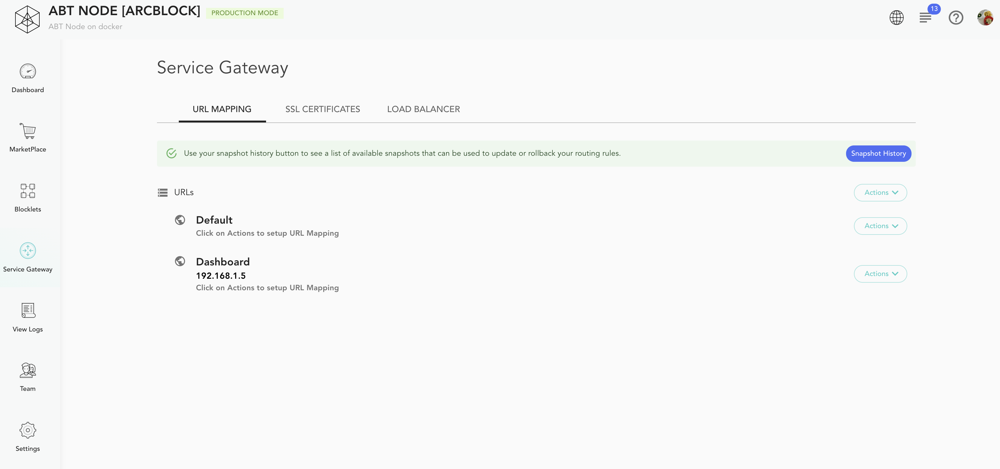
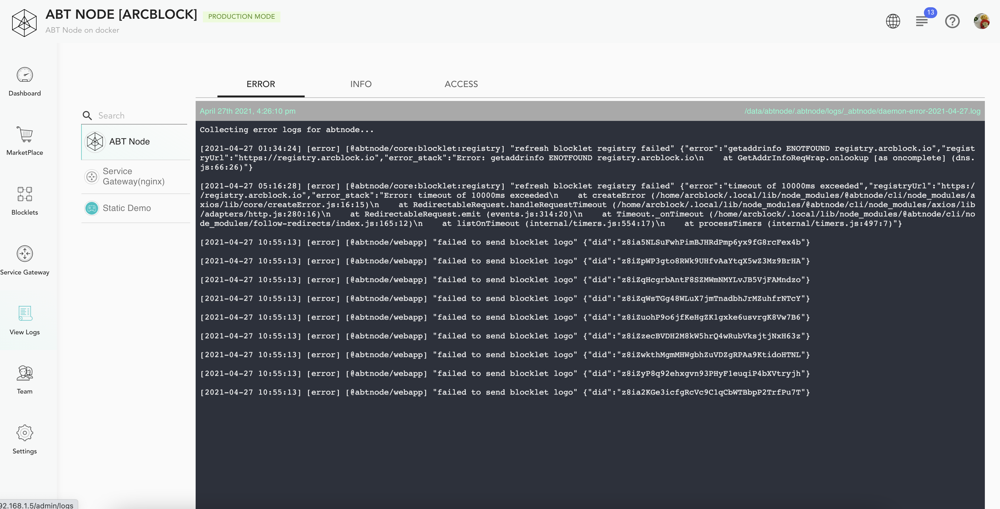
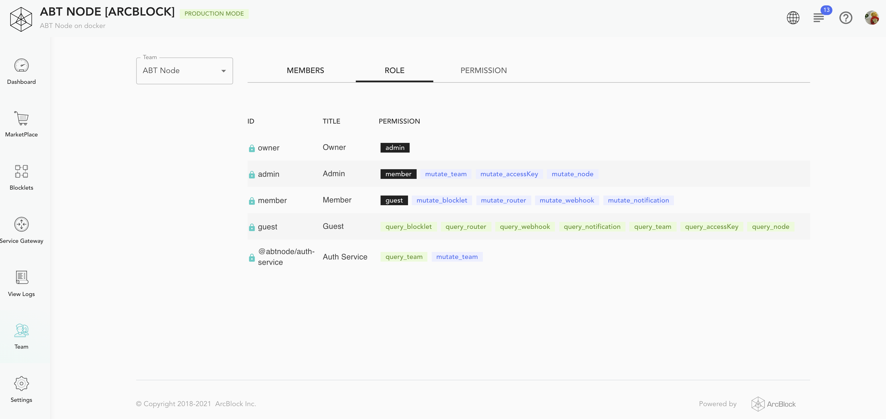

An ArcBlock instance is composed of one or more ABT Nodes. Each ABT Node offers the ability to create decentralized applications (DApps). The ABT Nodes offer a fully integrated blockchain framework with decentralized identity while having a  small footprint. It can be deployed on diverse platforms like a public or private clouds, bare metal machines, or developer desktops. ABT  Nodes offers intuitive  UI to build blockchain nodes, smart contracts, application logic, and more with zero hassle. Users with ABT Wallet can access the DApps deployed on the ABT Nodes.

In the following actions, we will go over all the capabilities offered by the ABT Node in detail.

## ABT Dashboard

The dashboard offers a unified view of the underlying infrastructure available with the ABT Node. It lists down different tenets of ABT Node, not limited to the following :
- Storage
- CPU
- Memory
- Disk
- UpTime
- Environment

## Marketplace

Blocklets are the foundation block for your application. They can deliver various behaviours like DApps, smart contracts, blockchain etc. The Marketplace is a digital catalog of Blocklets from ArcBlock, ecosystem partners, and software vendors that make it easy to find, install, manage and one-click deploy Blocklets on your ABT Node.

## Blocklets

The Blocklet management section shows you all of the Blocklets installed on your ABT Node. You can perform various actions like start, stop, reload and remove individual Blocklets. You can also access each Blocklet to review overview information and configuration details needed for development projects.

## Service Gateway
The Service Gateway is responsible for routing requests to the different applications, which can handle them. The section provides actions to upload SSL certificates and define URL Mapping.

For details on the Service Gateway functionality, visit: [Service Gateway](/en/abtnode/router)

## Settings
The Settings section defines configuration properties for the ABT Node like Node Name, Description, Registry location. The section also allows to define API Access keys and create external API Integrations.

## View Logs

The view logs section provides console logs for the different ABT node components like ABT Node Service, Service gateway, Blocklets, etc.

## Team
The Teams section allows you to define role-based access control for the users of your platform.

