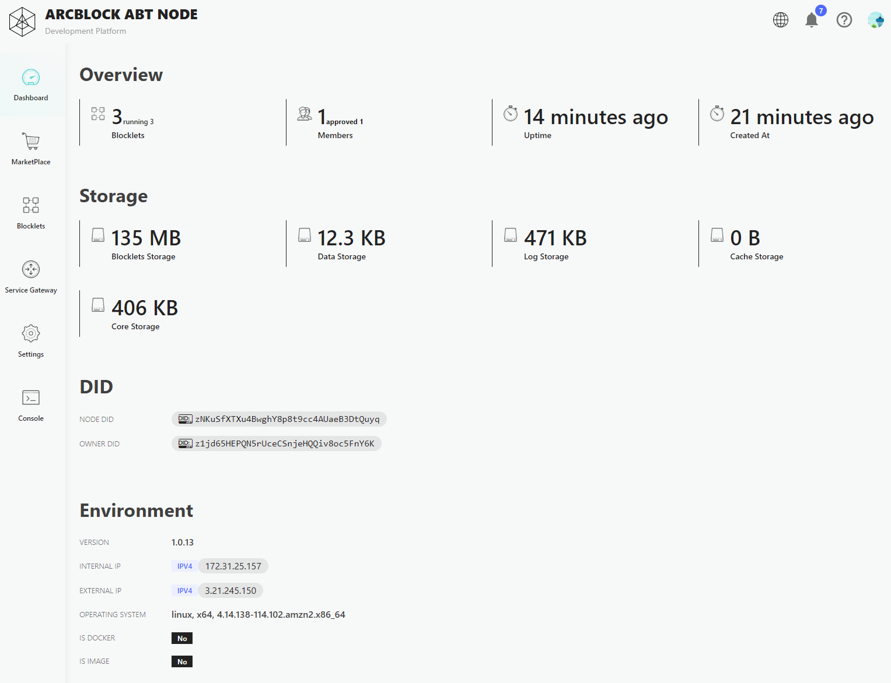
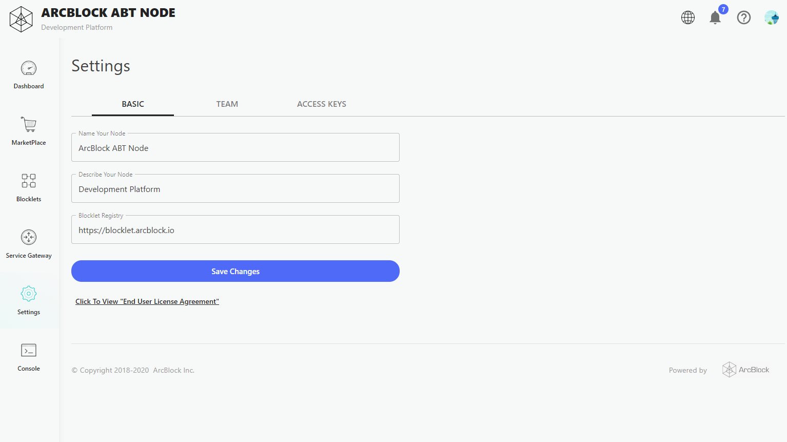

Following the steps above, we have completed the acquisition, installation, configuration, and operation of ABT Node. Now let's take a look at the functions of ABT Node in general.

## Dashboard

Dashboard of ABT node state properties.

## Marketplace

ABT Node Blocklet market where users can find installable Blocklets on this page.

## Blocklets

Blocklet list of ABT Node installed.

## Router

Routing configuration for ABT Node. Please go to the detailed functions: [Router](/en/abtnode/router)

## Settings

ABT Node configuration function. For more details, please visit: [Misc](/en/abtnode/misc)

## Console

ABT Node provides graphQL testbed functionality page. For details, please visit: [GraphQL Console](/en/abtnode/misc/graphql-console)
