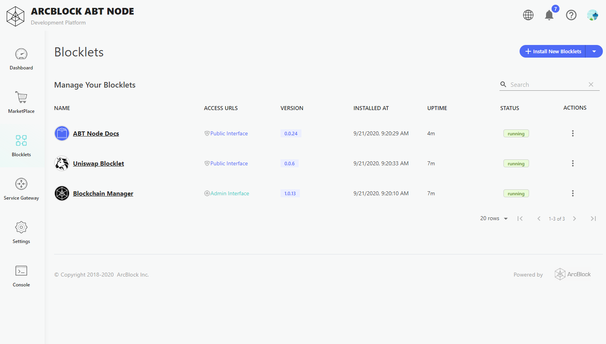
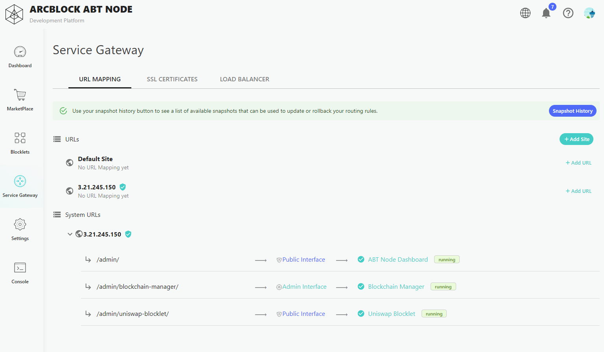
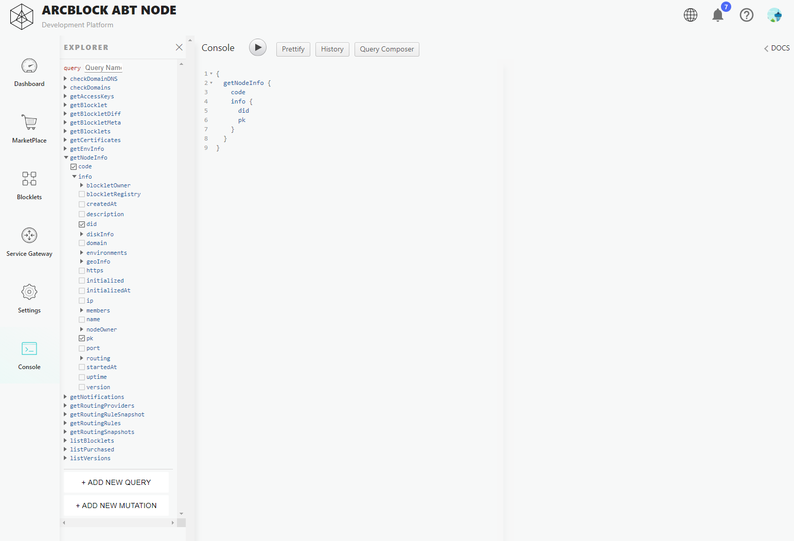

ABT Node is a distributed computing operaing system built for the decentralized web and is the foundation of the ArcBlock platform.  ABT Node is the first platform to fully integrate decentralized identity, blockchain framework and reusable software components known as Blocklets to make it easy to add new capabilities for any project. Users can one-click install apps, blockchains, developer tools, and more to enable them to deploy blockchain nodes, smart contracts, application logic, and more with zero hassle.

## Dashboard

In the dashboard view, you are presented with a "single pane of glass" view that shows you key details including an overview, storage, your node and owner decentralized identity (DID) addresses and environment variables. Every node also includes a left side action bar where that let you interact and control different aspects of your ABT Node. Let's take a look:

Dashboard of ABT node state properties.

## Marketplace

Your ABT Node Marketplace is a digital catalog of Blocklets from ArcBlock, ecosystem partners and software vendors that make it easy to find, install, manage and one-click deploy Blocklets on your ABT Node.

## Blocklets

The Blocklet management page shows you all of the Blocklets installed on your ABT Node, and gives you individual controls for each blocklet including the ability to start, stop, reload and remove the Blocklet. From the mangement page, you can access each Blocklet to review overview information and configuration details needed for development projects.

## Service Gateway

Service Gateway enables you to control a virtual connecctions and networking services for your ABT Node. For details on the Service Gateway functionality, visit: [Service Gateway](/en/abtnode/router)

## Settings

ABT Node settings enable you to customize your ABT Node name, and avaialble Blocklet Registry location, as well as team management features. For more details, please visit: [Misc](/en/abtnode/misc)

## Console

ABT Node provides a graphQL testbed functionality page. For details about the ABT Node GraphQL Console, please visit: [GraphQL Console](/en/abtnode/misc/graphql-console)
