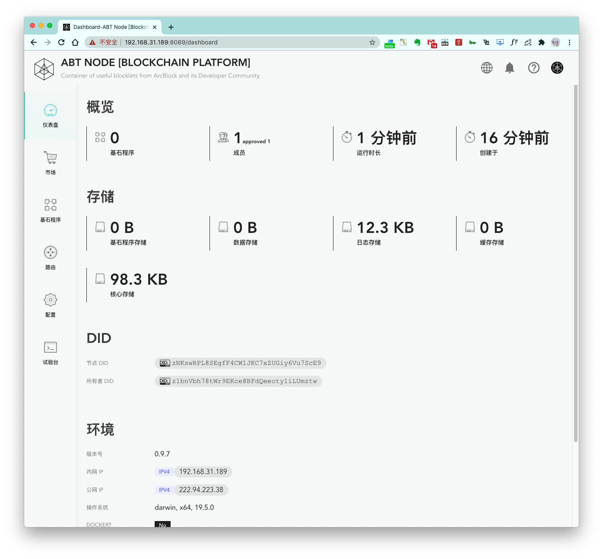
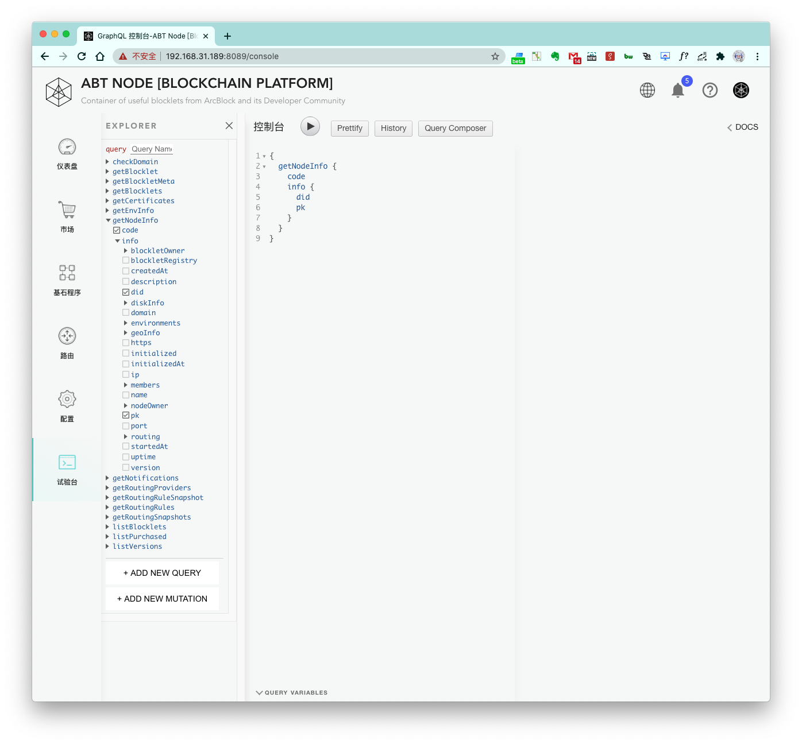

跟随上面的步骤，我们已经完成了 ABT 节点的获取，安装，配置和运行操作，下面我们来整体看一下 ABT 节点有哪些功能吧。

## 仪表盘

ABT 节点状态属性的仪表盘。

## 市场

ABT 节点 Blocklet 市场，用户可以在这个页面寻找可安装的 Blocklet。

## 基石程序

ABT 节点已安装的 Blocklet 列表。

## 路由

ABT 节点的路由配置。详细功能请前往：[路由管理](/zh/abtnode/router)

## 配置

ABT 节点配置功能。详细功能请前往：[其他功能](/zh/abtnode/misc)

## 试验台

ABT 节点提供的 GraphQL 试验台功能页面。详情请前往：[GraphQL 试验台](/zh/abtnode/misc/graphql-console)
