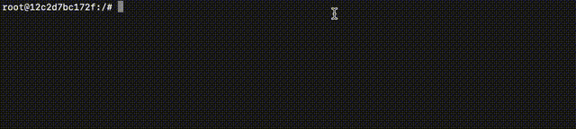
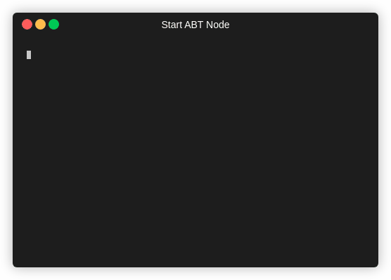
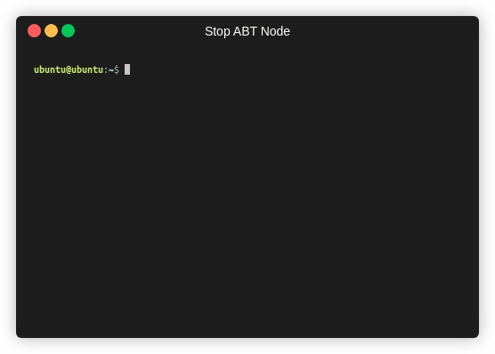
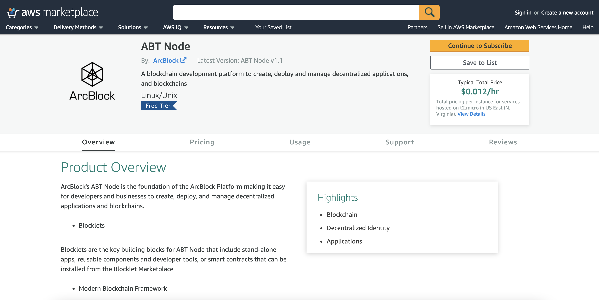
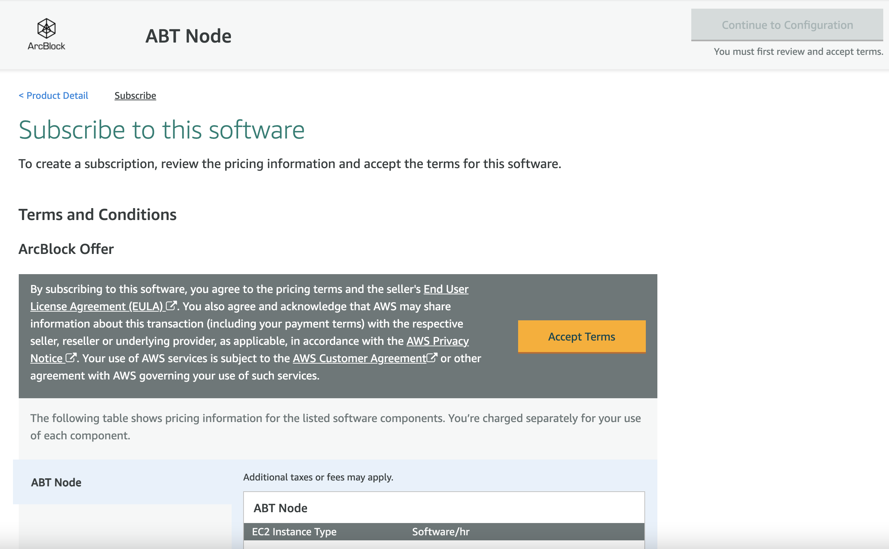
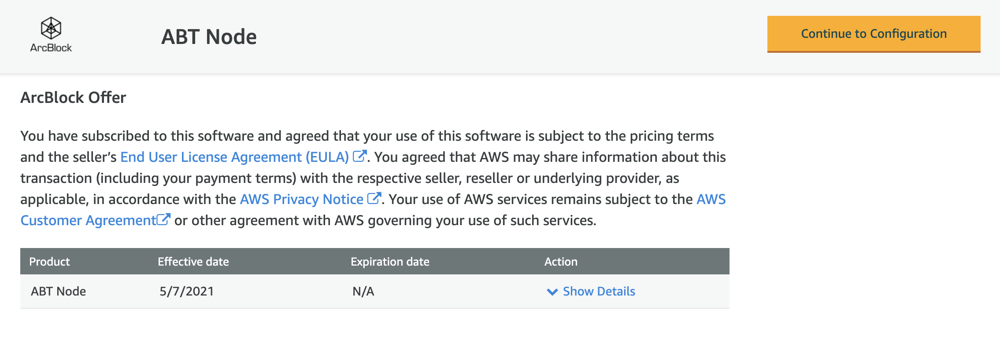
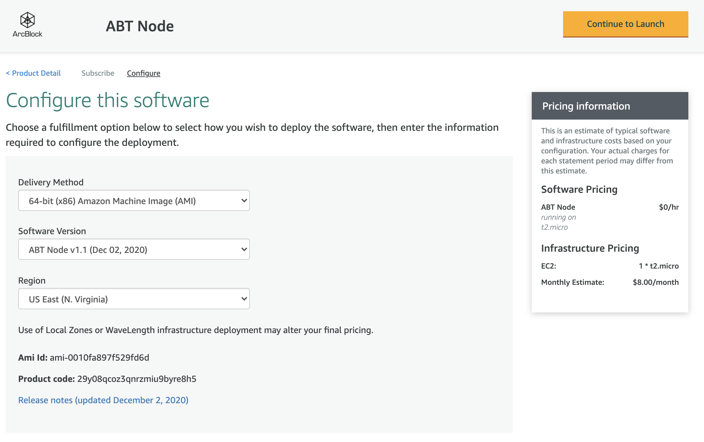
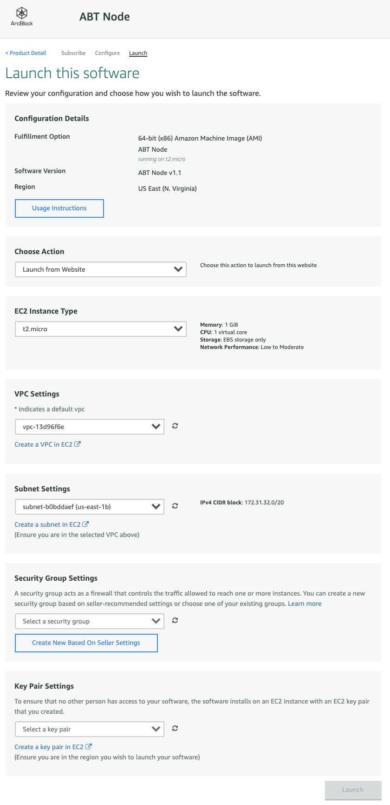

ABT Node can be installed in the following ways :

  - [Use the binary distribution](#use-the-binary-distribution)
  - [Use the official Docker image](#use-the-official-docker-image)
  - [Use AWS Marketplace](#use-aws-marketplace)

You can use either of the above ways to deploy it on any infrastructure like Cloud, Virtual machines, workstations, etc.

*If you are interested in running ABT Node locally on your device, we currently support [Linux] and [macOS]. If you are using another OS like Windows, we recommend using Windows Subsystem Linux (WSL), or you can use a virtual machine and make sure your ABT Wallet can access your VM's IP address.*

## Use the binary distribution

ABT Node is a [NodeJS application](https://www.npmjs.com/package/@abtnode/cli). You must have NodeJS Runtime and Node Package Manager (NPM) to install it.

### Environment Setup
You need to install NodeJS and NPM for installing ABT Node binary. ArcBlock recommends using Node Version Manager(NVM) for [installing NodeJS](https://nodejs.org/en/download/package-manager/#nvm).

#### Step 1: Install [NVM]

Install [NVM] using the below command:

```bash
curl -o- https://raw.githubusercontent.com/nvm-sh/nvm/v0.35.3/install.sh | bash
```

<details>
<summary>Sample output</summary>


</details>

#### Step 2: Install [Node.js] and [npm]

Get the latest LTS version of [Node.js] using below command (you can list all versions with `nvm ls-remote`):

```bash
nvm ls-remote | grep 'Latest LTS'
```

<details>
<summary>Sample output</summary>



</details>

At the time of writing this document, the latest LTS version was v14.16.1

Then, install [Node.js], which will automatically install [npm] (replace v10.22.0 with the version number):

```bash
nvm install v14.16.1  
```

<details>
<summary>Sample output</summary>


</details>

Note: You can install the latest version of [Node.js] by running `nvm install-latest-npm` command:

### Install ABT Node

Execute the below command to install ABT Node :

```bash
npm install -g @abtnode/cli
```

<details>
<summary>Sample output</summary>


</details>

### Configure ABT Node

After installing ABT Node binary, you must initialize the node and provide a directory location for storing configuration.

1. Run the `abtnode init` command  to initialize the ABT Node

2. Once initialized, the system will confirm the directory where you want to store the configuration.

3. After confirming, the system will automatically generate your ABT Node configuration.

4. Now start the ABT Node Service by executing the  `abtnode start` command.

<details>
<summary>Sample output</summary>



</details>

5. You can stop ABT node service by executing `abtnode stop` command.

<details>
<summary>Sample output</summary>



</details>

## Use the official Docker image

You can run ABT Node by using the [official Docker image](https://hub.docker.com/r/arcblock/abtnode)

```bash
docker run -d -p 80:80 -p 443:443  -v "$(pwd)":/data/abtnode arcblock/abtnode
```

Docker images are based on the Debian Linux platform.


## Use AWS Marketplace

You can run ABT Node on AWS using [AWS Marketplace](https://aws.amazon.com/marketplace/pp/B089KM6SFR?qid=1620381487343&sr=0-1&ref_=srh_res_product_title)

1. You must select **Continue to subscribe** from the overview tab,
  

2. You will be presented with *Terms and Conditions* which you must agree by clicking **Accept Terms**.
  

3. After the subscription authorization is complete **Continue to Configuration** will be enabled. Click it to proceed
  

4. Select ABT Node version and AWS region, then click **Continue to Launch**
  

5. You are on the Launch page, where you must provide the following instance details :

    - Select **Launch from Website** for the *Choose Acton* dropdown.
    - Select *EC2 instance type*.
    - Select appropriate *VPC Settings*, followed by *Subnet Settings*
    - In *Security Group Settings* select an existing security Group or create one by clicking "Create new based on seller setting".
    - select / create a key pair under *Key Pair Settings*
    - Click **Launch** to deploy ABT Node using the provided configuration

  


> ####  Security Group Ports
>
> ---
>
> Make note of the ports that are opened in the associated security group. The typical ports are: 8089 (ABT Node Port), 80 (HTTP) and 443 (SSL/HTTPS). We do not recommend opening port 22(SSH) unless required by your organisation practices.
>
> ---


[Linux]:   https://www.linux.org
[macOS]:   https://www.apple.com/macos
[NVM]:     https://github.com/nvm-sh/nvm
[Node.js]: https://nodejs.org
[npm]:     https://www.npmjs.com
