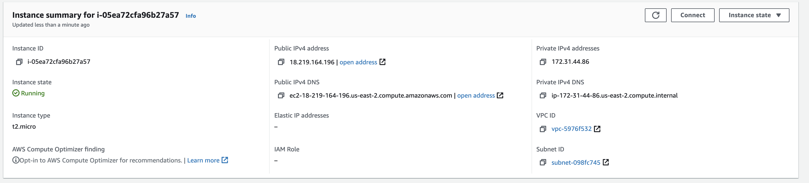
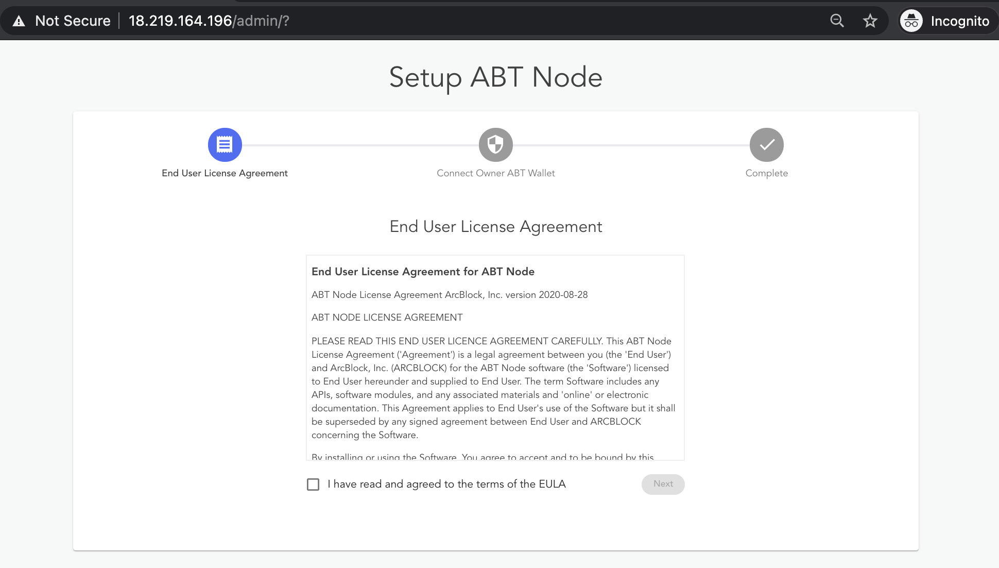

Blocklet Server can be installed in the following ways :

  - [Use the binary distribution](#use-the-binary-distribution)
  - [Use the official Docker image](#use-the-official-docker-image)
  - [Use AWS Marketplace](#use-aws-marketplace)

You can use either of the above ways to deploy it on any infrastructure like Cloud, Virtual machines, workstations, etc.

*If you are interested in running Blocklet Server locally on your device, we currently support [Linux] and [macOS]. If you are using another OS like Windows, we recommend using Windows Subsystem Linux (WSL), or you can use a virtual machine and make sure your ABT Wallet can access your VM's IP address.*

## Use the binary distribution

Blocklet Server is a [NodeJS application](https://www.npmjs.com/package/@blocklet/cli). You must have NodeJS Runtime and Node Package Manager (NPM) to install it.

### Environment Setup
You need to install NodeJS and NPM for installing Blocklet Server binary. ArcBlock recommends using Node Version Manager(NVM) for [installing NodeJS](https://nodejs.org/en/download/package-manager/#nvm).

#### Step 1: Install [NVM]

Install [NVM] using the below command:

```bash
curl -o- https://raw.githubusercontent.com/nvm-sh/nvm/v0.35.3/install.sh | bash
```

<details>
<summary>Sample output</summary>


</details>

#### Step 2: Install [Node.js] and [npm]

Blocklet Server will adapt the LTS version of Node.js as soon as possible, so we recommend installing the LTS version of Node.js.

```bash
nvm install --lts
```

<details>
<summary>Sample output</summary>


</details>

Note: You can install the latest version of [Node.js] by running `nvm install-latest-npm` command:

### Install Blocklet Server

Execute the below command to install Blocklet Server :

```bash
npm install -g @blocklet/cli
```

<details>
<summary>Sample output</summary>


</details>

### Configure Blocklet Server

After installing the Blocklet Server binary, you must initialize the node and provide a directory location for storing configuration.

1. Run the `blocklet server init` command  to initialize the Blocklet Server

2. Once initialized, the system will confirm the directory where you want to store the configuration.

3. After confirming, the system will automatically generate your Blocklet Server configuration.

4. Now, start the Blocklet Server Service by executing the  `blocklet server start` command.

<details>
<summary>Sample output</summary>


</details>

5. You can stop Blocklet Server service by executing `blocklet server stop` command.

<details>
<summary>Sample output</summary>


</details>

### Access Blocklet Server

The above command will start the Blocklet Server server on 8089. You can access the Blocklet Server on `/admin` request path (`http://18.217.238.146:8089/`). After this, you must agree to License terms before accessing the Blocklet Server dashboard.


*Please do not access the Blocklet Server using localhost / 127.0.0.1 address. You will not be able to connect it using ABT wallet.*

## Use the official Docker image

You can run Blocklet Server by using the [official Docker image](https://hub.docker.com/r/arcblock/abtnode)

```bash
docker run -d -p 80:80 -p 443:443  -v "$(pwd)":/data/abtnode arcblock/abtnode
```

Docker images are based on the Debian Linux platform.

### Access Blocklet Server

The above command will start the Blocklet Server container and bind it to port 80 /  443 on the Host machine. You should access it using the IP address of the Host machine (`http://192.168.1.5/`). *Please do not access the Blocklet Server using localhost / 127.0.0.1 address. You will not be able to connect it using ABT wallet.*


After this, you must agree to License terms before accessing the Blocklet Server dashboard.


## Use AWS Marketplace

You can run Blocklet Server on AWS using [AWS Marketplace](https://aws.amazon.com/marketplace/pp/B089KM6SFR?qid=1620381487343&sr=0-1&ref_=srh_res_product_title)

1. You must select **Continue to subscribe** from the overview tab,
  

2. You are presented with *Terms and Conditions*, to which you must agree by clicking **Accept Terms**.
  

3. After the subscription authorization is complete **Continue to Configuration** will be enabled. Click it to proceed
  

4. Select Blocklet Server version and AWS region, then click **Continue to Launch**
  

5. You are on the Launch page, where you must provide the following instance details :

    - Select **Launch from Website** for the *Choose Acton* dropdown.
    - Select *EC2 instance type*.
    - Select appropriate *VPC Settings*, followed by *Subnet Settings*
    - In *Security Group Settings* select an existing security Group or create one by clicking "Create new based on seller setting".
    - select / create a key pair under *Key Pair Settings*
    - Click **Launch** to deploy Blocklet Server using the provided configuration

  


> ####  Security Group Ports
>
> ---
>
> Please make a note of the ports that are opened in the associated security group. The standard ports are: 80 (HTTP) and 443 (SSL/HTTPS). We do not recommend opening port 22(SSH) unless required by your organisation practices.
>
> ---

### Access Blocklet Server

AWS will take some time to create an application instance. After the confirmation message, you should open the EC2 Dashboard to get the Public IP, and AWS-provided sub-domain of the Blocklet Server instance.



You can access the Blocklet Server on `/admin` request path using either of the following locations :
- **Non secured Access** : You can access Blocklet Server on HTTP by using the IP address (`http://18.219.164.196/admin`) or the AWS-provided sub-domain (`http://ec2-18-219-164-196.us-east-2.compute.amazonaws.com/admin`).


- **Secured Access** : ArcBlock provides HTTPS access to AWS hosted Blocklet Servers using a convention-based sub-domain(`ipv4convention.ip.abtnet.io`). You can determine the sub-domain by replacing the dot(`.`) separator in IPv4 address with the dash(`-`) separator. The above hosted Blocklet Server is available on `https://18-219-164-196.ip.abtnet.io/admin`.


ArcBlock recommends using the secured approach over the non-secured approach. The admin page presents License terms to which you must agree before accessing the Blocklet Server dashboard.

*Blocklet Server works on HTTPS using a sub-domain certificate (`ip.abtnet.io`). Accessing it using AWS provided public IPv4 address(`http://18.219.164.196/admin`) or sub-domain(`https://ec2-18-219-164-196.us-east-2.compute.amazonaws.com/admin`) gives an error of invalid certificate.*

[Linux]:   https://www.linux.org
[macOS]:   https://www.apple.com/macos
[NVM]:     https://github.com/nvm-sh/nvm
[Node.js]: https://nodejs.org
[npm]:     https://www.npmjs.com
