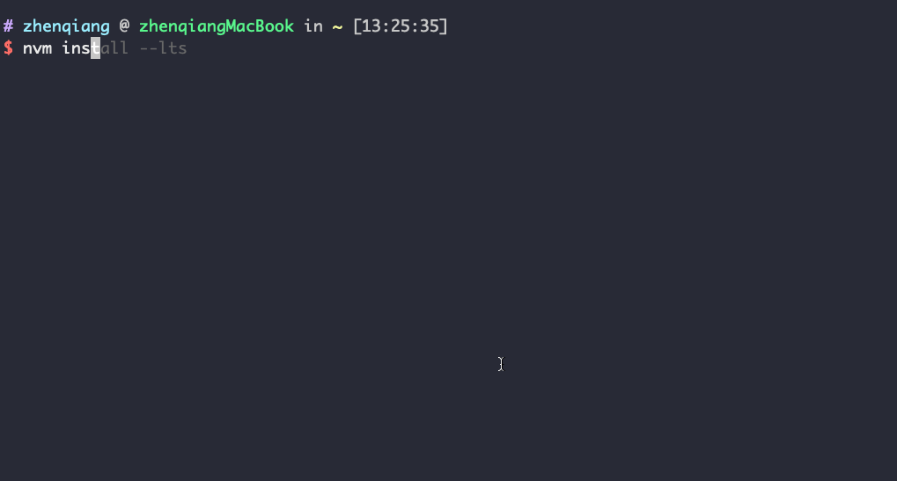

目前，只能在 [Linux] 和 [macOS] 安装。如果你想使用别的操作系统比如 Windows，你可以使用虚拟机，不过需要确保 ABT 钱包可以访问到你的虚拟机 IP 地址。

### 第一步: 安装 [nvm]

执行下面命令，即可安装 [nvm]：

```bash
/bin/bash -c "$(curl -fsSL https://raw.githubusercontent.com/nvm-sh/nvm/master/install.sh)"
```

<details>
<summary>输出示例


</details>

<details>
<summary>

注意：你也可以使用下面这两个命令，不过这两个命令都只能被特定的操作系统使用（点击展开查看）。

</summary>

此命令适用 [macOS]:

```bash
curl -o- https://raw.githubusercontent.com/nvm-sh/nvm/v0.35.3/install.sh | bash
```

此命令适用 [Linux]:

```bash
wget -qO- https://raw.githubusercontent.com/nvm-sh/nvm/v0.35.3/install.sh | bash
```

</details>

### 第二步: 安装 [Node.js] 和 [npm]

ABT Node 会在第一时间适配 Node.js LTS 版本, 所以我们推荐安装 LTS 版本 Node.js.

只要安装完 [Node.js]，[npm] 也会被自动安装完成。

```bash
nvm install --lts
```

<details>
<summary>输出示例



</details>

注意：你可以通过运行命令 `nvm install-latest-npm` 安装最新的 [Node.js]

### 第三步：安装 Nginx

ABT Node 的网关依赖于 Nginx, 所以我们需要安装 Nginx.

**版本 >= 1.18.0**

#### 在 Mac 上安装

使用 Homebrew 安装:

`brew install nginx`

参考: https://formulae.brew.sh/formula/nginx

#### 在 Linux 上安装

参考: https://www.nginx.com/resources/wiki/start/topics/tutorials/install/

### 第四步: 安装 ABT 节点

现在，使用 [npm] 执行下面命令即可安装 ABT 节点：

```bash
npm install -g @abtnode/cli
```

<details>
<summary>输出示例


</details>

### 第五步: 安装并初始化 ABT 钱包

从 [ABT 钱包官网](http://abtwallet.io) 找到下载入口完成 ABT 钱包的安装。然后打开钱包跟随钱包指引完成钱包的初始化。

### 第六步: 安装一个 IDE

如果你准备创建自己的 Blocklet，我们推荐您先安装一个 IDE。我们推荐安装主流的 IDE 是：[VSCode](https://code.visualstudio.com)

[linux]: https://www.linux.org
[macos]: https://www.apple.com/macos
[nvm]: https://github.com/nvm-sh/nvm
[node.js]: https://nodejs.org
[npm]: https://www.npmjs.com
