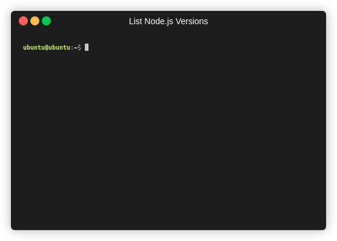

## How to get ABT Node?

Currently, we can only get ABT Node working for [Linux](https://www.linux.org) and [macOS](https://www.apple.com/macos). If you are using another OS like Windows, you can
use a virtual machine and make sure your ABT Wallet can access your VM's IP address.

### Step 1: Install [nvm](https://github.com/nvm-sh/nvm)

To install [nvm](https://github.com/nvm-sh/nvm), run this command:

```bash
/bin/bash -c "$(curl -fsSL https://raw.githubusercontent.com/nvm-sh/nvm/master/install.sh)"
```

<details>
<summary>Sample output</summary>


</details>

<details>
<summary>

Note: You can also use one of the two commands from nvm's repo [nvm](https://github.com/nvm-sh/nvm) or from the hidden content of this line, but this
one works with both [Linux](https://www.linux.org) and [macOS](https://www.apple.com/macos).

</summary>

This one works on [macOS](https://www.apple.com/macos):

```bash
curl -o- https://raw.githubusercontent.com/nvm-sh/nvm/v0.35.3/install.sh | bash
```

and this one works on [Linux](https://www.linux.org):

```bash
wget -qO- https://raw.githubusercontent.com/nvm-sh/nvm/v0.35.3/install.sh | bash
```

</details>

### Step 2: Install [Node.js](https://nodejs.org) and [npm](https://www.npmjs.com)

Get the latest LTS version of [Node.js](https://nodejs.org) using this command (you can list all versions with `nvm ls-remote`):

```bash
nvm ls-remote | grep 'Latest LTS'
```

<details>
<summary>Sample output</summary>



</details>

At the time of writing this document, the latest LTS version is v12.18.3.

Then, install [Node.js](https://nodejs.org), which will automatically install [npm](https://www.npmjs.com) (replace v10.22.0 with the version number):

```bash
nvm install v12.18.3
```

<details>
<summary>Sample output</summary>


</details>

Note: You can install the latest version of [Node.js](https://nodejs.org) instead by running this command: `nvm install-latest-npm`

### Step 3: Install ABT Node

Now, run this command to install ABT Node with [npm](https://www.npmjs.com):

```bash
npm install -g @abtnode/cli
```

<details>
<summary>Sample output</summary>


</details>

### Step 4: Install and set up ABT Wallet

Install [ABT Wallet](https://abtwallet.io) for iOS or Android at [ABT Wallet](https://abtwallet.io). Then, open up the app and follow the
directions in the app to set up your wallet.

### Step 5: Install an IDE

If you are going to create blocklets, you are recommended to install an IDE. A popular IDE you can try is
[VSCode](http://code.visualstudio.com).
