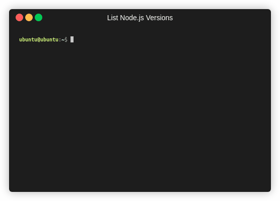
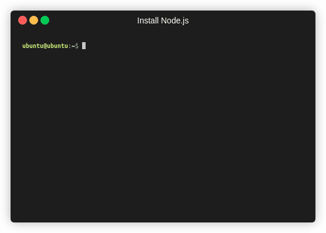

目前，只能在 [Linux](https://www.linux.org) 和 [macOS](https://www.apple.com/macos) 安装。如果你想使用别的操作系统比如 Windows，你可以使用虚拟机，不过需要确保 ABT 钱包可以访问到你的虚拟机 IP 地址。

### 第一步: 安装 [nvm](https://github.com/nvm-sh/nvm)

执行下面命令，即可安装 [nvm](https://github.com/nvm-sh/nvm)：

```bash
/bin/bash -c "$(curl -fsSL https://raw.githubusercontent.com/nvm-sh/nvm/master/install.sh)"
```

<details>
<summary>输出示例</summary>


</details>

<details>
<summary>

注意：你也可以使用下面这两个命令，不过这两个命令都只能被特定的操作系统使用（点击展开查看）。

</summary>

此命令适用 [macOS](https://www.apple.com/macos):

```bash
curl -o- https://raw.githubusercontent.com/nvm-sh/nvm/v0.35.3/install.sh | bash
```

此命令适用 [Linux](https://www.linux.org):

```bash
wget -qO- https://raw.githubusercontent.com/nvm-sh/nvm/v0.35.3/install.sh | bash
```

</details>

### 第二步: 安装 [Node.js](https://nodejs.org) 和 [npm](https://www.npmjs.com)

获取 [Node.js](https://nodejs.org) 最新长期支持版本，使用这个命令（你也可以使用这个命令列出所有的版本 `nvm ls-remote`）:

```bash
nvm ls-remote | grep 'Latest LTS'
```

<details>
<summary>输出示例</summary>



</details>

在写本文的时候，最新的长期支持版本号是 v12.18.3。

然后，只要安装完 [Node.js](https://nodejs.org)，[npm](https://www.npmjs.com) 也会被自动安装完成。

```bash
nvm install v12.18.3
```

<details>
<summary>输出示例</summary>



</details>

注意：你可以通过运行命令 `nvm install-latest-npm` 安装最新的 [Node.js](https://nodejs.org)

### 第三步: 安装 ABT 节点

现在，使用 [npm](https://www.npmjs.com) 执行下面命令即可安装 ABT 节点：

```bash
npm install -g @abtnode/cli
```

<details>
<summary>输出示例</summary>


</details>

### 第四步: 安装并初始化 ABT 钱包

从 [ABT 钱包官网](http://abtwallet.io) 找到下载入口完成 ABT 钱包的安装。然后打开钱包跟随钱包指引完成钱包的初始化。

### 第五步: 安装一个 IDE

如果你准备创建自己的 Blocklet，我们推荐您先安装一个 IDE。我们推荐安装主流的 IDE 是：[VSCode](https://code.visualstudio.com)
