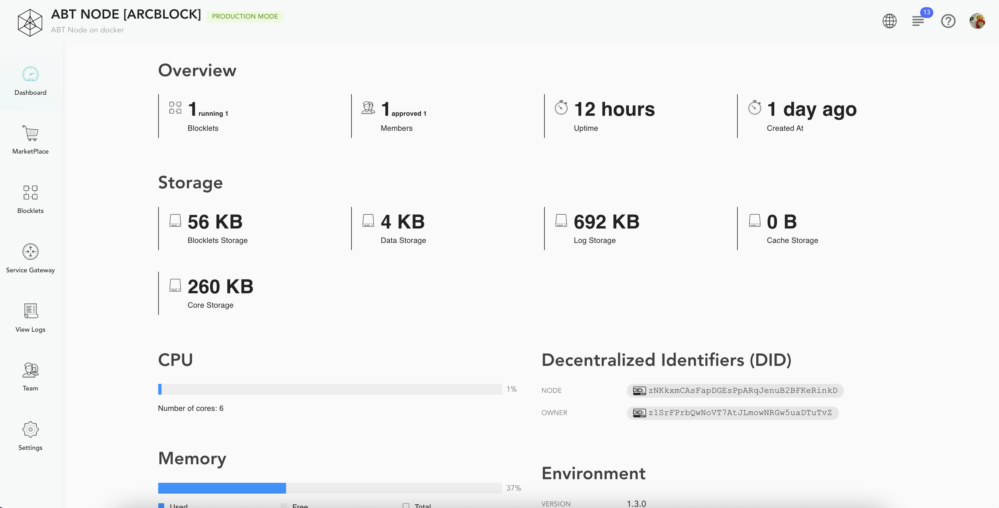
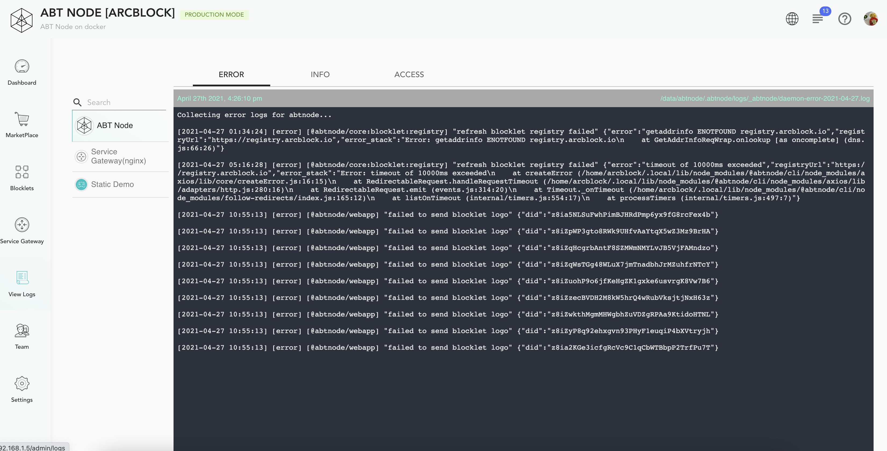

An ArcBlock instance is composed of one or more Blocklet Servers. Each Blocklet Server offers the ability to create decentralized applications (DApps). The Blocklet Servers offer a fully integrated blockchain framework with decentralized identity while having a small footprint. It can be deployed on diverse platforms like a public or private clouds, bare metal machines, or developer desktops. Blocklet Servers offers intuitive UI to build blockchain nodes, smart contracts, application logic, and more with zero hassle. Users with DID Wallet can access the DApps deployed on the Blocklet Servers.

In the following actions, we will go over all the capabilities offered by the Blocklet Server in detail.

## Dashboard

The dashboard offers a unified view of the underlying infrastructure available with the Blocklet Server. It lists down different tenets of Blocklet Server, not limited to the following :

- Storage
- CPU
- Memory
- Disk
- UpTime
- Environment

## Store

Blocklets are the foundation block for your application. They can deliver various behaviours like DApps, smart contracts, blockchain etc. The Store is a digital catalog of Blocklets from ArcBlock, ecosystem partners, and software vendors that make it easy to find, install, manage and one-click deploy Blocklets on your Blocklet Server.

## Blocklets

The Blocklet management section shows all Blocklets installed on your Blocklet Server. You can perform various actions like start, stop, reload and remove individual Blocklets. You can also access review and modify each Blocklet configuration to alter its behaviour at runtime.

## Service Gateway

The Service Gateway is responsible for routing requests to the different applications, which can handle them. The section provides actions to upload SSL certificates and define URL Mapping.

For details on the Service Gateway functionality, visit: [Service Gateway](/en/abtnode/router)

## Settings

The Settings section defines configuration properties for the Blocklet Server like Node Name, Description, Store location. The section also allows to define API Access keys and create external API Integrations.

## View Logs

The view logs section provides console logs for the different Blocklet Server components like Blocklet Server Service, Service gateway, Blocklets, etc.

## Team

The Teams section allows you to define role-based access control for the users of your platform.

