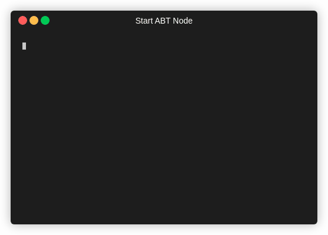
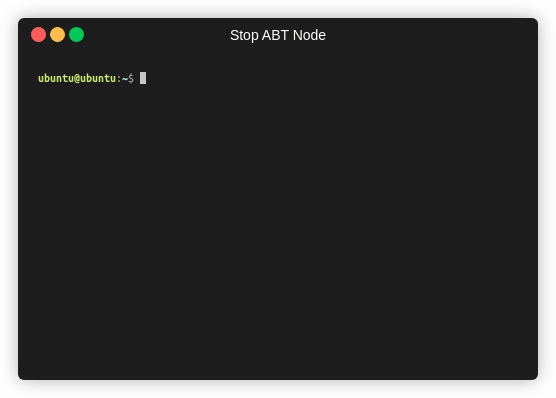

With your ABT Node installed on your device you will need to initialize it to get started. 

_Note, make sure you are connected to the network you want the node to be on and if you are using a VM, use a bridged network adapter (NAT network adapter also works
if port forwarding is enabled) or attach an external wireless card to the VM._

1. To initialize your ABT Node, run this command:

```bash
abtnode init
```

2. Once initialized, the system will confirm the directory where you want to initilize your ABT Node instance. 

3. After confirming, the system will automatically generate your ABT Node configuration.

4. With your configuration genreated, you need to start your ABT Node in order to use it. Run this command:

```bash
abtnode start
```

<details>
<summary>Sample output</summary>



</details>

5. Then, open the generated link in your browser. The first screen confirms acceptance of ArcBlock's End-User Agreement.


6. After accepting the License Agreement, you will scan the generated QRCode using your ArcBlock ABT Wallet. During this process, you will secure your ABT Node and connect this ABT Node to your wallet.  


7. Now, go to the dashboard. 

8. If you want to stop the node, run this command:

```bash
abtnode stop
```

<details>
<summary>Sample output</summary>



</details>
