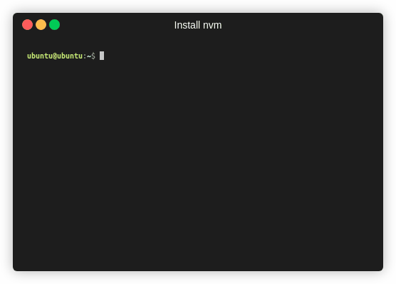
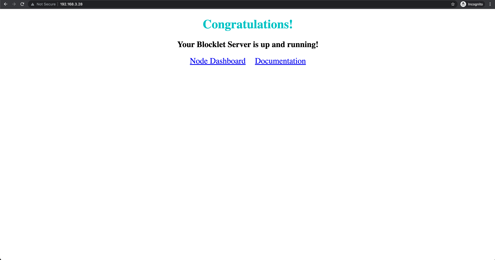
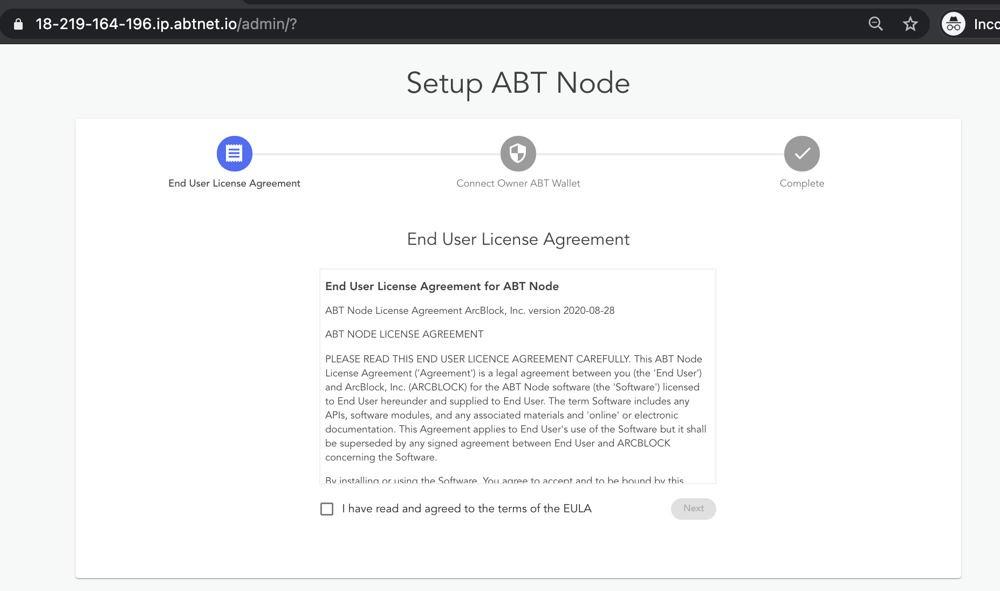

Blocklet Server can be installed in the following ways :

  - [Use the binary distribution](#use-the-binary-distribution)
  - [Use the official Docker image](#use-the-official-docker-image)
  - [Use AWS Store](#use-aws-Store)

You can use either of the above ways to deploy it on any infrastructure like Cloud, Virtual machines, workstations, etc.

*If you are interested in running Blocklet Server locally on your device, we currently support [Linux] and [macOS]. If you are using another OS like Windows, we recommend using Windows Subsystem Linux (WSL), or you can use a virtual machine and make sure your DID Wallet can access your VM's IP address.*

## Use the binary distribution

Blocklet Server is a [NodeJS application](https://www.npmjs.com/package/@blocklet/cli). You must have NodeJS Runtime and Node Package Manager (NPM) to install it.

### Environment Setup
You need to install NodeJS and NPM for installing Blocklet Server binary. ArcBlock recommends using Node Version Manager(NVM) for [installing NodeJS](https://nodejs.org/en/download/package-manager/#nvm).

#### Step 1: Install [NVM]

Install [NVM] using the below command:

```bash
curl -o- https://raw.githubusercontent.com/nvm-sh/nvm/v0.35.3/install.sh | bash
```

<details>
<summary>Sample output</summary>



</details>

#### Step 2: Install [Node.js] and [npm]

Blocklet Server will adapt the LTS version of Node.js as soon as possible, so we recommend installing the LTS version of Node.js.

```bash
nvm install --lts
```

<details>
<summary>Sample output</summary>


</details>

Note: You can install the latest version of [Node.js] by running `nvm install-latest-npm` command:

#### Step 3: Install Nginx

The gateway of Blocklet Server depends on Nginx, so we need to install Nginx.

**Version >= 1.18.0**

##### Install Nginx on Mac

Use Homebrew:

`brew install nginx`

Reference: https://formulae.brew.sh/formula/nginx

##### Install Nginx on Linux

Reference: https://www.nginx.com/resources/wiki/start/topics/tutorials/install/

### Install Blocklet CLI

Execute the below command to install Blocklet CLI :

```bash
npm install -g @blocklet/cli
```

<details>
<summary>Sample output</summary>

```
LinkdeMacBook-Pro:demo linchen$ npm install -g @blocklet/cli

/Users/linchen/.nvm/versions/node/v14.17.1/bin/blocklet -> /Users/linchen/.nvm/versions/node/v14.17.1/lib/node_modules/@blocklet/cli/bin/blocklet.js

+ @blocklet/cli@1.6.1
added 7 packages from 3 contributors, removed 7 packages and updated 125 packages in 123.454s
```

</details>

### Create and Run Blocklet Server

After installing Blocklet CLI, you can provide a empty directory location for storing configuration and initialize the blocklet server.

1. Run the `mkdir -p ~/blocklet-server-data && cd ~/blocklet-server-data` command to enter the directory. `~/blocklet-server-data` can be replaced to any other directory

2. Run the `blocklet server init` command to initialize the Blocklet Server

3. Once initialized, the system will confirm the directory where you want to store the configuration.

4. After confirming, the system will automatically generate your Blocklet Server configuration.

5. Now, start the blocklet server by executing the  `blocklet server start` command.

<details>
<summary>Sample output</summary>

```
linchen@LinkdeMacBook-Pro demo % blocklet server init
blocklet server v1.6.1
? Are you sure to initialize a Blocklet Server instance in the current directory(/Users/linchen/code/arcblock/ad/demo) Yes
✔ Blocklet Server configuration is successfully generated /Users/linchen/code/arcblock/ad/demo/.abtnode/abtnode.yml
ℹ blocklet server start

linchen@LinkdeMacBook-Pro demo % blocklet server start
blocklet server v1.6.1
ℹ Node did from config zNKoXYcX3yy74pFiNr3UcrtkmhkPccZE5Sso
ℹ Load config from /Users/linchen/code/arcblock/ad/demo/.abtnode/abtnode.yml
✔ Blocklet Server DB Proxy ready on port 40404
✔ Blocklet Server Event Hub ready on port 40407
✔ Blocklet Server Updater ready on port 40405
✔ Dashboard HTTPS certificate was downloaded successfully!
✔ Starting Blocklet Server Service... Done in 7.086s
✔ Starting Blocklet Server Daemon... Done in 13.095s
✔ You can access your Blocklet Server with either of the following URLs

HTTP URLs:

- http://192.168.3.28/admin/ [private]
- http://60.24.229.153/admin/ [public]

Secure URLs (Recommended):

- https://192-168-3-28.ip.abtnet.io/admin/ [private]
- https://60-24-229-153.ip.abtnet.io/admin/ [public]
linchen@LinkdeMacBook-Pro demo %
```

</details>

5. You can stop the blocklet server by executing `blocklet server stop` command.

<details>
<summary>Sample output</summary>

```
linchen@LinkdeMacBook-Pro demo % blocklet server stop
blocklet server v1.6.1
ℹ Node did from config zNKoXYcX3yy74pFiNr3UcrtkmhkPccZE5Sso
ℹ Load config from /Users/linchen/code/arcblock/ad/demo/.abtnode/abtnode.yml
✔ Sending shutdown notification to web dashboard users Done in 2.055s
✔ Routing engine is stopped successfully
✔ abt-node-daemon is stopped successfully
✔ abt-node-service is stopped successfully
✔ abt-node-updater is stopped successfully
✔ abt-node-db-hub is stopped successfully
✔ abt-node-log-rotate is stopped successfully
✔ abt-node-event-hub is stopped successfully
✔ Done!
```

</details>

### Access Blocklet Server

The above command will start the Blocklet Server. You can access the Blocklet Server on `http://192.168.3.28/admin/` or `https://192-168-3-28.ip.abtnet.io/admin/` ( Plase replace `192.168.3.28` to your local network ip). After this, you must agree to License terms before accessing the Blocklet Server dashboard.


*Please do not access the Blocklet Server using localhost / 127.0.0.1 address. You will not be able to connect it using DID Wallet.*

## Use the official Docker image

You can run Blocklet Server by using the [official Docker image](https://hub.docker.com/r/arcblock/blocklet-server)

```bash
docker run -d -p 80:80 -p 443:443  -v "$(pwd)":/data/abtnode arcblock/blocklet-server
```

Docker images are based on the Debian Linux platform.

### Access Blocklet Server

The above command will start the Blocklet Server container and bind it to port 80 /  443 on the Host machine. You should access it using the IP address of the Host machine (`http://192.168.1.5/`). *Please do not access the Blocklet Server using localhost / 127.0.0.1 address. You will not be able to connect it using DID Wallet.*



After this, you must agree to License terms before accessing the Blocklet Server dashboard.


## Use AWS Store

You can run Blocklet Server on AWS using [AWS Store](https://aws.amazon.com/Store/pp/B089KM6SFR?qid=1620381487343&sr=0-1&ref_=srh_res_product_title)

1. You must select **Continue to subscribe** from the overview tab,
  

2. You are presented with *Terms and Conditions*, to which you must agree by clicking **Accept Terms**.
  

3. After the subscription authorization is complete **Continue to Configuration** will be enabled. Click it to proceed
  

4. Select Blocklet Server version and AWS region, then click **Continue to Launch**
  

5. You are on the Launch page, where you must provide the following instance details :

    - Select **Launch from Website** for the *Choose Acton* dropdown.
    - Select *EC2 instance type*.
    - Select appropriate *VPC Settings*, followed by *Subnet Settings*
    - In *Security Group Settings* select an existing security Group or create one by clicking "Create new based on seller setting".
    - select / create a key pair under *Key Pair Settings*
    - Click **Launch** to deploy Blocklet Server using the provided configuration

  


> ####  Security Group Ports
>
> ---
>
> Please make a note of the ports that are opened in the associated security group. The standard ports are: 80 (HTTP) and 443 (SSL/HTTPS). We do not recommend opening port 22(SSH) unless required by your organisation practices.
>
> ---

### Access Blocklet Server

AWS will take some time to create an application instance. After the confirmation message, you should open the EC2 Dashboard to get the Public IP, and AWS-provided sub-domain of the Blocklet Server instance.


You can access the Blocklet Server on `/admin` request path using either of the following locations :
- **Non secured Access** : You can access Blocklet Server on HTTP by using the IP address (`http://18.219.164.196/admin`) or the AWS-provided sub-domain (`http://ec2-18-219-164-196.us-east-2.compute.amazonaws.com/admin`).


- **Secured Access** : ArcBlock provides HTTPS access to AWS hosted Blocklet Servers using a convention-based sub-domain(`ipv4convention.ip.abtnet.io`). You can determine the sub-domain by replacing the dot(`.`) separator in IPv4 address with the dash(`-`) separator. The above hosted Blocklet Server is available on `https://18-219-164-196.ip.abtnet.io/admin`.


ArcBlock recommends using the secured approach over the non-secured approach. The admin page presents License terms to which you must agree before accessing the Blocklet Server dashboard.

*Blocklet Server works on HTTPS using a sub-domain certificate (`ip.abtnet.io`). Accessing it using AWS provided public IPv4 address(`http://18.219.164.196/admin`) or sub-domain(`https://ec2-18-219-164-196.us-east-2.compute.amazonaws.com/admin`) gives an error of invalid certificate.*

[Linux]:   https://www.linux.org
[macOS]:   https://www.apple.com/macos
[NVM]:     https://github.com/nvm-sh/nvm
[Node.js]: https://nodejs.org
[npm]:     https://www.npmjs.com
