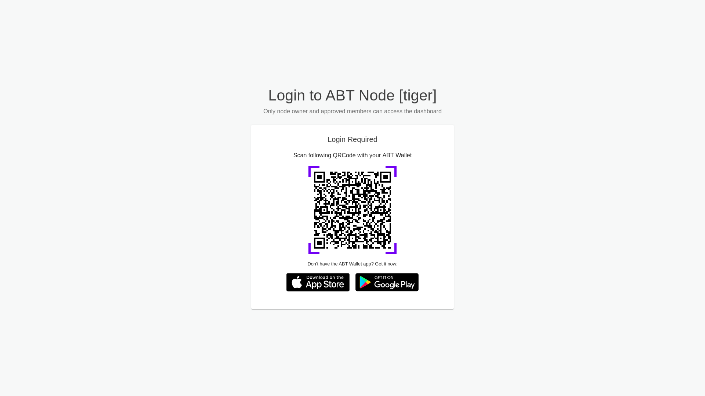
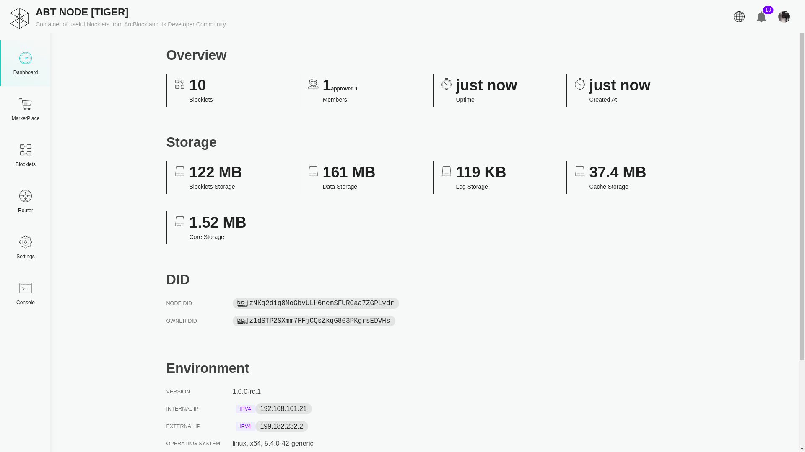
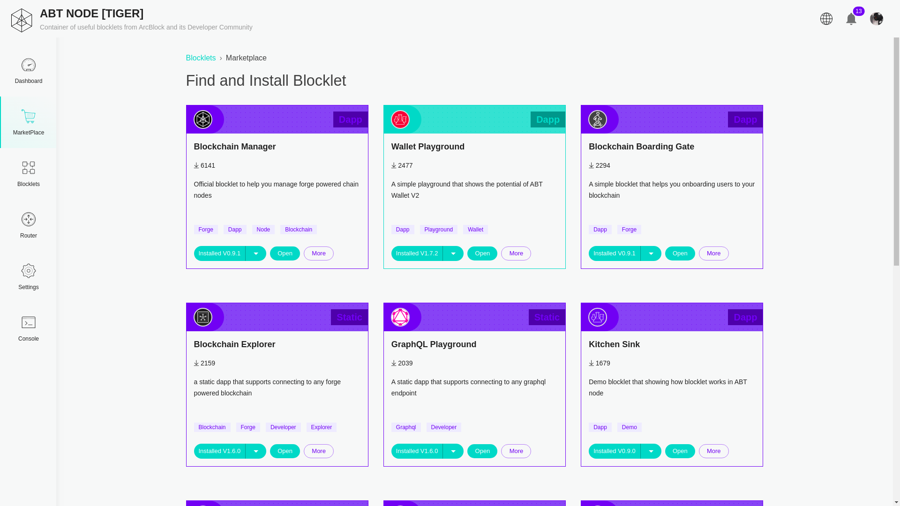
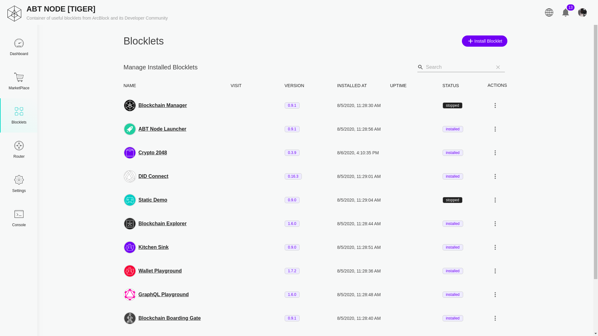
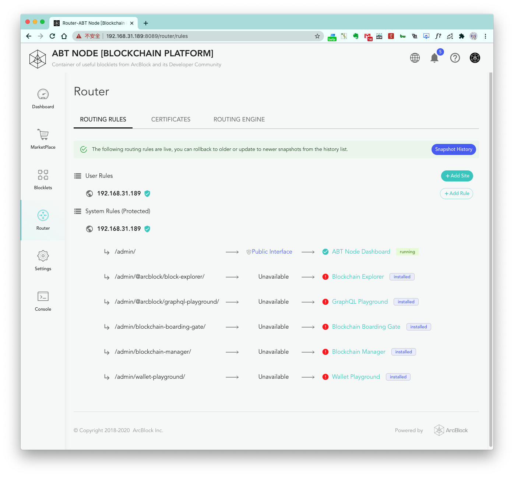

## What is ABT Node?

ABT Node is a web-based blocklet platform where users can install, uninstall, upgrade, downgrade, and run static and
DApp blocklets directly directly from a web browser.

## Login Interface

ABT Node's login interface consists of a login QR code that logs the user in when scanned by the ABT Wallet app and two
download buttons for downloading the ABT Wallet app on the user's phone.

## Dashboard

The dashboard displays the status and the properties of the ABT Node such as the storage used, uptime, node DID, and
owner DID.

## Blocklets

Blocklets are programs that can run independently or use other blocklets to perform complex tasks. The data and the
blocklets are stored separately, so reinstalled blocklets do not need to be reconfigured if the user chose to keep the
data during the last uninstalls.

### Blocklet Marketplace

The blocklet marketplace is a part of the web interface where blocklets can be installed, uninstalled, upgraded, or
downgraded. Although Arcblock's blocklet marketplace is used by default, other blocklet marketplaces can be used as
well.

### Manage Installed Blocklets

The blocklets page consists of a list of all of the installed blocklets. Blocklets can be started, stopped, and run from
here.

## Router

ABT Node also comes with the ability to use a routing engine to assign custom subdirectories to certain blocklets.
Currently, the only compatible routing engine is Nginx.

