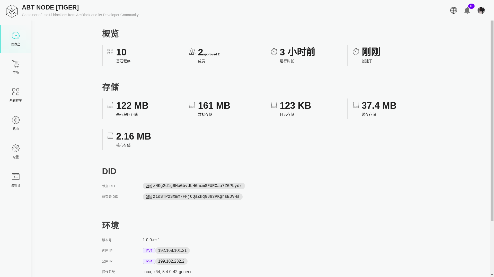
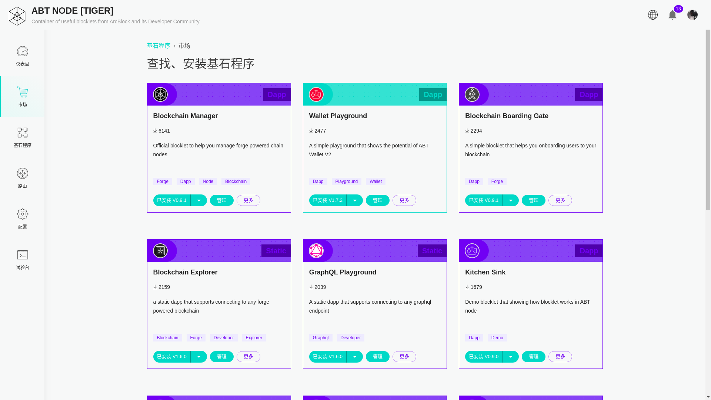
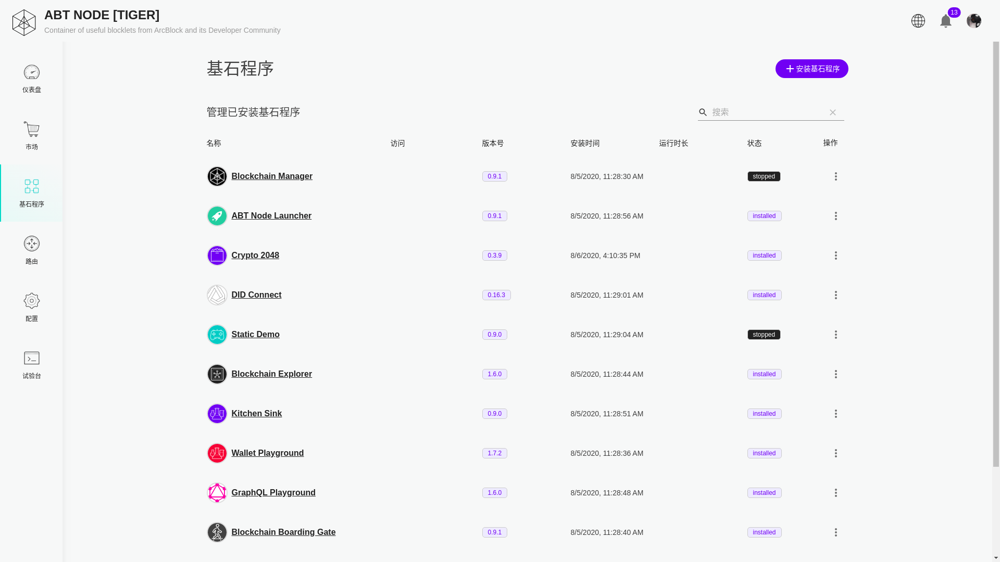
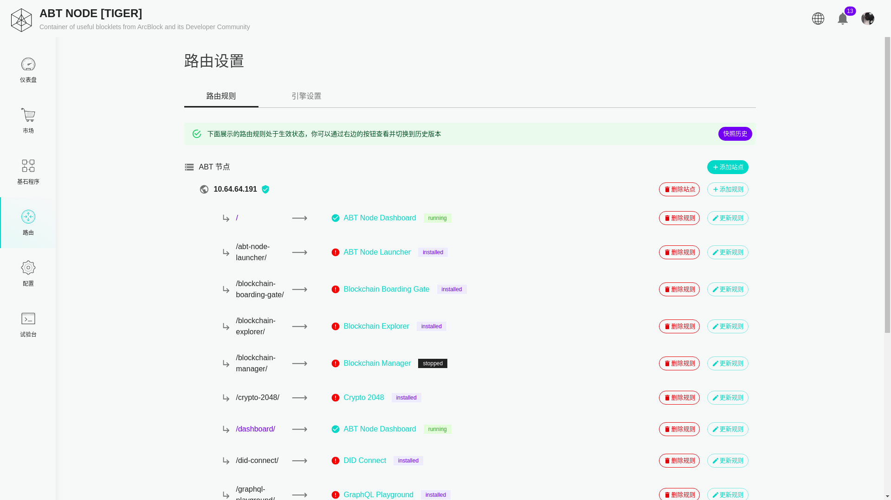

ABT 节点是基于 Web 的 Blocklet（基石程序）平台，用户可以通过浏览器在其中安装、卸载、升级、降级和运行静态和动态 Blocklet。

## 登录界面

ABT 节点的登录界面由 `登录二维码` 和 ABT 钱包下载按钮组成，用户可以使用初始化完毕的 ABT 钱包扫描 `登录二维码` 完成登录请求。

## 仪表盘页面

ABT 节点仪表盘页面展示了节点当前的状态以及节点的一些属性，比如：存储使用、更新时间、节点 DID、节点拥有者 DID 等信息。

## Blocklet

Blocklet 是可以独立运行的或者依赖其他的 Blocklet 执行的程序。它的数据是单独存储的。用户可以在删除一个 Blocklet 的时候保留它的数据，这样下次再安装可以不需要重新配置。

### Blocklet 市场

Blocklet 市场提供了 Blocklet 的安装、卸载、升级等功能。并且这个市场的数据源是支持自定义的。默认情况下会使用 ArcBlock 提供的 Blocklet 市场。

### 管理已安装的 Blocklet

Blocklet 页面由已安装的 Blocklet 列表组成，在这里可以完成已安装 Blocklet 的启动、停止、重启、删除等操作。

## 路由

ABT 节点支持使用路由引擎为 Blocklet 分配子访问路径的能力，目前唯一支持的路由引擎是 Nginx。

