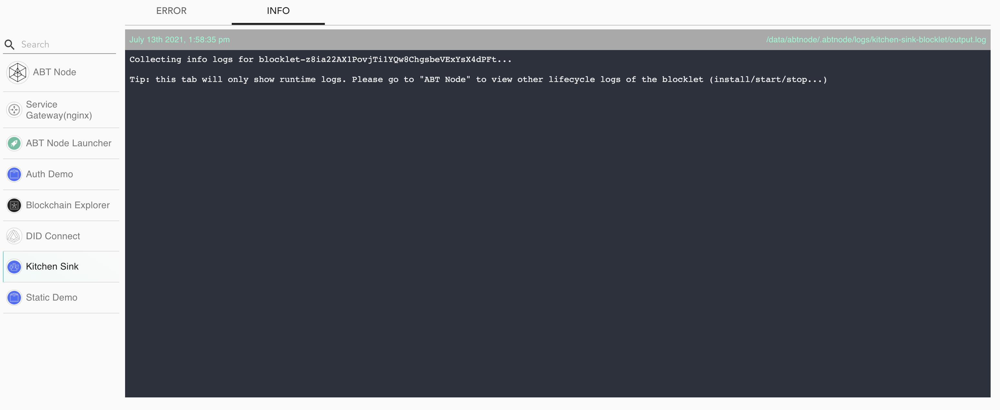
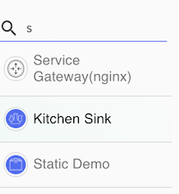
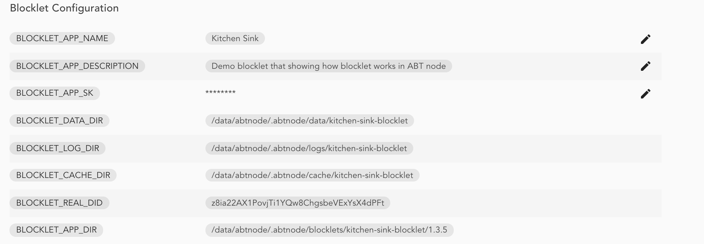

The logs console also shows log lines read from the logs files created by blocklets, log source information is displayed at the top right of the logs panel.

The logs console is segmented into multiple tabs(error, info etc.). These tabs are corresponding to the different log files created by each blocklet. The ERROR tab displays logs generated from `error.log`, and INFO is shown from `output.log`. You can scroll through each view to determine all logs statements from the latest log file.

The logs console also provides a search function to quickly lookup the required log producer using its name.

### Archived Logs

Blocklet Server archived logs file on day rollover. The archived files for blocklets are available at path specified by `BLOCKLET_LOGS_DIR` environment variable. You can determine the path for a specific blocklet from [Blocklet management > Overview](/en/blocklet/configuration) console.

