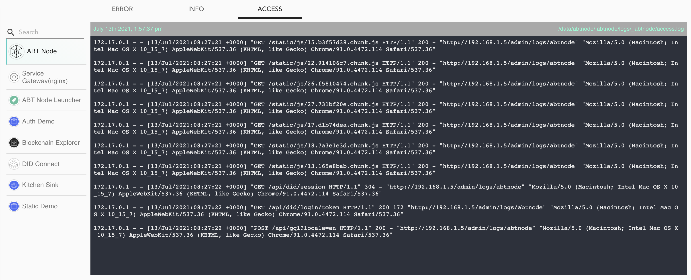

Blocklet Server is responsible for executing all components like Service gateway, Blocklets, etc. Additionally, Blocklet management allows you to control the lifecycle of each Blocklet. You can install, start, stop, reload, upgrade and remove each blocklet. All these events are handles by Blocklet Server and thus logged under the corresponding logs.

```bash
[2021-07-13 10:04:57] [info] [@abtnode/timemachine] "dry-run" {"dryRun":true}

[2021-07-13 10:04:57] [info] [@abtnode/timemachine] "Remove blocklet abt-node-launcher" {"tree":"7688bae62a738eff007aa80c2ceee941101d5509","parents":["e6e3bdefd91ec6bf153120c86298ce5e2e5af458"],"author":{"name":"abtnode","email":"abtnode@arcblock.io","date":{"seconds":1626170694,"offset":0}},"committer":{"name":"abtnode","email":"abtnode@arcblock.io","date":{"seconds":1626170694,"offset":0}},"commitHash":"d7dd95560a370062e1cef16f005f70f001ef50b0","treeHash":"7688bae62a738eff007aa80c2ceee941101d5509"}

[2021-07-13 10:04:58] [info] [@abtnode/webapp] "log stream: add" {"name":"abtnode"}
```

Blocklet Server generates the following 3 log files

- `error.log`, contains all errors generated by Blocklet Server.
- `output.log`, contains information about the various events handled by Blocklet Server. It has Blocklet lifecycle logs, node metrics, etc.
- `access.log`, contains logs for all handled user requests


