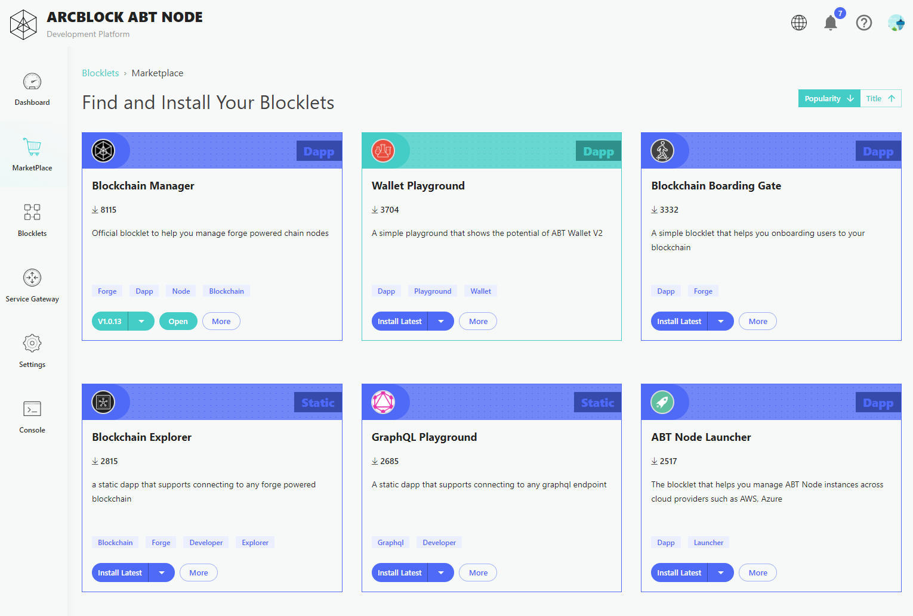
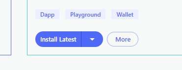

Your ABT Node Marketplace is your digital catalog of Blocklets from ArcBlock, ecosystem partners and software vendors that make it easy to find, install, manage and one-click deploy Blocklets on your ABT Node.

## Find a Blocklet

To get started, simply go to the left-hand action bar and click on **marketplace**.  Inside of the marketplace, you can relist your catalogue by popularity, or title, with new filters coming soon.

## Install a Blocklet

Installing and working with Blocklets is easy. When you have a Blocklet you want to add to your ABT Node, simply click on **Install Latest** and the Blocklet will automatically install for you.

Once installed, be sure to start the Blocklet to begin using it.

_Note, some blocklets may require additional configuration in order to work correctly so be sure to check your configuration details if additional steps are required.
