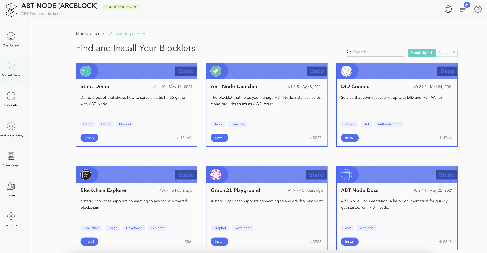
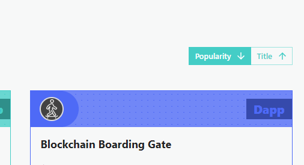
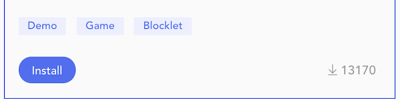
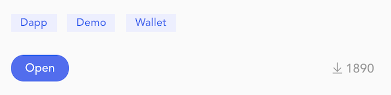
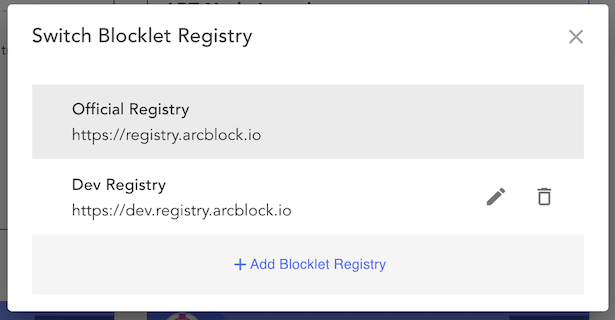

Your ABT Node Marketplace is your digital catalog of Blocklets from ArcBlock, ecosystem partners, and software vendors that make it easy to find, install, manage and one-click deploy Blocklets on your ABT Node.

## Find a Blocklet

To get started, go to the left-hand action bar and click on **marketplace**. It will display a catalog of Blocklets created by the ABT Node community. Blocklets are shown with details like the latest release version, release date, install count, and project tags. You can sort the catalog by popularity or by title.

A *search* box is also provided to filter Blocklets based on their name and description.

## Install a Blocklet

Installing and working with Blocklets is easy. When you have a Blocklet you want to add to your ABT Node, click on **Install**, and the Blocklet will automatically install for you.

Once the installation is complete, the Install button will change to the *Open* button.

The installation process does not start the Blocklet. You have to access the [Blocklet Management console](/en/blocklet) for starting / stopping / configuring the Blocklet

_Note, some Blocklets may require additional configuration to work correctly, so be sure to check your configuration details if additional steps are required.

## Register Blocklet Repository

By default, ABT Node marketplace is configured to use Blocklets from the ABT Node and Dev ABT Node repositories. These repositories provide an extensive catalog of community-created Blocklets.

However, if you develop Blocklets for internal use only, you can set up a custom repository by clicking **Add Blocklet Repository**. You will need to provide a URL for the custom repository.
