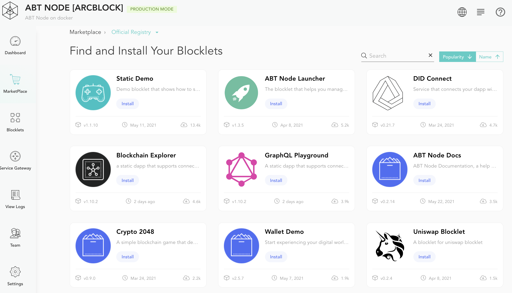
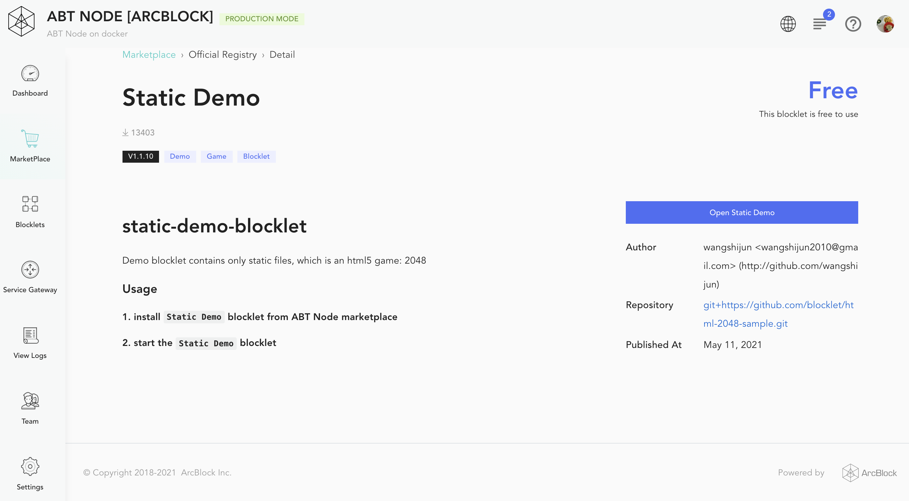

The marketplace is a digital catalog of Blocklets created by ArcBlock, ecosystem partners, and third-party vendors. These Blocklet are fetched from different Blocklet registries, analogous to development package registries like `npm registry`. Each of these Blocklets can offer out-of-box capabilities by using ArcBlock Platform. The marketplace allows you to filter and install Blocklets based on your selection criteria. The Blocklet details page servers as a product guide which shows all provided information.

## Find a Blocklet

To get started, go to the left-hand action bar and click on **marketplace**. It will display a catalog of Blocklets created by the ABT Node community. Blocklets are shown with details like the latest release version, release date, install count, and project tags. You can sort the catalog by *popularity* or by *name*. Additionally, a *search* box is also provided to filter Blocklets based on their name and description.

## Blocklet Overview
The marketplace dashboard shows Blocklet summary, which can serve your selection criteria. But while working with a Blocklet you must determine its setup guide, environment configurations, license, etc. All these details are provided on the Blocklet details page. Click on a particular Blocklet on the marketplace dashboard to reach its details page.

 

## Install a Blocklet

Installing a Blocklets is quite easy. Find a Blocklet you want to add to your ABT Node and click on the *Install* button. It will take sometime to complete the installation.

Once the installation is complete, the marketplace dashboard  will confirm this with a notification message.The Blocklet *Install* button will also change to *Open* button.

The installation process does not start the Blocklet. You have to access the [Blocklet Management console](/en/blocklet) for starting / stopping / configuring the Blocklet. Please refer to the Blocklet details page for associated instructions.

_Note, some Blocklets may require additional configuration to work correctly, so be sure to check your configuration details if additional steps are required.

## Blocklet Registry

ABT Node marketplace is configured to use Blocklets from the following   Blocklet registries :
1. Official Registry: It provides hosting for production-ready Blocklets for the end-user.
2. Dev Registry: It provides sample Blocklets for developers to know the possibilities with the ArcBlock platform.

However, if you develop Blocklets for internal use only, you can set up a custom registry by clicking **Add Blocklet Registry**. You will need to provide a URL for the custom registry.
