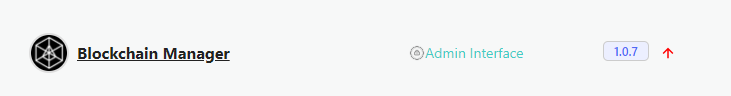
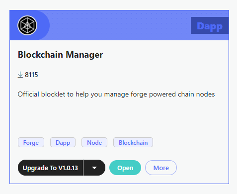

By default, ArcBlock Blocklets will always install the latest version, or notify you whenever a newer version is available.

On the Blocklet page you will see a red arrow to notify of an upgrade.

Or, in the Marketplace you node will request that you upgrade to the latest version.

