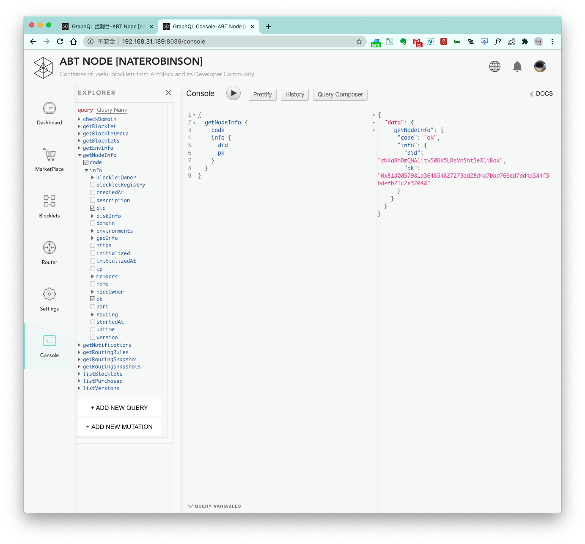

ABT Node's API is based on QraphQL. In the GraphQL console shown below, a list of all possible query keys is on the left, and an editable request is in the middle. The request can be sent via the triangle button, and the response appears on the right

> To learn more about GraphQL, please visit [GraphQL official website](https://graphql.org/).

