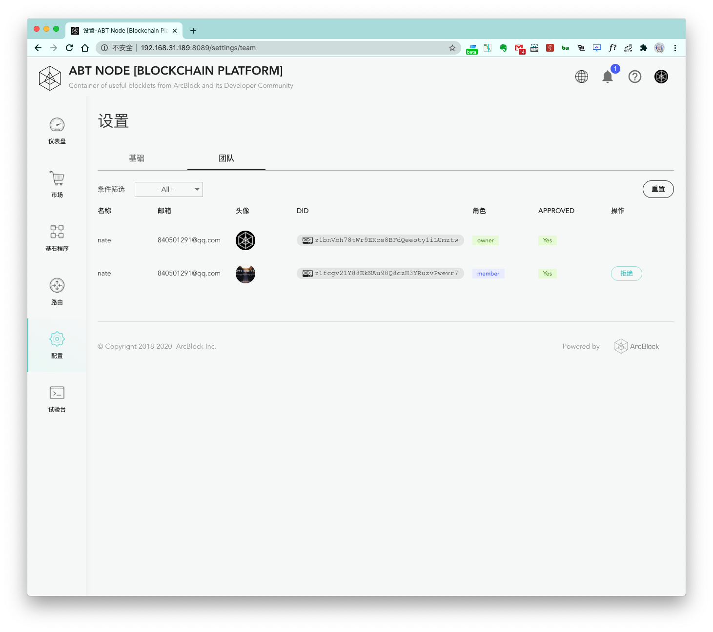

ABT Node 可以自由添加成员，并且节点的拥有者可以在 `配置-团队` 页面自由管理成员权限。

首先，新成员需要准备好初始化完成的 [ABT Wallet](https://abtwallet.io/zh/)。

然后，你只需将当前 ABT Node 的访问地址发送给他，让对方用钱包做一次扫码操作即可：

对方扫码之后，会得到这个结果，提示他没有权限登录该节点：

此时，当前节点的拥有者即可在 `配置-团队` 页面看到刚刚的新成员加入申请了：

可以看到多了一个角色为 `member` 的成员，并且目前的 approved 状态为 `No`。此时点击 `同意` 按钮即可完成新成员加入操作，同意之后，让对方再次扫码即可登录当前节点。

> 以后，你也可以到此页面通过点击 `拒绝` 按钮取消成员的访问权限。

