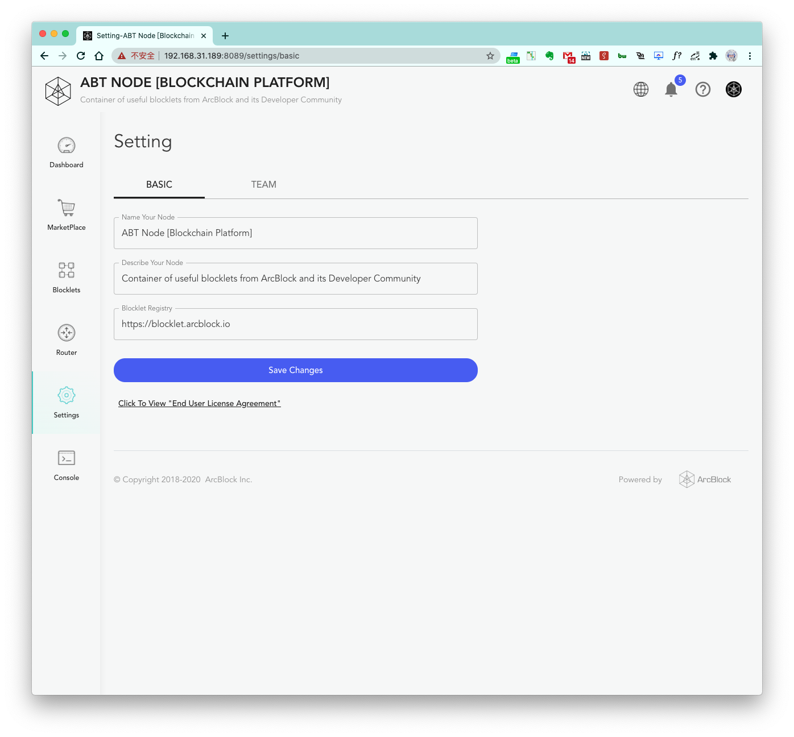

This is an overview of ABT Node's settings.

### Name your Node

The node name is displayed at the top of the node console page that allows others to identify which node they are
accessing.

### Describe your Node

Displayed at the top of the node console page.

### Blocklet Registry

The blocklet registry defines which blocklets are available in the marketplace. Usually, using the default market
registry is sufficient.

Currently, ArcBlock provide two blocklet registry:

1. [https://blocklet.arcblock.io](https://blocklet.arcblock.io)

2. [https://blocklet.arcblockio.cn](https://blocklet.arcblockio.cn)
