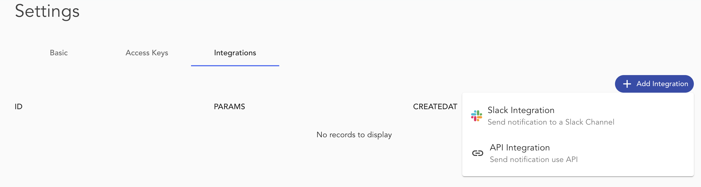

Integrations allow outgoing messages from ABT Node. These messages are related to Blocket updates, ABT Node configuration changes, and Alerts. You can integrate ABT Node with Slack and custom webhooks to receive the notifications.

 
