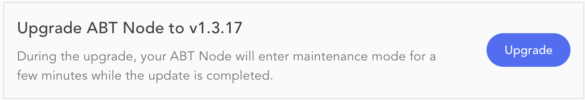

The *Basic Settings* view configured the below described attributes about the ABT Node.

 

Besides the ABT Node details, the settings page also provides the end-user license agreement.

### Name Your Node

The node name is displayed at the top of the node console page to identify which node they are accessing.

### Describe Your Node

It is displayed at the top of the node console page.

### Register Your Node

Allows users to reach your ABT Node.

### DID Wallet Location

Provides the location of DID wallet.

### Alerts

ABT Node monitors the disk usage and can raise notifications when the usage goes above the specified limit.

### Automatic Update Check

ABT Node can periodically check for an available newer version. Optionally, there is a *check for updates* button to verify manually if a  newer version is available.

ABT Node does not perform auto-upgrade. An admin user must confirm the upgrade process.

 

### Welcome Page

ABT Node displays a welcome page to help users navigate to the ABT Node login and the ABT Node documentation pages.
