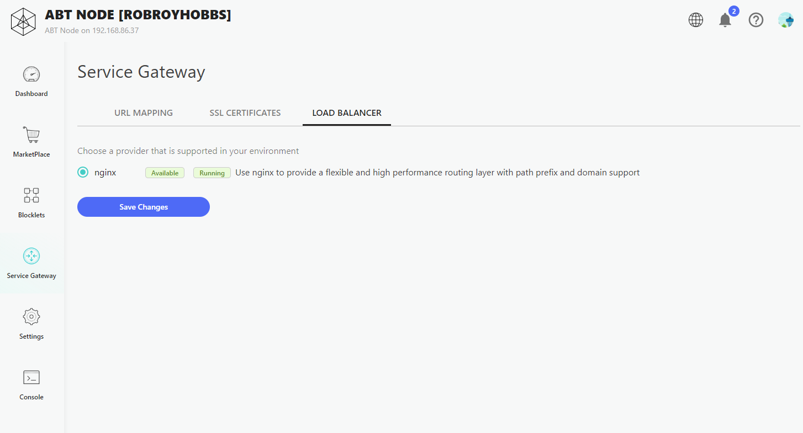
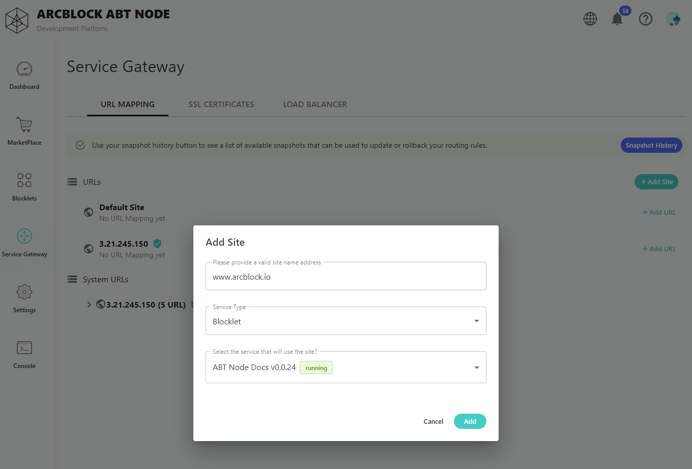
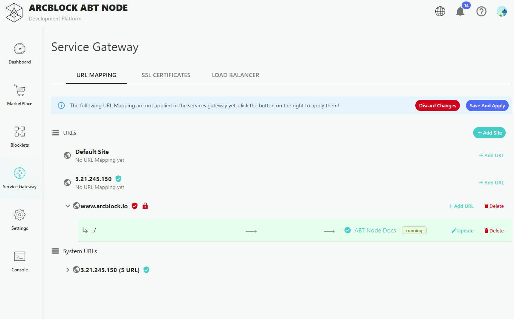
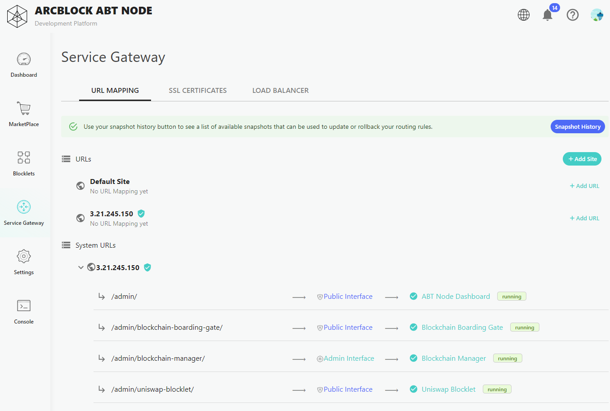
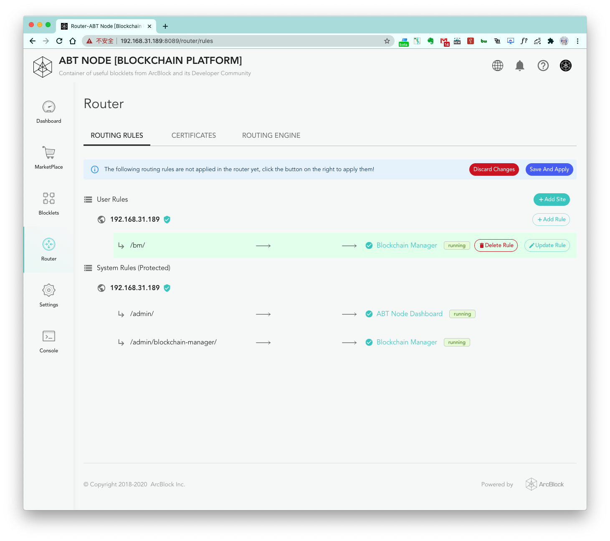
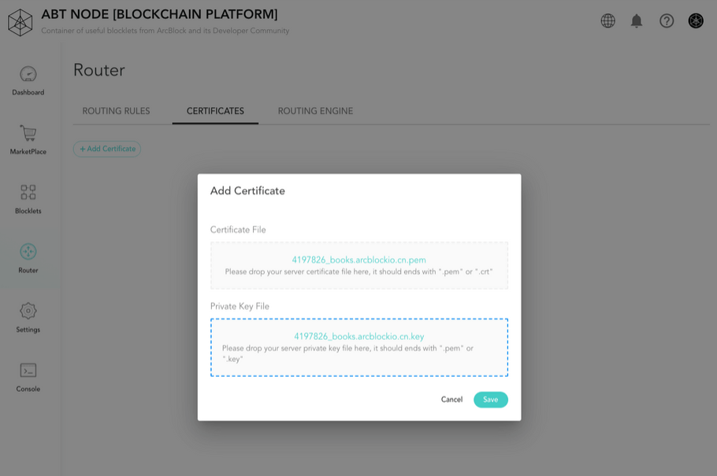
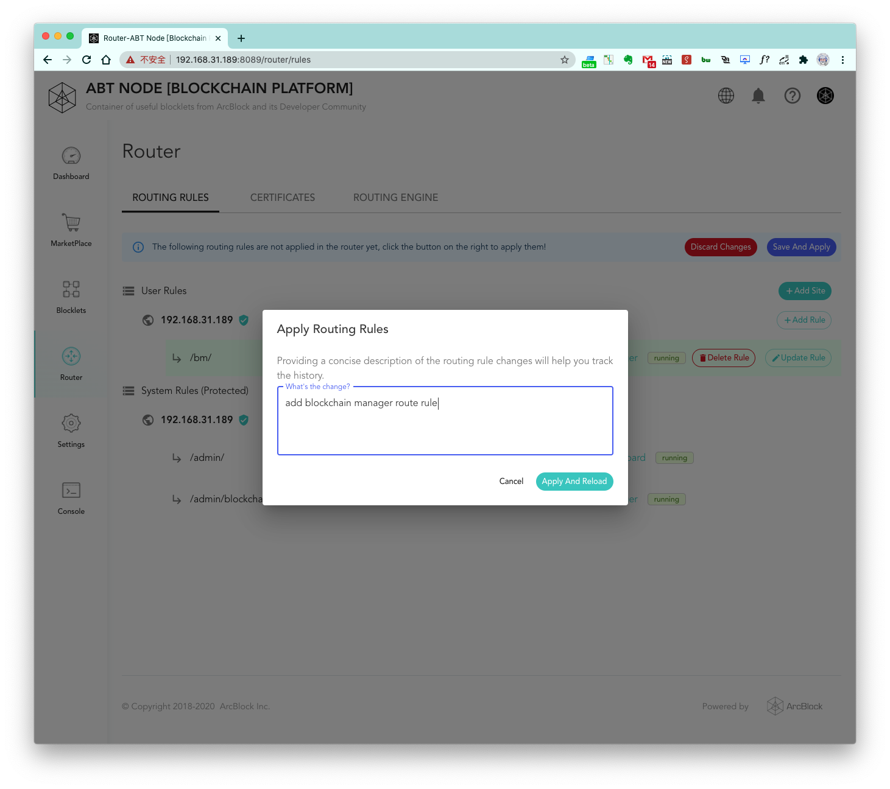
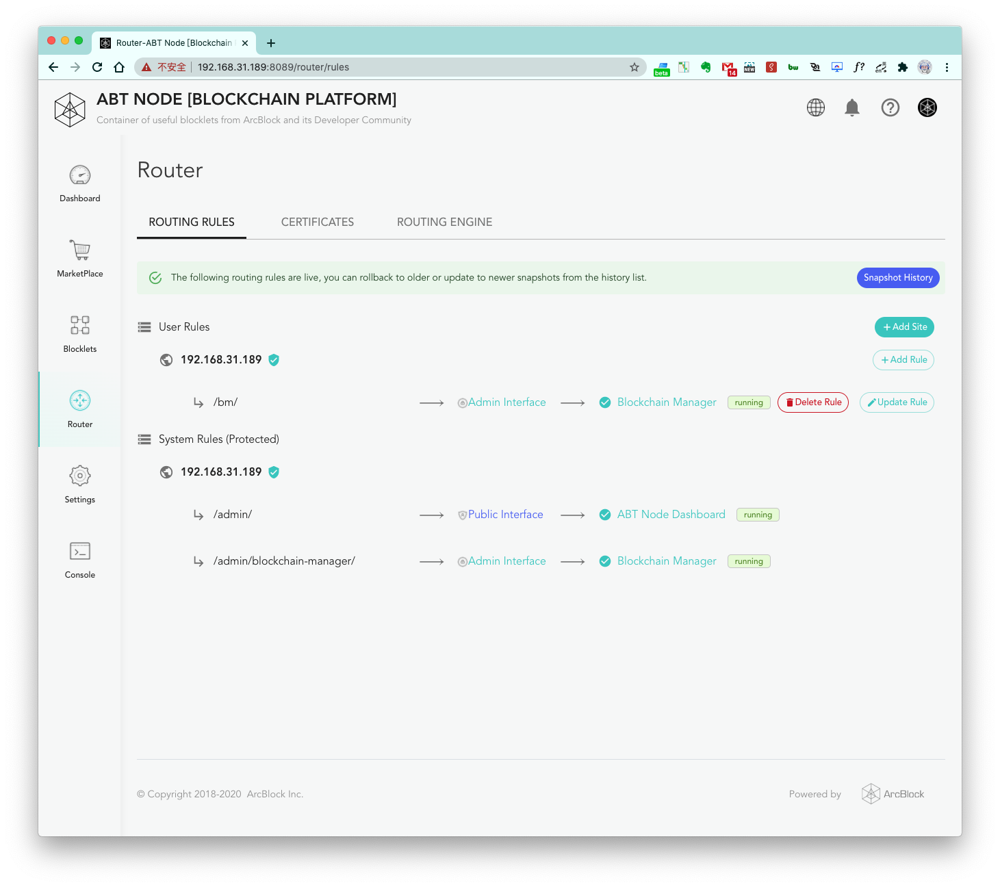
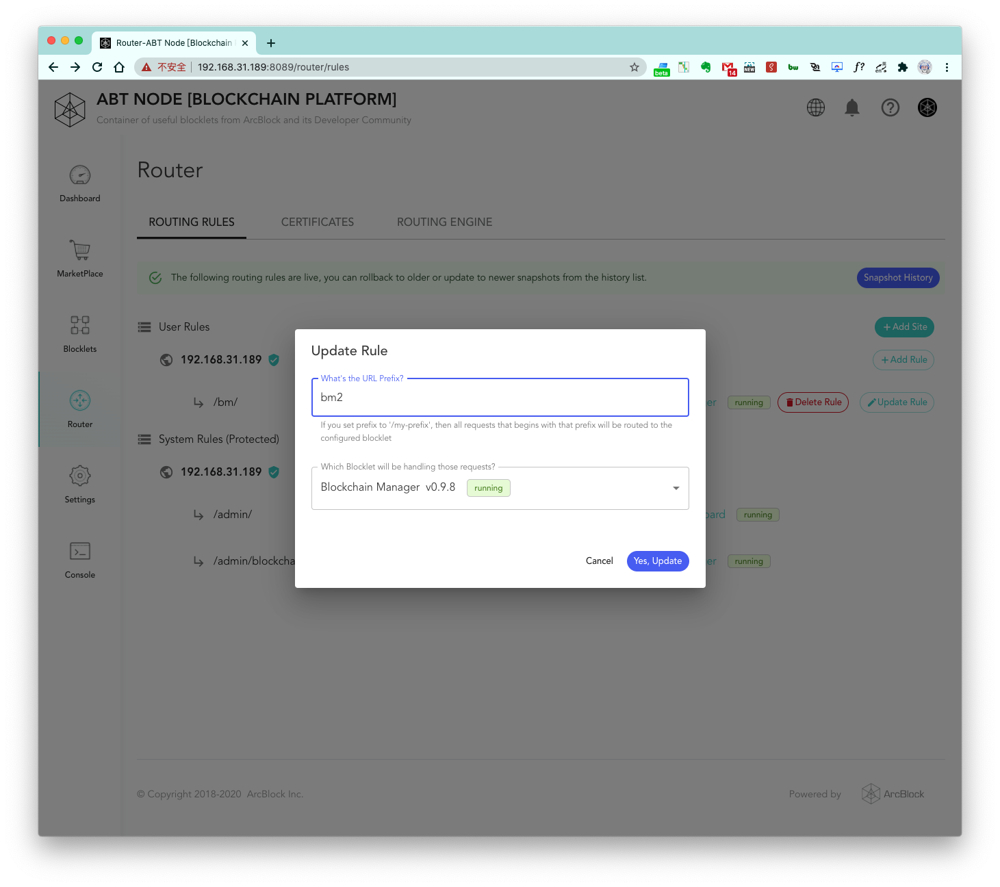

## Configuring Router

### Step 1: Configure the Routing Engine

If you chose `none` as the routing engine while initializing your node, blocklet sites are in the form of `IP` plus
`port`. To use a routing engine, go to `Router -> ROUTING ENGINE` and select a routing engine from the drop-down menu. At
the time of writing this document, the only available routing engine is Nginx.



### Step 2: Add a Site


Before we can link subdirectories to blocklets, we need to add ABT Node's site to the routing rules. Simply go to
`Router -> ROUTING RULES` and click on `Add Site`. The default site would be the site of your ABT Node, so you won't need
to change it. You can change the service the default subdirectory `/` routes to by choosing the service from the
drop-down menu, which includes the dashboard and the list of installed blocklets. If somehow the default port number
doesn't match that of the service, change the port number to match that of the service.



Details about the different input fields are shown below.

#### 1. Site domain name or IP input box

By default, the external access IP of the machine will be filled in. If you want to configure the domain name, you can
fill in your domain name.

#### 2. The root directory of the site default request forwarded to which service

By default, the root directory of a site will be forwarded to the selected ABT Node service, you can change it here.

#### 3. Port configuration of forwarded service

The default port number should be the port number of the service and does not need to be changed by default, but if it
somehow does not match that of the service, change the port number so it does.

After clicking Add, you will see the following interface by default:



> You can see that a routing rule generated by default under the site has a background color, which means that the
> routing rule has not been deployed yet to take effect

### Step 3: Add Routing Rules

Then, to route a subdirectory to other services, click on `Add Rule` and enter a custom unused subdirectory that you
want to link to a service. Then, select a service you want the subdirectory to link to. You can change the port number
to a custom unused port or use the default value. Then click on `Add` to add the rule. You can add multiple rules, each
linking a subdirectory to a service, but make sure you don't use the same subdirectory or the same port for two
services, but you can link multiple subdirectories to the same service.



> In the above figure, I added a routing rule for `BlockChain Manager`, which is already running with the subdirectory
> `bm`. The default port number is used. Click `Add` to complete the addition of a routing rule, as shown below:
>
> 

### Configure a certificate for custom domain

If we configure a domain name instead of an IP address, the generated site page will
look like this:


Here I use the domain name `books.arcblockio.cn` for testing, and prepare the HTTPS certificate for this domain name in
advance. When the domain name is configured, the button `+ Update Certificate` will appear. Click it to add a
certificate.



After selecting the certificate file and certificate private key, you can complete the submission. If the certificate is
configured correctly, the status symbol next to the site domain name will also change from red to green.


### Step 4: Apply Routing Rules

Even though the routing rules are configured, they have not been put into effect. Click on `Save and Apply` to put your
changes into effect.

#### Discard Changes

This option will discard all changes you have made.

#### Save and Apply

This option will save the changes you've made and put them into effect. Name your change and click `Apply and Reload`,
which will save your changes as a snapshot and put them into effect.



### Step 5: Verify Routing Rules



After applying changes, you can verify that the changes are put into effect by clicking on the link (in this case it's
`/bin/`).


You can see that by visiting `http://192.168.31.189/bm/?__t=1596508019533`, the corresponding Blocklet service can be
opened normally, indicating that our changes have taken effect.

## Update or Delete Routing Rules

### Update Routing Rules

To update a routing rule, click on `Update Rule` and edit the fields. In my case, I am changing `bm` to `bm2`.



Click the `Yes, Update` button, and click on `Save and Apply`.


To verify that the routing rule has taken effect, click on the new link and look at the URL. In my case, the new link is
`http://192.168.31.189/bm2/?__t=1596508019533`.

### Delete Routing Rulesdeployment is completed, you can see that the deleted route is in an inaccessible state.

Click the `Delete Rule` button next to an existing rule to delete that rule. After the rule is deleted, click on `Save
and Apply` to put the change into effect. After the change is in effect, the link becomes inaccessible.

## Snapshot History

Each time you save your changes, a snapshot is created. To restore to a snapshot, click on `Snapshot History` and select
the desired snapshot.


Click on `Use This Snapshot`, and the selected snapshot would be put into effect immediately.

## Troubleshooting Nginx

If Nginx fails to run, try one of these fixes.

After you apply these fixes, use this command to restart ABT Node.

```bash
ubuntu@ubuntu:~$ abtnode stop && abtnode start
ℹ Load config from /home/ubuntu/.abtnode.yml
ℹ Node did from config zNKhAjw6ktz37Ysb3PqBbgaZqZ59Td9fXR7G
✔ abt-node-daemon is stopped successfully
✔ abt-node-db-hub is stopped successfully
✔ Routing engine is stopped successfully
✔ Done!
ℹ Load config from /home/ubuntu/.abtnode.yml
ℹ Node did from config zNKhAjw6ktz37Ysb3PqBbgaZqZ59Td9fXR7G
✔ ABT Node DB Hub was started successfully
✔ ABT Node Daemon started successfully: http://192.168.1.10:8089
```

### No access to port 80

If you get this error, Nginx does not have access to port 80 (this error might look similar to [this
error](#port-already-in-use)).

```
nginx: [emerg] bind() to 0.0.0.0:80 failed (13: Permission denied)
```

First, get Nginx's path.

```bash
ubuntu@ubuntu:~$ which nginx
/usr/sbin/nginx
```

Give Nginx access to ports 0–1024 using this command (if your Nginx's path is noth `/usr/sbin/nginx`, replace it with
your Nginx's path).

```bash
ubuntu@ubuntu:~$ sudo setcap 'cap_net_bind_service=+ep' /usr/sbin/nginx
[sudo] password for ubuntu: 
```

If you still get the same error, get a list of all Nginx installations and try again with each path.

```bash
ubuntu@ubuntu:~$ which -a nginx
/usr/sbin/nginx
/sbin/nginx
```

### Can't access log files

If you get one of these errors, Nginx can't write to log files.

```
nginx: [alert] could not open error log file: open() "/var/log/nginx/error.log" failed (13: Permission denied)
```
```
nginx: [alert] could not open error log file: open() "/var/log/nginx/access.log" failed (13: Permission denied)
```


By default, log files are stored in `/var/log/nginx`. If you customized the log directories, the log paths are found in
`/etc/nginx/nginx.conf` (remember to replace `/var/log/nginx` with your customized log path in this case).

```bash
ubuntu@ubuntu:~$ sudo chmod -R g=rw /var/log/nginx
[sudo] password for ubuntu: 
```

### Port already in use

If you get this error, port 80 is already in use (this error might look similar to [this error](#no-access-to-port-80)).

```
nginx: [emerg] bind() to 0.0.0.0:80 failed (98: Address already in use)
nginx: [emerg] bind() to 0.0.0.0:80 failed (98: Address already in use)
nginx: [emerg] bind() to 0.0.0.0:80 failed (98: Address already in use)
nginx: [emerg] bind() to 0.0.0.0:80 failed (98: Address already in use)
nginx: [emerg] bind() to 0.0.0.0:80 failed (98: Address already in use)
nginx: [emerg] still could not bind()
```

If you are sure that the only process using port 80 is another instance of Nginx, you can use this command.

```bash
ubuntu@ubuntu:~$ sudo killall nginx
[sudo] password for ubuntu: 
```

Otherwise, find all tasks using port 80 with this command.

```bash
ubuntu@ubuntu:~$ sudo fuser 80/udp 80/tcp
[sudo] password for ubuntu: 
80/tcp:              329828 329829
```

Copy those PID's and use them in this command (change the `329828 329829` with the PID's you get from the previous
command).

```bash
ubuntu@ubuntu:~$ sudo kill 329828 329829
[sudo] password for ubuntu: 
```