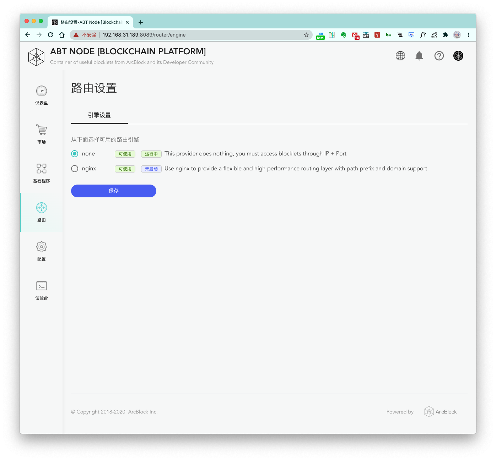
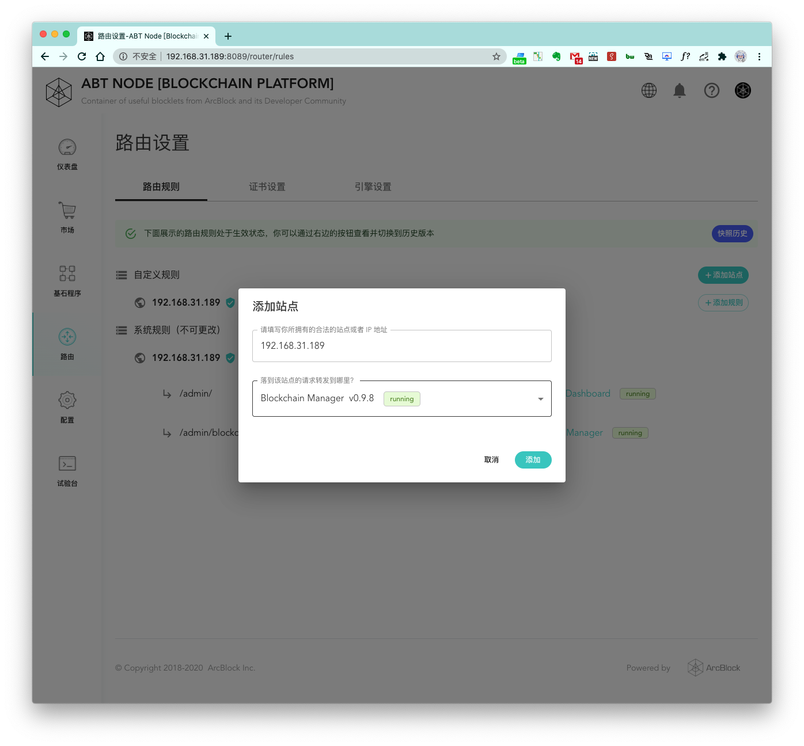
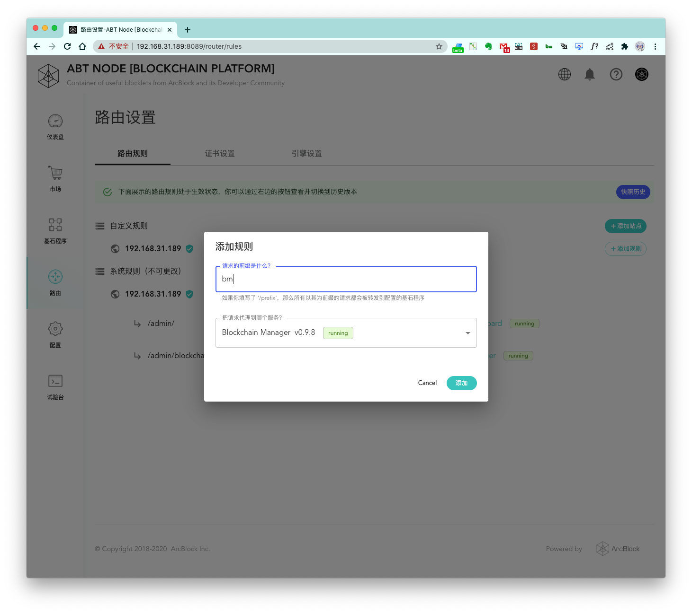
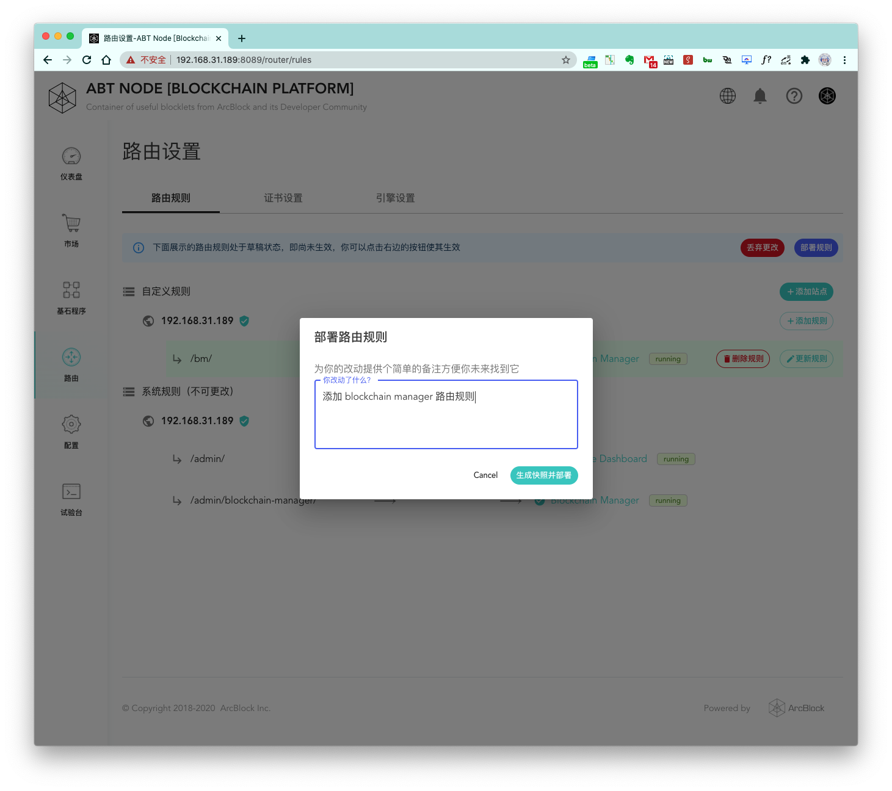
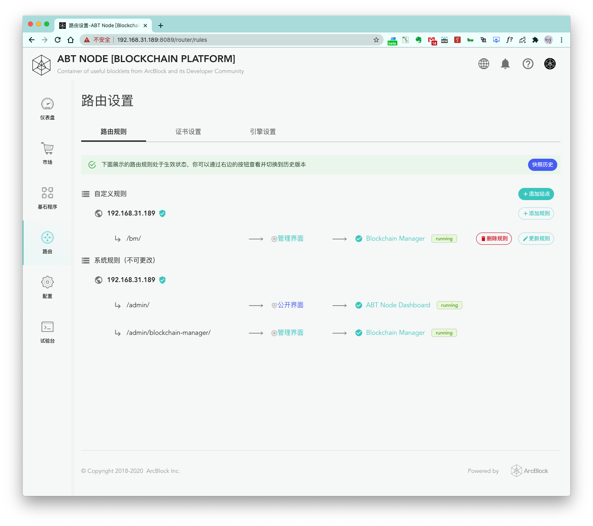
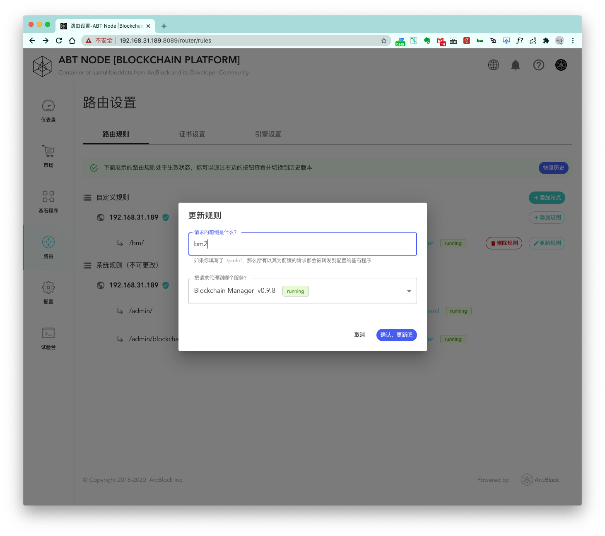

## 第一步，配置路由引擎

默认情况下，Blocklet 的访问是以 `IP` 加 `端口` 的形式，当我们在路由引擎设置界面设置了路由引擎为 `Nginx` 之后，`路由规则` 栏目便会出现，我们需要点击 `路由规则` 切换到规则页面进行下面的步骤。

## 第二步，添加站点

首次进来的页面如图所示，目前还没有任何站点，我们动手添加第一个站点吧，点击 `+添加站点` 按钮，你将会看到下面的页面：

#### 1. 站点域名或 IP 输入框

这边默认会将本机的对外访问 IP 填入，如果你想要配置域名的话，可以修改此处，填入你的域名名称

#### 2. 该站点根目录默认请求转发到哪个服务

默认的话，一个站点的根目录请求会转发给当前的 ABT Node 服务，你也可以在此做选择自定义

#### 3. 转发的服务的端口配置

这里默认会自动填入，一般无需做额外更改，除非你发现这边默认填入的端口号和你上面选择的被转发的服务的端口号不符再做修改

点击添加之后，默认情况下你将会看到下面的界面：

> 可以看到站点下面默认生成的一条路由规则有一个背景色，这个背景色即表示此路由规则还未真正部署生效

### 为域名站点配置证书

上面的步骤是使用的 IP 配置的站点，不过如果我们配置的是一个域名，生成的站点页面就会是下面这样：

这里我用 `books.arcblockio.cn` 这个域名用来做测试，并且提前准备好了此域名的 HTTPS 证书，可以看到如果配置的是域名，会出来 `+更新 HTTPS 证书` 的按钮，我们点击进行更新配置:

选择好证书文件和证书私钥之后，即可完成提交。如果证书配置正确，站点域名旁边的状态符号也会从红色变成绿色。

## 第三步，添加路由规则

站点添加完成之后，就可以在站点下面配置自己的路由规则了，通过自定义的路由规则可以将在运行的 Blocklet 服务都自定义到对应的路由下面：

上图中，我为本地已经在运行的 `BlockChain Manager` Blocklet 服务添加了一个路由规则为 `bm`, 端口号会默认填写好，一般无需额外的更改。点击 `添加` 之后即可完成一个路由规则的添加，添加完之后如下图：

此时路由规则还未真正生效，我们继续下面的步骤。

## 第四步，部署路由规则

可以看到，当我们新添加了站点或路由规则，在顶部会出现两个按钮：`丢弃更改` 和 `部署规则`。

#### 丢弃更改

会放弃此次的操作，将整个路由规则回到更改前的状态

#### 部署规则

点击 `部署规则` 并成功后，路由规则的更改才会真正的生效，点击之后页面如下图：

这里会要求我们做一个部署日志记录，方便后面我们维护以及做回滚路由规则等操作。最后，点击 `生成快照并部署` 完成路由规则部署。

## 第五步，验证路由规则

部署成功之后，即可进行点击进行访问验证：

可以看到访问 `http://192.168.31.189/bm/?__t=1596508019533` 已经可以正常打开对应的 Blocklet 服务了，说明我们的部署已经生效。

## 其他一，更新或删除路由规则

#### 更新路由规则

我们尝试将上面的 `bm` 路由规则更改成 `bm2` 试试吧

点击 `确认，更新吧` 按钮，并且执行一次 `部署规则` 操作，我们访问 `http://192.168.31.189/bm2/?__t=1596508019533` 进行尝试：

可以更改的路由规则已经生效。

#### 删除路由规则

点击 `删除规则` 按钮即可触发删除操作，删除完成之后同样需要执行一次 `部署规则` 操作完成重新部署，部署完成之后，可以看到刚刚的删除的路由已经处于无法访问的状态。

## 其他二，快照历史

上面的实践步骤中，我们每次执行 `部署规则` 操作都会被要求做一次日志维护，这正是给 `快照历史` 使用的，快照历史可以方便的将我们每一次部署操作记录下来，同样的我们也可以通过快照历史快速的将路由规则切回到之前的某一次更改，下面是使用快照历史的例子：

点击使 `使用此快照` 按钮，我们可以快速切回到之前的某一次部署。
