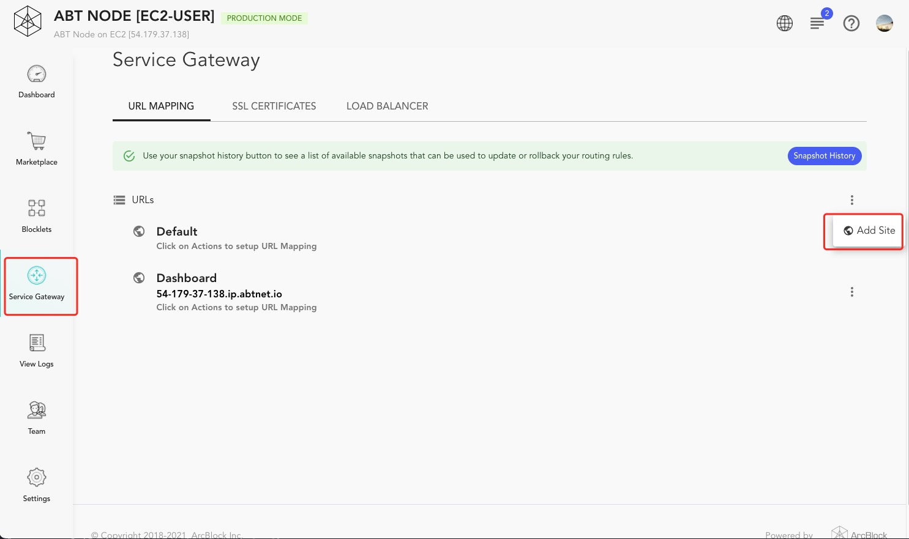
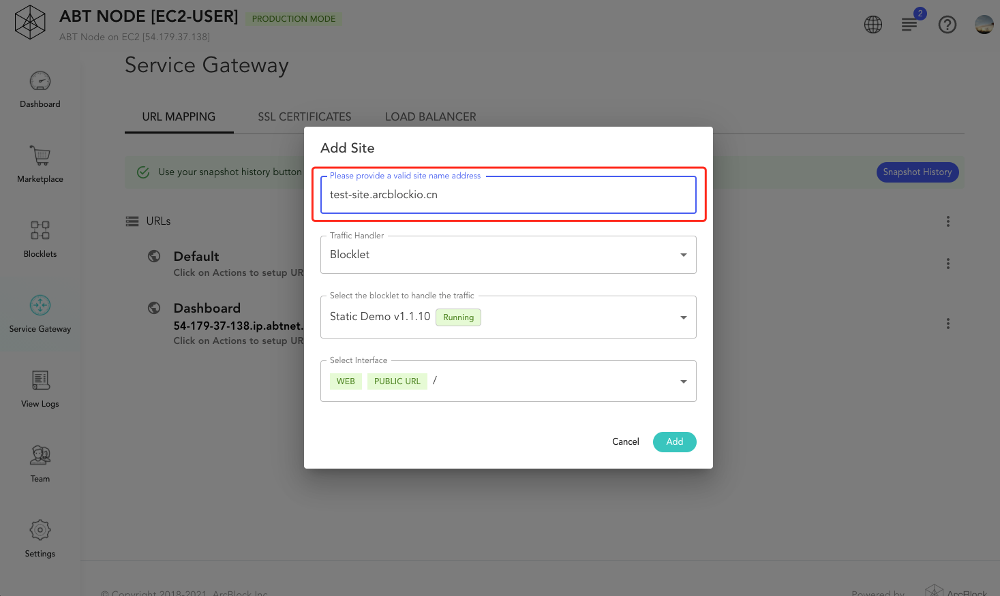
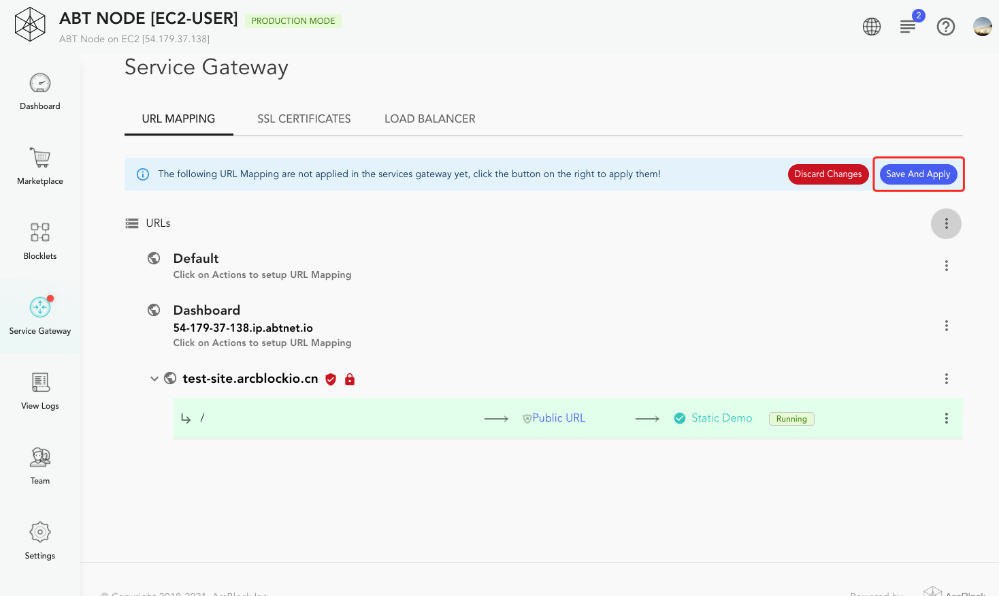
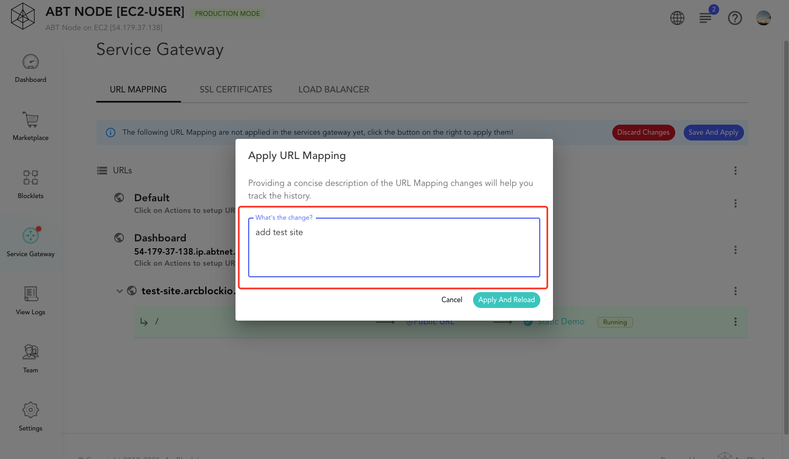
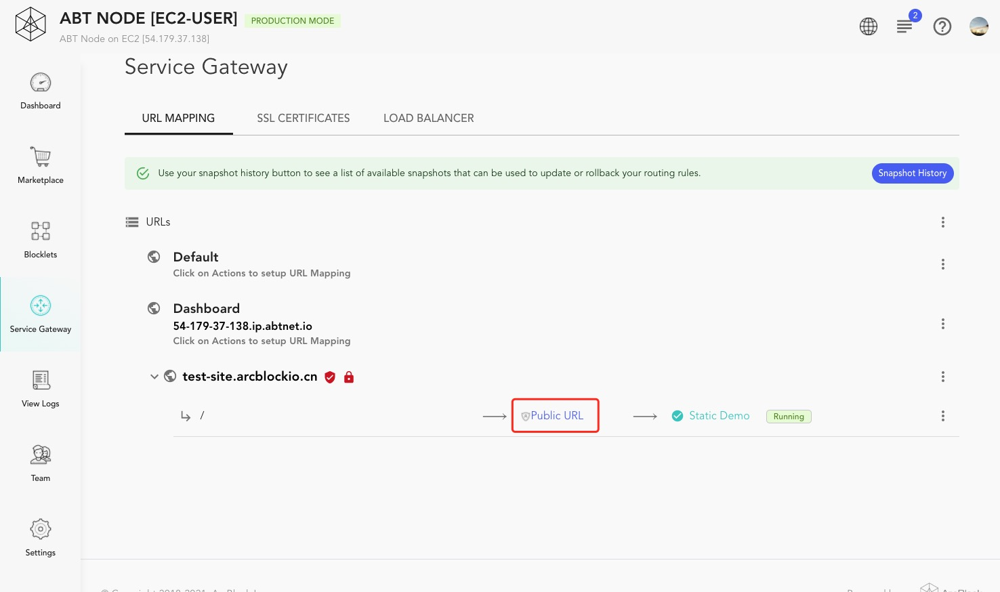
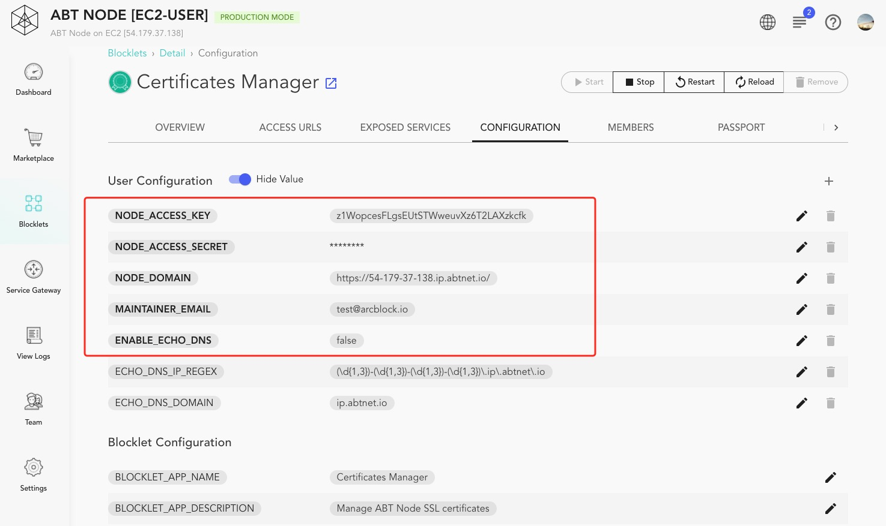
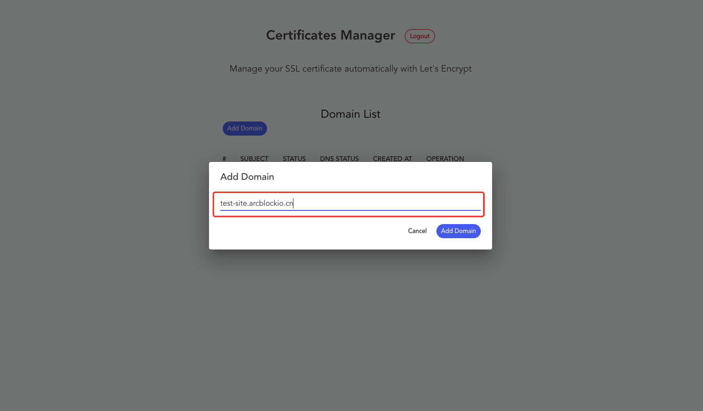
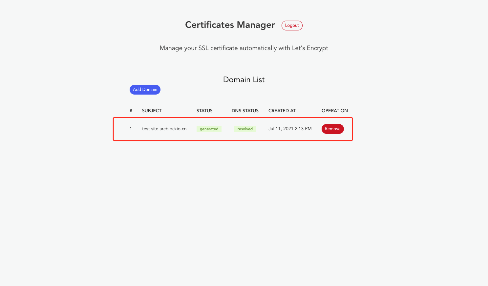

When we create a site in ABT Node, ABT Node automatically assigns an accessible address to the application; also, users can bind a custom domain name to the application and activate SSL for the site.

## Binding Domain

### Add DNS resolution

The prerequisite for binding a domain name is that the domain name has resolved to the server where the node is located, which requires the user to resolve the domain name at the domain name service provider where their domain name is located.

### Binding in ABT Node

#### Add Site

1. Open the `Service Gateway > URL Mapping` page, click on `Add Site`.



2. Fill in the domain name



3. Save And Apply

Click the `Save And Apply` button and fill in the information to apply the routing rules:

Save And Apply:



Fill in the information：



#### 完成

If everything is fine, the site will be accessible at this time.

Click on the website link:



Site:


## Start SSL

When our site is already running, we should add an SSL certificate to this site to make it more secure. ABT Node provides two ways to add an SSL certificate, by uploading it by the user and by creating a free certificate using the Certificate Manager Blocklet.

### Upload yourself

1. Go to `Service Gateway > SSL Certificate` page


2. Upload certificate and private key


3. Done

Once added, visit the site and we can see that the site is now HTTPS:


### Create a free Let's Encrypt SSL certificate with Certificate Manager

This is the way we recommend. It is very easy to add a free SSL certificate to a site using this method.

1. Install Certificate Manager Blocklet
2. Configure Certificate Manager

```
  - `NODE_ACCESS_KEY`: NODE_ACCESS_KEY generated in ABT Node, used by Certificate Manager to upload certificates
  - `NODE_ACCESS_SECRET`: NODE_ACCESS_SECRET generated in ABT Node, used by Certificate Manager to upload certificates
  - `NODE_DOMAIN`: Node address to display a prompt message
  - `MAINTAINER_EMAIL`: The maintainer's email for receiving certificate related emails
```



3. Start Certificate Manager
4. Visit Certificate Manager, and login


5. Add the required domain name and generate a certificate for that domain name




Waiting for the certificate to be generated:



6. Automatic certificate binding

Certificate Manager will automatically bind the certificate to the site, and if all is well, the site is already HTTPS at this point:


