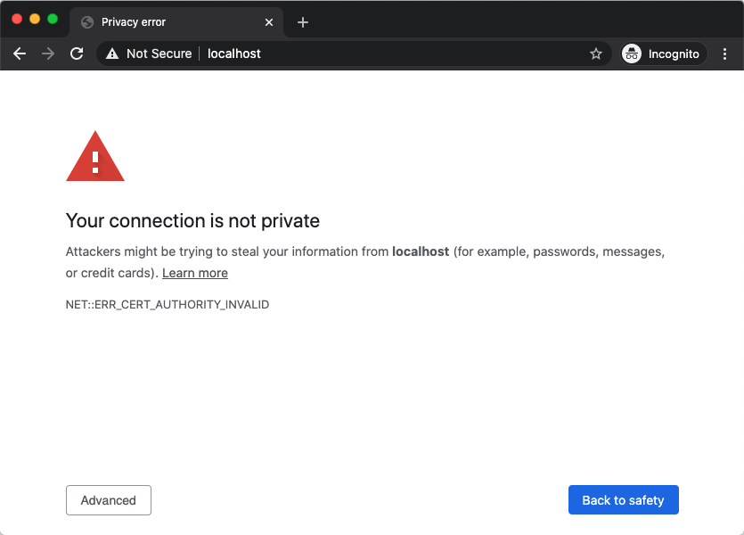
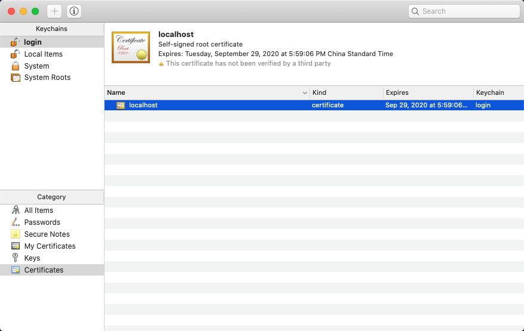
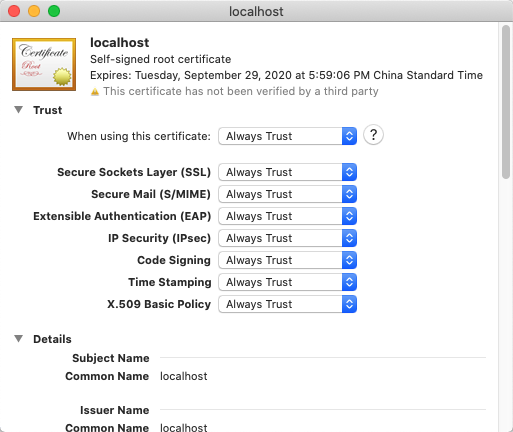
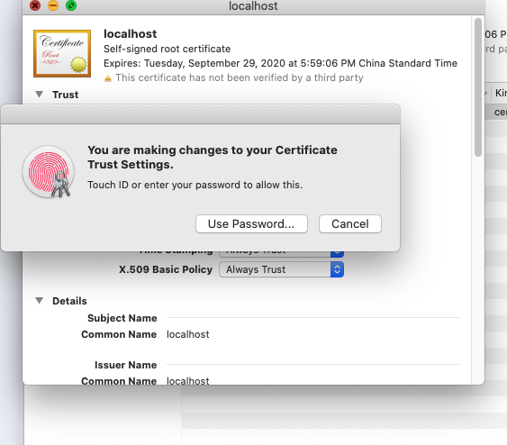
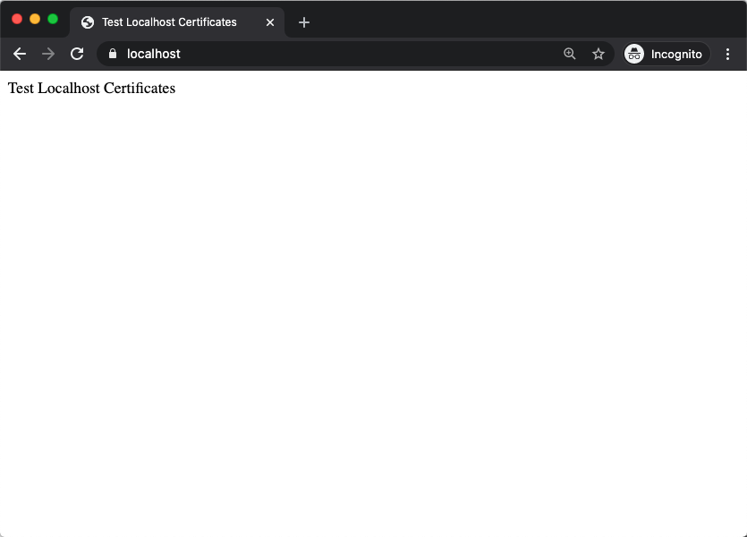

In order to facilitate local development and testing, we can generate a local certificate only. Except for this machine, the certificate will not be trusted by anyone else, which is sufficient for development.

## Use openssl to generate localhost certificate

We use `openssl` to generate the certificate, the command is as follows:

```bash
openssl req -x509 -out localhost.crt -keyout localhost.key \
  -newkey rsa:2048 -nodes -sha256 \
  -subj'/CN=localhost' -extensions EXT -config <( \
   printf "[dn]\nCN=localhost\n[req]\ndistinguished_name = dn\n[EXT]\nsubjectAltName=DNS:localhost\nkeyUsage=digitalSignature\nextendedKeyUsage=serverAuth")
```

## Test Certificate

After the certificate is generated, we can test the certificate in Nginx. The test configuration is as follows:

**Replace \<your directory\> with the real directory**

```nginx
worker_processes auto;

events {}

http {
    server {
        listen 443 ssl;
        server_name localhost;

        ssl_certificate <your directory>/localhost.crt;
        ssl_certificate_key <your directory>/localhost.key;

        root <your directory>/localhost-certificates;

        location / {
          index index.html;
        }
    }
}
```

Then enter `https://localhost` in the browser:



We can see that there is a problem with the certificate in Chrome (it will show 'Safari Can't Open the Page' in Safari), because the certificate is not yet trusted by the system at this time, and we need to set the system to trust it.

## Trust Certificate (Mac OS)

After the certificate is generated, it cannot be used directly; you need to **trust** the newly generated certificate in the system. Let's take Mac OS as an example to show how to **trust** the certificate in the system.

The generated certificate is in the current directory, double-click the `localhost.crt` file in the file manager (Finder):


After double-clicking, the setting page of `Keychains Access` will appear, then double-click the `localhost` certificate:



After double-clicking the certificate, in the settings of `Trust`, set `When using this certificate` to `Always Trust`:



Then click the `Close` button in the upper left corner, before the window is closed, the system will prompt to save the settings, enter the password to save the settings:



Then revisit `https://localhost` in the browser. At this time, we can see that the test website can be accessed normally:



Complete the settings.

## Reference

-[Let's Encrypt] localhost certificate: https://letsencrypt.org/docs/certificates-for-localhost/
