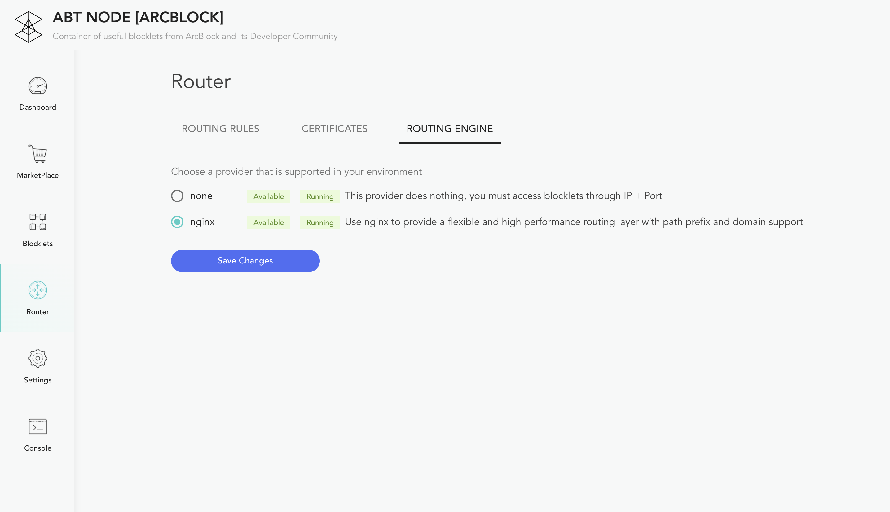

ABT Node now supports a routing engine: Nginx, ABT Node does not have a built-in Nginx, you need to install it yourself.

## Version requirements

It is recommended to install the latest stable version, now (2020-08-30) the most stable version is `Version 1.18`.

## Installation

Because ABT Node can only run on *nix platforms now, here is only how to install Nginx on these platforms.

### Linux

[Nginx official documentation site](http://nginx.org/en/linux_packages.html) provides installation methods using the package manager on each Linux system:

-[RHEL/CentOS](https://docs.nginx.com/nginx/admin-guide/installing-nginx/installing-nginx-open-source/#installing-prebuilt-centos-and-rhel-packages)
-[Debian](https://docs.nginx.com/nginx/admin-guide/installing-nginx/installing-nginx-open-source/#prebuilt_debian)
-[Ubuntu](https://docs.nginx.com/nginx/admin-guide/installing-nginx/installing-nginx-open-source/#prebuilt_ubuntu)
-[SLES](https://docs.nginx.com/nginx/admin-guide/installing-nginx/installing-nginx-open-source/#prebuilt_suse)
-[Alpine](https://docs.nginx.com/nginx/admin-guide/installing-nginx/installing-nginx-open-source/#prebuilt_alpine)

### Mac OS

It is recommended to use [Homebrew](https://brew.sh/) install on Mac:

```bash
brew install nginx
```

### Build from source

Of course, you can also build from source code: https://docs.nginx.com/nginx/admin-guide/installing-nginx/installing-nginx-open-source/#sources

Remember HTTPS, gzip/unzip and other modules when building from source code:

```nginx
./configure
--with-http_ssl_module
--with-http_gunzip_module
--with-http_gzip_static_module
...
```

## Enable Nginx

After installing Nginx, you only need to check the status of Nginx on the Router -> Routing Engine page. If the status of Nginx is "Available`, you can set Nginx as a route:

